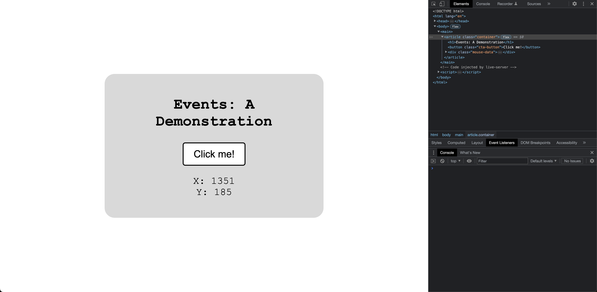
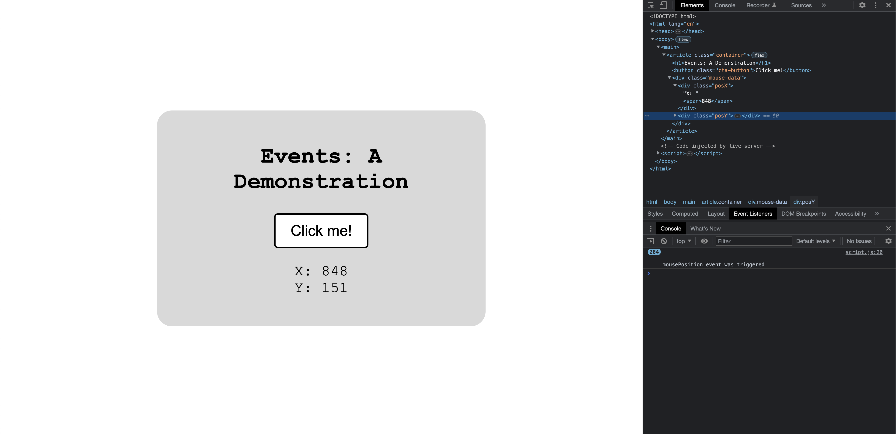
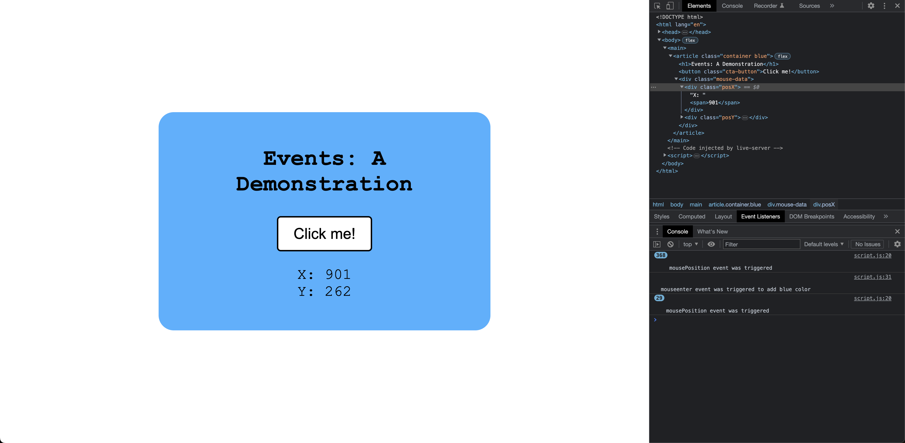
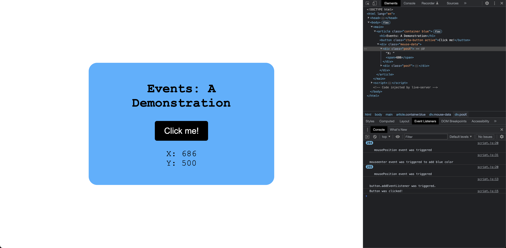
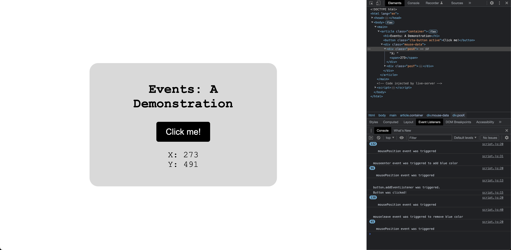

# Typical dom events

## Explaination

The provided code demonstrates the usage of typical DOM events in JavaScript. Here's an explanation of the events and their functionality:

1. **"click" event on the button**: When the button with the class "cta-button" is clicked, the event listener triggers a callback function. In this case, it logs a message to the console, toggles the "active" class on the button, and logs another message indicating that the button was clicked.

2. **"mousemove" event on the window**: This event is bound to the entire window, and when the mouse moves, the event listener triggers the `mousePosition` callback function. This function updates the X and Y positions of the mouse on the page by modifying the text content of the respective `` elements.

3. **"mouseenter" event on the container**: When the mouse enters the container element with the class "container", the event listener triggers a callback function. In this case, it adds the class "blue" to the container element, which changes its background color to blue. This effect can be observed in the provided CSS styles.

4. **"mouseleave" event on the container**: When the mouse leaves the container element, the event listener triggers a callback function. This function removes the "blue" class from the container element, reverting its background color to the default state.

Each event listener is set to use the `addEventListener` method, which takes the event type as the first argument, the callback function as the second argument, and a boolean value indicating whether to use capturing (false in this case).

By utilizing these events, the code demonstrates interactive behavior by responding to user interactions (clicking the button), tracking mouse movement, and updating the appearance of elements on the page.

## Screenshots

- Initially

- Start hovering the mouse

- Taking the mouse inside the box. Note the change in `class`.

- Clicking on `clickme`. Note the change in `class`.

- Taking the mouse back outside the box. Note the change in `class`

