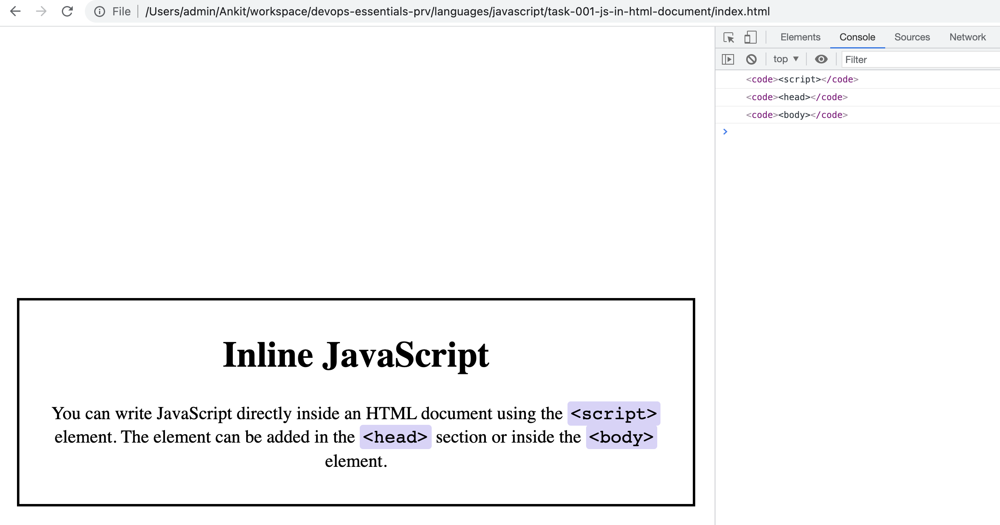
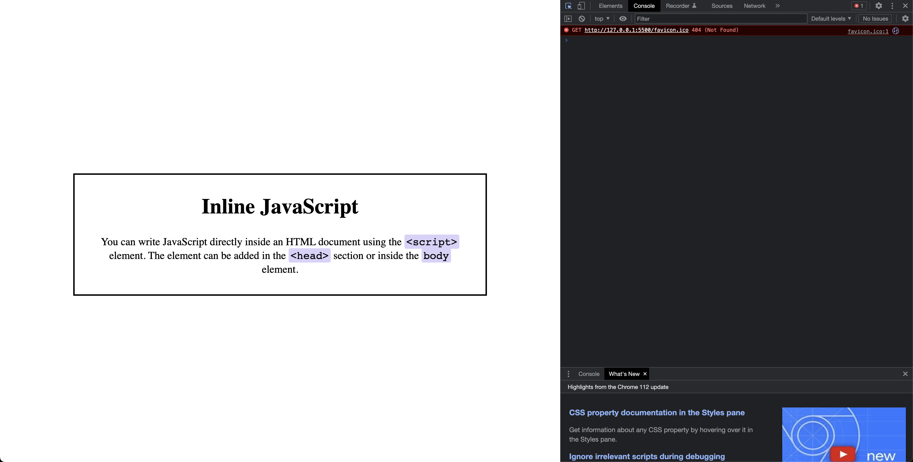

# JS in HTML document

## Objective

- Where you place the javascript inside the HTML document i.e. inside the `<script>` tag. Effort to understand the javascript code not needed yet.

## Begin

```javascript
    <script>
        const allCode = document.querySelectorAll("code");

        for (let item of allCode) {
            console.log(item)
            item.innerHTML = `&lt;${item.innerHTML}&gt;`;
        }
    </script>
```

The JavaScript code in the given HTML file is enclosed within the `<script>` tag. This is an inline script, which means the JavaScript code is directly embedded in the HTML file. Here's the explanation of the JavaScript code:

1. `const allCode = document.querySelectorAll("code");`

   This line selects all the `<code>` elements in the HTML document using `querySelectorAll` and assigns the result to a constant variable called `allCode`. `querySelectorAll` returns a NodeList (a collection of DOM elements) that matches the specified CSS selector ("code" in this case).

2. `for (let item of allCode) {`

   This line starts a `for...of` loop, iterating over each item in the `allCode` NodeList. The loop will execute the code inside the curly braces for each `<code>` element found.

3. `console.log(item);`

   Inside the loop, this line logs the current `item` (a `<code>` element) to the browser's console. This is mostly for debugging purposes and can be helpful when you want to see the content of the variable.

4. `item.innerHTML = `&lt;${item.innerHTML}&gt;`;`

   This line modifies the `innerHTML` property of the current `item` by wrapping its content with the HTML entities `&lt;` and `&gt;`. These entities represent the less-than (<) and greater-than (>) signs, respectively. This way, the content of each `<code>` element will be displayed as plain text instead of being interpreted as HTML code by the browser.

5. `}`

   This closing brace marks the end of the loop.

So, the JavaScript code in this HTML file selects all `<code>` elements, iterates through them, logs each element to the console, and wraps their content with the less-than and greater-than signs as plain text.

## Output



- index-v1.html : The same thing can be achieved without javascript as well.


