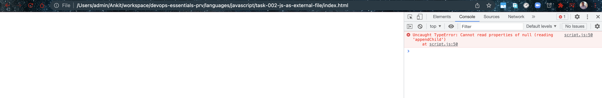
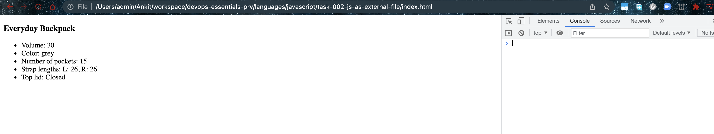

# JS as external file

## Objective

- How can we include javascript in HTML using external file. Again, effort to understand the javascript code not needed yet.

## Begin

- When js is loaded before Body element

```html
<!DOCTYPE html>
<html lang="en">
  <head>
    <meta charset="UTF-8" />
    <meta name="viewport" content="width=device-width, initial-scale=1.0" />
    <title>Module demo</title>
    <script src="script.js"></script>
  </head>
  <body></body>
  <!-- <script src="script.js"></script> -->
</html>
```



- When js is loaded after Body element

```html
<!DOCTYPE html>
<html lang="en">
  <head>
    <meta charset="UTF-8" />
    <meta name="viewport" content="width=device-width, initial-scale=1.0" />
    <title>Module demo</title>
    <!-- <script src="script.js"></script> -->
  </head>
  <body></body>
  <script src="script.js"></script>
</html>
```


