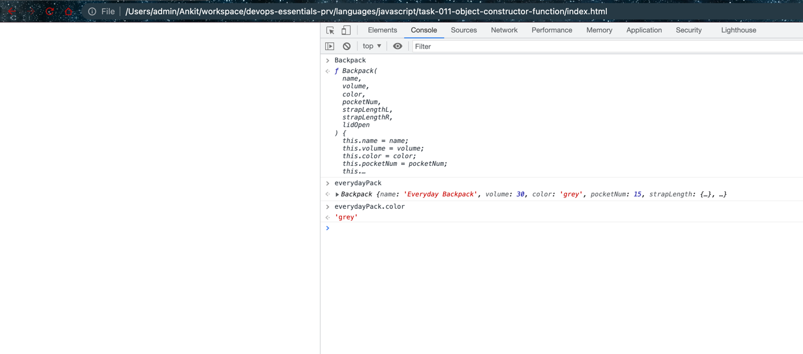

# Object Constructor Function

## Code

```javascript
/**
 * Create an object constructor function for the Backpack object type.
 * @link https://developer.mozilla.org/en-US/docs/Web/JavaScript/Reference/Operators/new
 */

function Backpack(
  name,
  volume,
  color,
  pocketNum,
  strapLengthL,
  strapLengthR,
  lidOpen
) {
  this.name = name;
  this.volume = volume;
  this.color = color;
  this.pocketNum = pocketNum;
  this.strapLength = {
    left: strapLengthL,
    right: strapLengthR,
  };
  this.lidOpen = lidOpen;
  this.toggleLid = function (lidStatus) {
    this.lidOpen = lidStatus;
  };
  this.newStrapLength = function (lengthLeft, lengthRight) {
    this.strapLength.left = lengthLeft;
    this.strapLength.right = lengthRight;
  };
}

const everydayPack = new Backpack(
  "Everyday Backpack",
  30,
  "grey",
  15,
  26,
  26,
  false
);
```

This JavaScript code is creating a constructor function for a `Backpack` object type.

Here's how it works:

1. The `Backpack` function is a constructor that takes several parameters: `name`, `volume`, `color`, `pocketNum`, `strapLengthL`, `strapLengthR`, and `lidOpen`. These parameters represent various properties of a backpack.

2. Inside the constructor, `this` keyword is used to attach these parameters to the instance of the object that's being created. For example, `this.name = name;` assigns the `name` parameter to the `name` property of the object.

3. Two methods are added to the object using the `this` keyword: `toggleLid` and `newStrapLength`. These methods are functions that modify the properties of the object. `toggleLid` changes the `lidOpen` property, and `newStrapLength` changes the `strapLength` property.

4. Finally, a new `Backpack` object is created with the `new` keyword, which invokes the `Backpack` constructor function. The new object is called `everydayPack`, and its properties are set by the arguments passed to the `Backpack` constructor. 

So, `everydayPack` is an instance of `Backpack`, with properties and methods defined by the `Backpack` constructor. For example, you could call `everydayPack.toggleLid(true)` to open the lid of the backpack.

## Screenshot

- Object Constructor function


