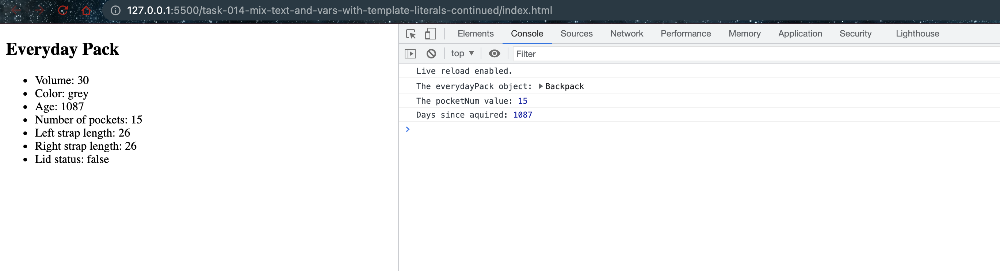

# Mix text and vars with template literals continued

## Code

```javascript
/**
 * Use template literals to output HTML
 * @link https://developer.mozilla.org/en-US/docs/Web/JavaScript/Reference/Template_literals
 *
 */
import Backpack from "./Backpack.js";

const everydayPack = new Backpack(
  "Everyday Pack",
  30,
  "grey",
  15,
  26,
  26,
  false,
  "December 5, 2018 15:00:00 PST"
);

const content = `
  <main>
    <article>
      <h1>${everydayPack.name}</h1>
      <ul>
        <li>Volume: ${everydayPack.volume}</li>
        <li>Color: ${everydayPack.color}</li>
        <li>Age: ${everydayPack.backpackAge()}</li>
        <li>Number of pockets: ${everydayPack.pocketNum}</li>
        <li>Left strap length: ${everydayPack.strapLength.left}</li>
        <li>Right strap length: ${everydayPack.strapLength.right}</li>
        <li>Lid status: ${everydayPack.lidOpen}</li>
      </ul>
    </article>
  </main>
`;

document.body.innerHTML = content;

console.log("The everydayPack object:", everydayPack);
console.log("The pocketNum value:", everydayPack.pocketNum);
console.log("Days since aquired:", everydayPack.backpackAge());
```

## Explaination

This code demonstrates how to use template literals in JavaScript to create a dynamic HTML content. Template literals are a feature in ES6 (a version of JavaScript) that allows you to create strings that can include variables, expressions, multiline strings, and string formatting.

The key feature of template literals is the backtick (` `) character. Anything within the backticks is a part of the template literal.

You can insert variables or expressions into template literals using `${}` syntax. The JavaScript runtime will replace `${}` with the value of the variable or the result of the expression.

In the provided code:

1. An instance of the `Backpack` class is created, called `everydayPack`.

2. A template literal is then created to hold an HTML string. This string contains placeholders for various properties of the `everydayPack` object.

```javascript
const content = `
  <main>
    <article>
      <h1>${everydayPack.name}</h1>
      <ul>
        <li>Volume: ${everydayPack.volume}</li>
        <li>Color: ${everydayPack.color}</li>
        <li>Age: ${everydayPack.backpackAge()}</li>
        <li>Number of pockets: ${everydayPack.pocketNum}</li>
        <li>Left strap length: ${everydayPack.strapLength.left}</li>
        <li>Right strap length: ${everydayPack.strapLength.right}</li>
        <li>Lid status: ${everydayPack.lidOpen}</li>
      </ul>
    </article>
  </main>
`;
```

In this `content` string, each `${}` is replaced with the corresponding value from the `everydayPack` object. For instance, `${everydayPack.name}` is replaced with the name of the backpack, `${everydayPack.volume}` is replaced with the volume, and so on.

3. This `content` string is then set as the HTML content of the `body` element in the HTML document. This is done using the `innerHTML` property of the `body` element: `document.body.innerHTML = content;`. This line effectively populates the body of the webpage with the details of the `everydayPack` object.

This method of using template literals to create dynamic HTML content is often used in JavaScript for creating or updating the DOM (Document Object Model), especially when working with dynamic data.

## Screenshot

- Replacing the body content


