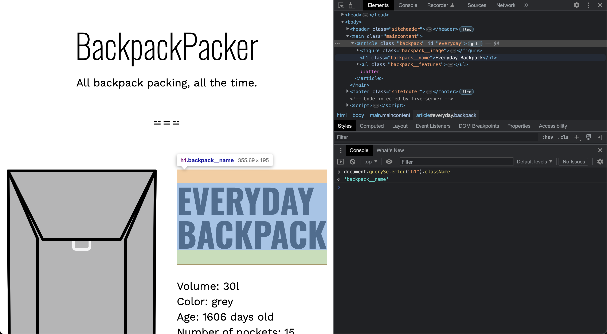
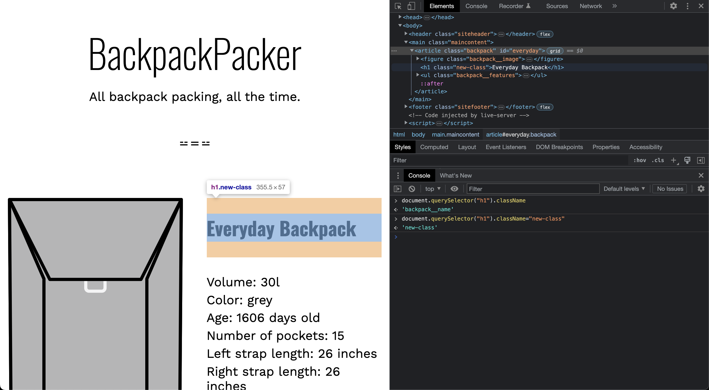
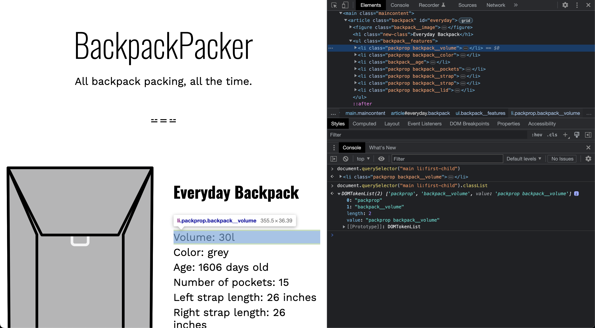
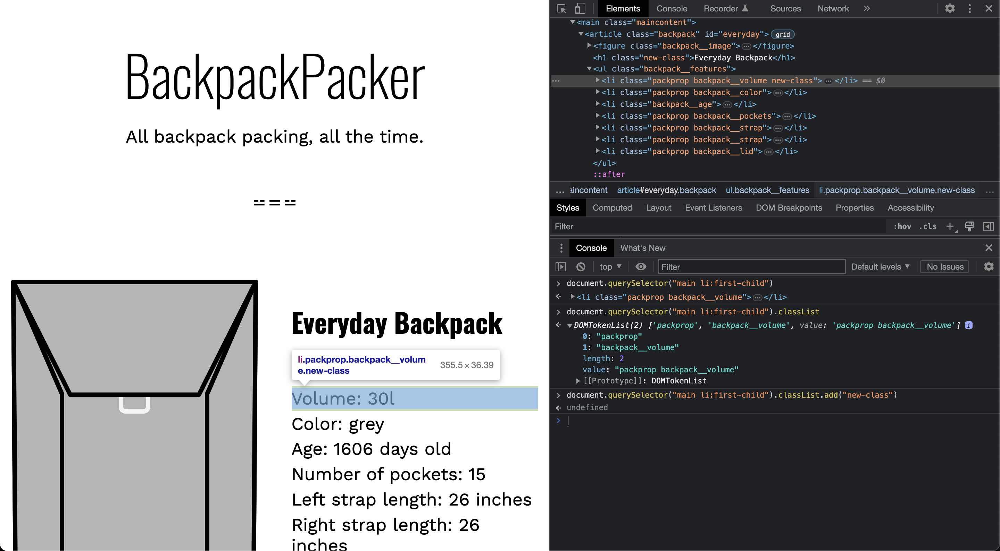
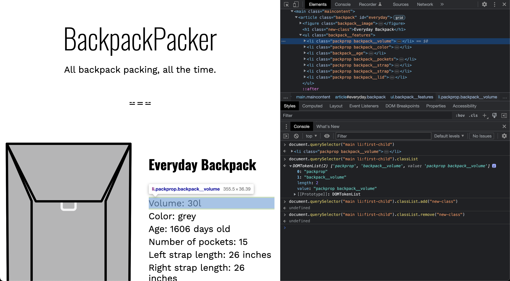
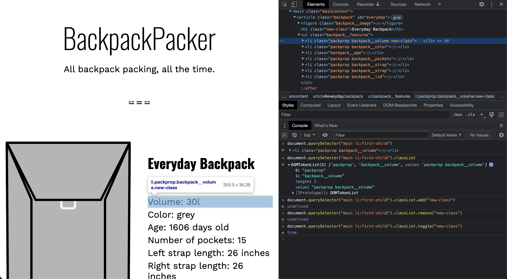
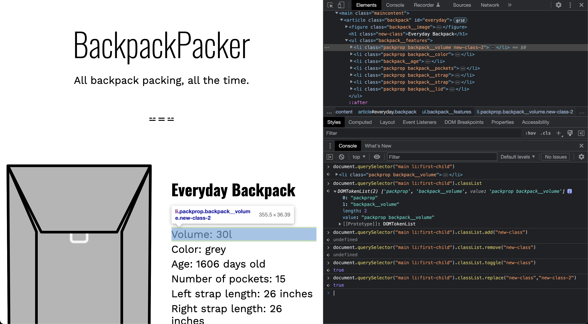

# Modifying Element Classes

- [className](https://developer.mozilla.org/en-US/docs/Web/API/Element/className)
- [classList](https://developer.mozilla.org/en-US/docs/Web/API/Element/classList)

## className

The `className` property of the Element interface gets and sets the value of the `class` attribute of the specified element.

When you get `element.className`, it returns a string representing the class or space-separated classes of the current element.

When you set `element.className`, it replaces all existing classes with the new class or classes.

Here's an example:

```javascript
let element = document.getElementById("myElement");

console.log(element.className); // outputs the current classes, for example: "class1 class2"

element.className = "newClass1 newClass2"; // sets new classes

console.log(element.className); // outputs: "newClass1 newClass2"
```

Note: If you want to manipulate classes without replacing all existing classes, you can use the `classList` property, which provides methods to add, remove, and toggle classes, and check whether an element contains a specific class.

- Let's get the className of `h1` element



- Let's set the className of the same `h1` element



## classList

The `classList` property provides read/write access to the list of classes for a given element. It returns a live `DOMTokenList` collection, which can then be manipulated to add, remove, and toggle classes. 

Here are the primary methods you can use with `classList`:

1. `add(class1, class2, ... , classN)`: Adds specified class values. If these classes already exist in the element's class attribute, they are ignored.

2. `remove(class1, class2, ... , classN)`: Removes specified class values.

3. `item(index)`: Returns the class value by index in the collection.

4. `toggle(class, true|false)`: When only one argument is present, `toggle` will add the class value when it's missing and remove it when it's present. If the optional second argument is `false`, then `remove()` is called, if `true` then `add()` is called.

5. `contains(class)`: Checks if the specified class value exists in the element's class attribute.

6. `replace(oldClass, newClass)`: Replaces an existing class with a new class.

Here's an example:

```javascript
let element = document.getElementById("myElement");

console.log(element.classList); // outputs the DOMTokenList of classes, e.g., ["class1", "class2"]

element.classList.add("newClass"); // adds a new class

console.log(element.classList); // now includes the new class, e.g., ["class1", "class2", "newClass"]

element.classList.remove("class1"); // removes a class

console.log(element.classList); // "class1" is now removed, e.g., ["class2", "newClass"]

console.log(element.classList.contains("class2")); // checks if "class2" is present, returns true or false

element.classList.toggle("class3"); // if "class3" is present, it gets removed; if it's not present, it gets added

console.log(element.classList); // the state of classes after toggle
```

Note that `classList` is a more modern and versatile approach to manipulate classes compared to the `className` property, especially when you want to add or remove classes without affecting existing classes.

- Let's get the `classList` for the element `main li:first-child`



- Let's add a new class `new-class` to the same element



- Let's remove the newly added class `new-class`



- Let's toggle the class `new-class`, if it's not there it will get added, if it's there, it will get removed



- Let's replace the `new-class` with `new-class-2`


