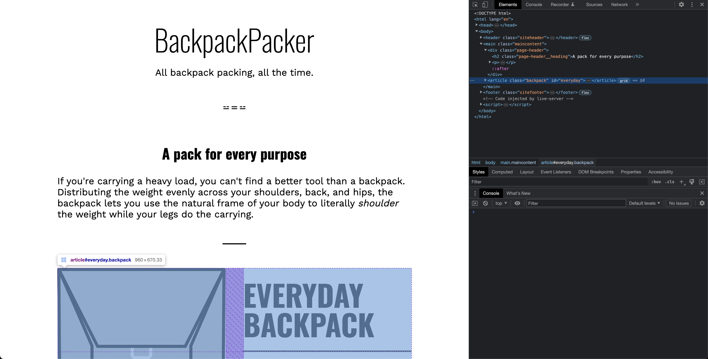

# Add Dom Element

- [createElement()](https://developer.mozilla.org/en-US/docs/Web/API/Document/createElement)

The createElement() method is a built-in method in the Document object of the Web API in JavaScript. It creates a new HTML element with the specified tag name and returns a reference to the newly created element.

- [append()](https://developer.mozilla.org/en-US/docs/Web/API/Element/append)

The append() method is a part of the DOM (Document Object Model) API in JavaScript. It is used to insert a set of Node objects or DOMString objects after the last child of the Element.

- [prepend](https://developer.mozilla.org/en-US/docs/Web/API/Element/prepend)
- [appendChild](https://developer.mozilla.org/en-US/docs/Web/API/Node/appendChild)
- [replaceChild](https://developer.mozilla.org/en-US/docs/Web/API/Node/replaceChild)
- [insertBefore](https://developer.mozilla.org/en-US/docs/Web/API/Node/insertBefore)
- [insertAdjacentElement](https://developer.mozilla.org/en-US/docs/Web/API/Element/insertAdjacentElement)

## Code

```javascript
const main = document.querySelector(".maincontent");

const newArticle = document.createElement("article");
newArticle.classList.add("backpack");
newArticle.setAttribute("id", "everyday");
newArticle.innerHTML = content;

main.append(newArticle);
```

## Explaination

This JavaScript code is manipulating the Document Object Model (DOM) to add a new `article` element to a webpage. 

Let's break down each line of this code:

1. `const main = document.querySelector(".maincontent");`

   This line is selecting the first element in the document with the class "maincontent" and assigns it to the variable `main`. If there's no such element, `main` will be `null`.

2. `const newArticle = document.createElement("article");`

   Here, a new `article` element is created and assigned to the `newArticle` variable.

3. `newArticle.classList.add("backpack");`

   This line is adding the class "backpack" to the `newArticle` element. After this operation, the `newArticle` would look like `<article class="backpack"></article>` in HTML.

4. `newArticle.setAttribute("id", "everyday");`

   Here, the code sets an attribute `id` with the value "everyday" to the `newArticle` element. Now, the `newArticle` would look like `<article class="backpack" id="everyday"></article>` in HTML.

5. `newArticle.innerHTML = content;`

   The `innerHTML` property is being used to set the HTML content of the `newArticle` element. The `content` variable, which is not defined in your provided code, is supposed to contain a string of HTML.

6. `main.append(newArticle);`

   Finally, this line appends the `newArticle` element to the `main` element. If `main` is not `null`, then the `newArticle` will be added at the end of all other content inside the `main` element.

So in summary, this script creates a new `article` HTML element with the class "backpack", id "everyday", and some HTML content, then appends this new article element to the end of the element with class "maincontent".

## Examples

- After adding dom element


