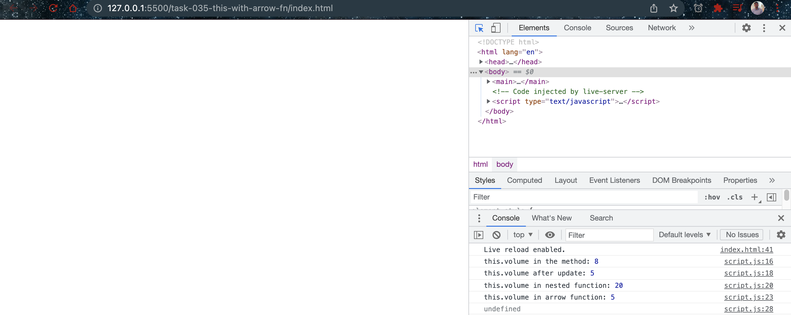

# This with arrow function

- [this_and_arrow_functions](https://developer.mozilla.org/en-US/docs/Web/JavaScript/Reference/Functions/Arrow_functions#this_and_Arrow_Functions)
- [this](https://developer.mozilla.org/en-US/docs/Web/JavaScript/Reference/Operators/this)

## Javascript Code

```javascript
// Define a default volume for the window (the entire DOM):
window.volume = 20;

const greenPack = {
  name: "Frog Pack",
  color: "green",
  volume: 8,
  pocketNum: 3,
  newVolume: function (volume) {
    console.log("this.volume in the method:", this.volume);
    this.volume = volume;
    console.log("this.volume after update:", this.volume);
    (function () {
      console.log("this.volume in nested function:", this.volume);
    })();
    (() => {
      console.log("this.volume in arrow function:", this.volume);
    })();
  },
};

console.log(greenPack.newVolume(5));
```

## Explaination

The updated code includes an additional arrow function that is used to demonstrate how arrow functions help with scoping. The output of the code is:

```bash
this.volume in the method: 8
this.volume after update: 5
this.volume in nested function: 20
this.volume in arrow function: 5
undefined
```

The first three lines of the output are the same as in the previous example, where the "newVolume" method of the "greenPack" object is called with a value of 5, which updates the volume property of the object from 8 to 5. Inside the nested function that is defined using a regular function expression, "this" refers to the global "window" object, which has a default volume value of 20.

However, in the new code, there is an additional arrow function that is defined inside the "newVolume" method using the arrow function syntax. Arrow functions do not create a new scope, and instead inherit the scope from the surrounding code block. Therefore, inside the arrow function, "this" refers to the "greenPack" object, which has a volume property that was updated to 5. This is why the output of the arrow function logs the updated value of "this.volume", which is 5.

The last line of the output logs "undefined" because the "newVolume" method does not return any value explicitly.

## Screenshots


