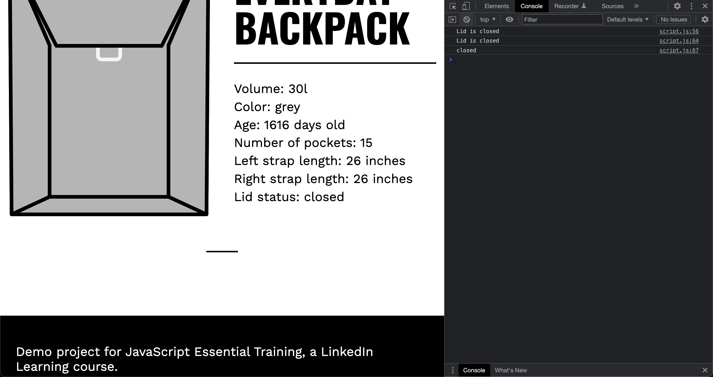
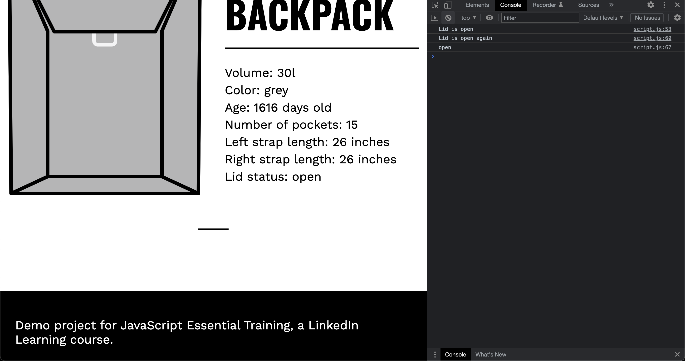

# If else and ternary conditional

- [createElement](https://developer.mozilla.org/en-US/docs/Web/API/Document/createElement)
- [append](https://developer.mozilla.org/en-US/docs/Web/API/ParentNode/append)
  
## Javascript Code

```javascript
import Backpack from "./Backpack.js";

const everydayPack = new Backpack(
  "Everyday Backpack",
  30,
  "grey",
  15,
  26,
  26,
  false,
  "December 5, 2018 15:00:00 PST",
  "./.images/everyday.svg"
);

const content = `
    <figure class="backpack__image">
      
    </figure>
    <h1 class="backpack__name">${everydayPack.name}</h1>
    <ul class="backpack__features">
      <li class="feature backpack__volume">Volume:<span> ${everydayPack.volume
  }l</span></li>
      <li class="feature backpack__color">Color:<span> ${everydayPack.color
  }</span></li>
      <li class="feature backpack__age">Age:<span> ${everydayPack.backpackAge()} days old</span></li>
      <li class="feature backpack__pockets">Number of pockets:<span> ${everydayPack.pocketNum
  }</span></li>
      <li class="feature backpack__strap">Left strap length:<span> ${everydayPack.strapLength.left
  } inches</span></li>
      <li class="feature backpack__strap">Right strap length:<span> ${everydayPack.strapLength.right
  } inches</span></li>
      <li class="feature backpack__lid">Lid status:<span> ${everydayPack.lidOpen ? "open" : "closed"
  }</span></li>
    </ul>
  `;

const main = document.querySelector(".maincontent");

const newArticle = document.createElement("article");
newArticle.classList.add("backpack");
newArticle.setAttribute("id", "everyday");
newArticle.innerHTML = content;

main.append(newArticle);

if (everydayPack.lidOpen === true) {
  console.log("Lid is open");
}
else {
  console.log("Lid is closed");
}

if (everydayPack.lidOpen) {
  console.log("Lid is open again");
}

else {
  console.log("Lid is closed");
}

console.log(everydayPack.lidOpen ? "open" : "closed");
```

## Explaination

In JavaScript, conditionals are used to execute code based on whether a certain condition is true or false. One of the most common conditional statements is the "if-else" statement, which checks if a certain condition is true, and if it is not, it executes the code inside the "else" block.

In the example code, there are two "if-else" statements that check whether the "lidOpen" property of the "everydayPack" object is true or false. The first "if-else" statement prints out "Lid is open" if the "lidOpen" property is true, and "Lid is closed" if it is false. The second "if-else" statement does the same thing, but uses the shorthand notation for checking a boolean value - it checks whether the "lidOpen" property is truthy, and if it is, it prints out "Lid is open again". Otherwise, it prints out "Lid is closed".

Another way to write this shorthand notation is by using the ternary operator, which is a shorthand way to write "if-else" statements that only have one line of code in each block. In the example code, the ternary operator is used to print out "open" if the "lidOpen" property is true, and "closed" if it is false. The ternary operator looks like this: 

```javascript
everydayPack.lidOpen ? "open" : "closed"
```

This means that if the "lidOpen" property is truthy (i.e. it is not false, 0, null, undefined, NaN, or an empty string), then "open" will be returned. Otherwise, "closed" will be returned.

## Screenshots

- When object is

```javascript
const everydayPack = new Backpack(
  "Everyday Backpack",
  30,
  "grey",
  15,
  26,
  26,
  false,
  "December 5, 2018 15:00:00 PST",
  "./.images/everyday.svg"
);
```



- When object is

```javascript
const everydayPack = new Backpack(
  "Everyday Backpack",
  30,
  "grey",
  15,
  26,
  26,
  true,
  "December 5, 2018 15:00:00 PST",
  "./.images/everyday.svg"
);
```


