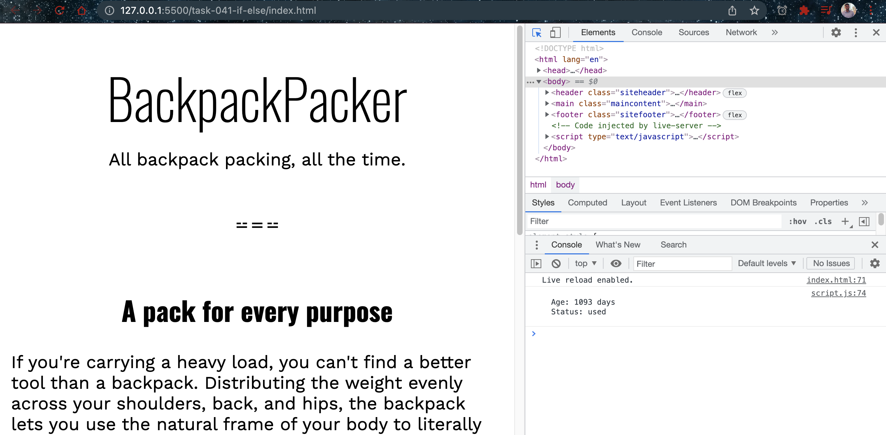

# Issue with too many if-else

## Javascript Code

```javascript
const usedStatus = () => {
  let age = everydayPack.backpackAge();
  let description;
  if (age >= 30) {
    if (age >= 365) {
      if (age >= 1095) {
        description = "old";
      } else {
        description = "used";
      }
    } else {
      description = "lightly used";
    }
  } else {
    description = "new";
  }

  console.log(`
  Age: ${age} days
  Status: ${description}
  `);
};

usedStatus()
```

## Explainaiton

The provided JavaScript code defines a function named `usedStatus` that determines the status of the backpack based on its age. Here's a breakdown of the code:

1. The `usedStatus` function is declared using an arrow function syntax `() => { ... }`.

2. Inside the function, the `age` variable is assigned the value of `everydayPack.backpackAge()`, which represents the age of the backpack.

3. The `description` variable is declared without an initial value.

4. The code utilizes nested `if` statements to determine the appropriate description based on the backpack's age.

5. If the `age` is greater than or equal to 30 days, the code further evaluates the age to determine the description.

6. If the `age` is greater than or equal to 365 days (1 year), it checks if it is also greater than or equal to 1095 days (3 years). If it is, the `description` is set to "old". Otherwise, if it is less than 1095 days, the `description` is set to "used".

7. If the `age` is less than 365 days, the `description` is set to "lightly used".

8. If the `age` is less than 30 days, the `description` is set to "new".

9. The final `console.log` statement outputs the `age` and `description` values using template literals.

10. Finally, the `usedStatus` function is invoked with `usedStatus()`.

When the code is executed, it calculates the backpack's age, determines the appropriate description based on the age ranges, and logs the age and status to the console.

## Screenshots


