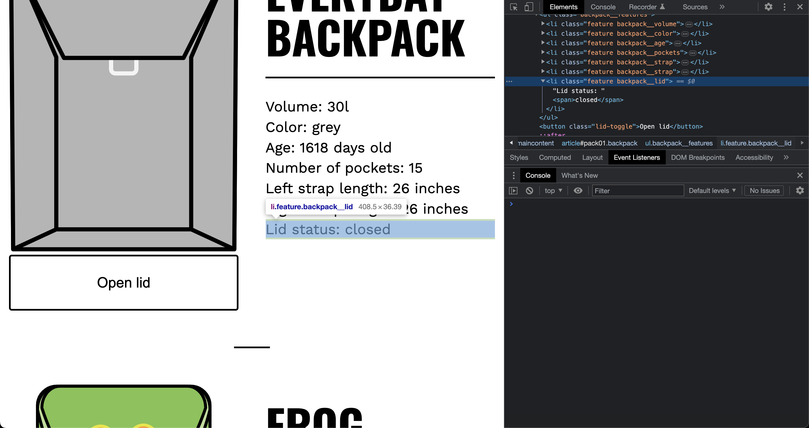
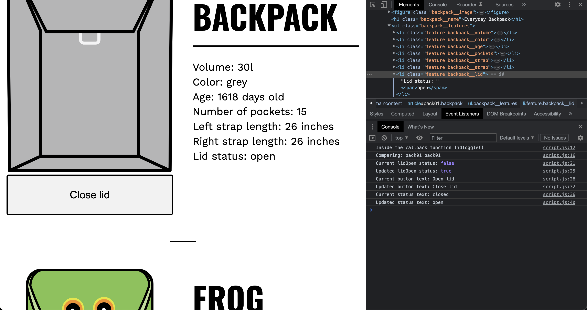
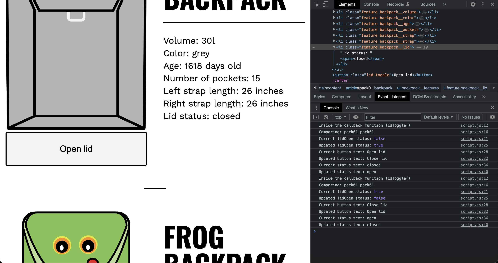

# Advanced Event Listners And This

Let's break down the `lidToggle` function step by step:

```javascript
const lidToggle = function () {
  console.log("Inside the callback function lidToggle()");

  // Find the current backpack object in backpackObjectArray
  let backpackObject = backpackObjectArray.find(({ id }) => {
    console.log("Comparing:", id, this.parentElement.id);
    return id === this.parentElement.id;
  });
```

- The function `lidToggle` is defined as an anonymous function assigned to the variable `lidToggle`.
- The first console.log statement simply logs a message indicating that we are inside the callback function.
- `backpackObject` is declared as a variable using the `let` keyword. It is assigned the result of `backpackObjectArray.find()`, which finds the first object in `backpackObjectArray` that satisfies the condition provided as a callback function.
- Inside the callback function of `find()`, a console.log statement is added to log the values being compared: `id` from the current object and `this.parentElement.id`, which refers to the ID of the parent element of the button that triggered the event.
- The callback function returns `true` when the `id` matches, and this object is assigned to `backpackObject`.

```javascript
  // Toggle lidOpen status
  console.log("Current lidOpen status:", backpackObject.lidOpen);
  backpackObject.lidOpen == true
    ? (backpackObject.lidOpen = false)
    : (backpackObject.lidOpen = true);
  console.log("Updated lidOpen status:", backpackObject.lidOpen);
```

- The current status of `lidOpen` property in `backpackObject` is logged to the console.
- The `lidOpen` property is toggled using a conditional (ternary) operator. If the current value is `true`, it is set to `false`, and vice versa.
- The updated value of `lidOpen` is logged to the console.

```javascript
  // Toggle button text
  console.log("Current button text:", this.innerText);
  this.innerText == "Open lid"
    ? (this.innerText = "Close lid")
    : (this.innerText = "Open lid");
  console.log("Updated button text:", this.innerText);
```

- The current text of the button is logged to the console.
- The text of the button is toggled using a conditional (ternary) operator. If the current text is "Open lid", it is set to "Close lid", and vice versa.
- The updated text of the button is logged to the console.

```javascript
  // Set visible property status text
  let status = this.parentElement.querySelector(".backpack__lid span");
  console.log("Current status text:", status.innerText);
  status.innerText == "closed"
    ? (status.innerText = "open")
    : (status.innerText = "closed");
  console.log("Updated status text:", status.innerText);
};
```

- A variable `status` is declared using the `let` keyword. It is assigned the result of `this.parentElement.querySelector(".backpack__lid span")`, which selects the `<span>` element inside the parent element of the button with the class "backpack__lid".
- The current text of the status is logged to the console.
- The text of the status is toggled using a conditional (ternary) operator. If the current text is "closed", it is set to "open", and vice versa.
- The updated text of the status is logged to the console.

The `lidToggle` function is responsible for toggling the `lidOpen` status of a backpack object, updating the button text, and updating the status text. It uses

## Explaination

The provided code demonstrates the use of event listeners to handle the "click" event on a button element with the class "lid-toggle". Here's a detailed explanation of the code:

1. The code imports an array of backpack objects from a separate module using the statement `import backpackObjectArray from "./components/data.js";`.

2. The code defines a function named `lidToggle`. This function serves as the callback function for the click event on the "lid-toggle" button. It performs the following tasks:
   - It finds the corresponding backpack object in the `backpackObjectArray` by matching the `id` of the clicked button's parent element (`this.parentElement.id`).
   - It toggles the `lidOpen` property of the backpack object. If it was `true`, it sets it to `false`, and vice versa.
   - It toggles the text content of the button element between "Open lid" and "Close lid".
   - It sets the text content of the `status` element (the span inside the backpack article) to "open" if it was "closed", and vice versa.

3. The code then maps over the `backpackObjectArray` to create a new array of backpack articles. For each backpack object, it creates an article element, sets its attributes and content using template literals, and assigns the `lidToggle` function as the event listener for the button click event.

4. Finally, the code selects the main content container using `document.querySelector(".maincontent")` and appends each backpack article to it using `main.append(backpack)`.

In summary, the code creates a list of backpack articles dynamically and adds a "lid-toggle" button to each article. Clicking the button triggers the `lidToggle` function, which updates the corresponding backpack object's `lidOpen` property, toggles the button's text, and updates the status text in the backpack article.

## Screenshots

- Before doing anything



- Click on `Open Lid` button



- Now click on `Close Lid`


