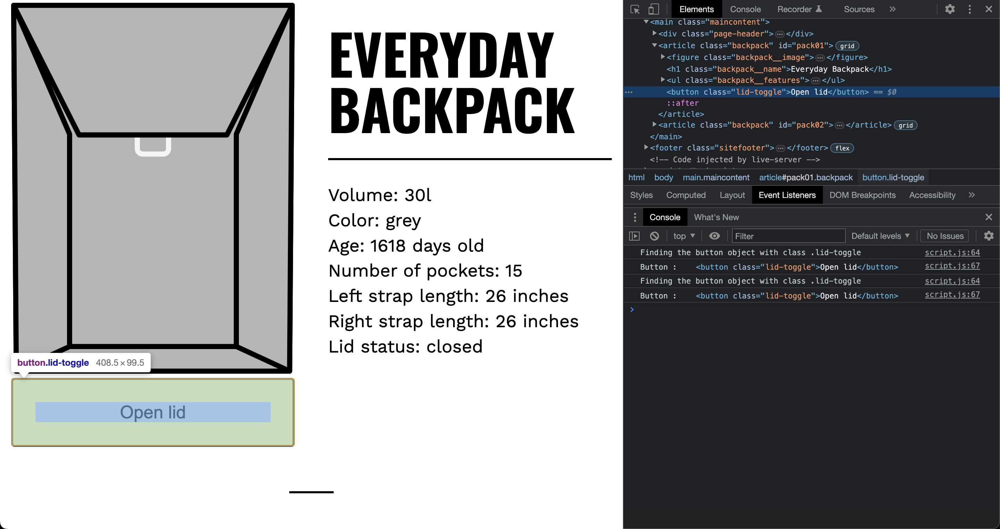
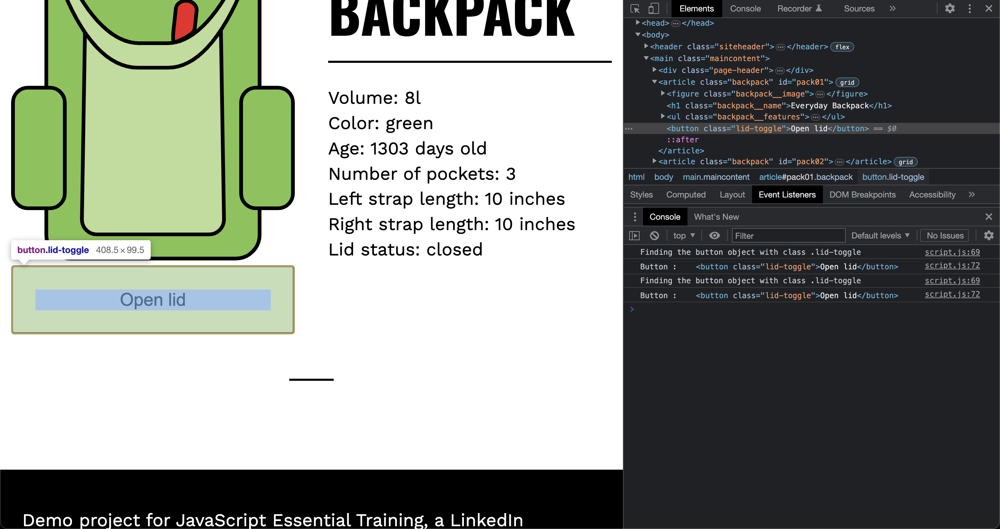
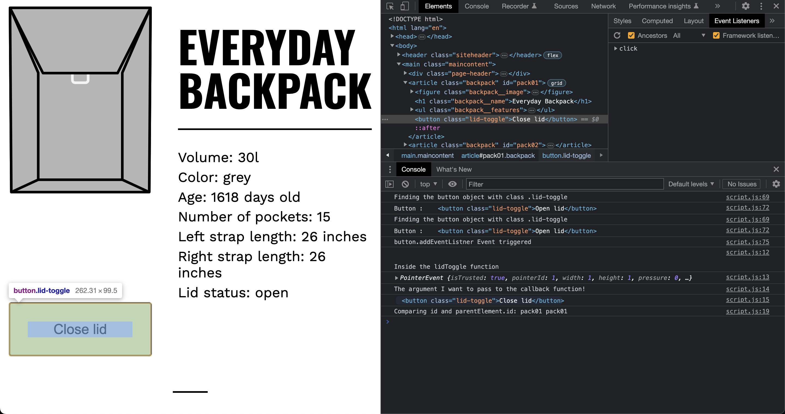
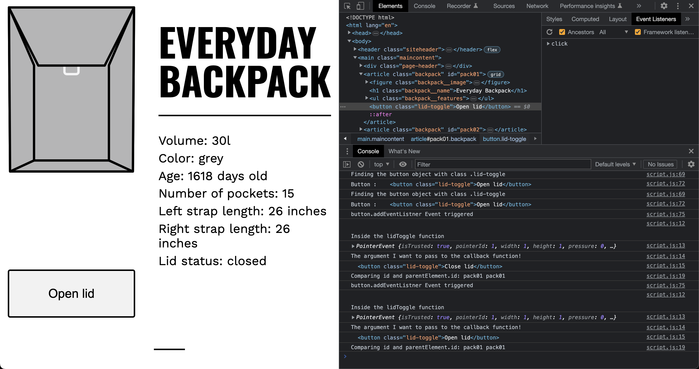

# Pass Argument Through Event Listners Updated

## Javascript Code

- Adding console.log to the following

```javascript
 console.log("Finding the button object with class .lid-toggle")
  let button = backpackArticle.querySelector(".lid-toggle");
  let newArg = "The argument I want to pass to the callback function!"
  console.log("Button : ", button);
  // Add event listener
  button.addEventListener("click", (event) => {
    console.log("button.addEventListner Event triggered")
    lidToggle(event, button, newArg)
  })
```

The output appears twice because there are two elements with the class "lid-toggle" in the HTML code. This causes the event listener to be attached to both elements, resulting in the callback function (lidToggle) being executed twice when either of the buttons is clicked.




- The `lidToggle` function

```javascript
const lidToggle = function (event, button, newArg) {
  console.log("\n\nInside the lidToggle function");
  console.log(event);
  console.log(newArg);
  console.log(button);

  // Find the current backpack object in backpackObjectArray
  let backpackObject = backpackObjectArray.find(({ id }) => {
    console.log("Comparing id and parentElement.id:", id, this.parentElement.id);
    return id === this.parentElement.id;
  });

  // Toggle lidOpen status
  backpackObject.lidOpen == true
    ? backpackObject.lidOpen = false
    : backpackObject.lidOpen = true;

  // Toggle button text
  button.innerText == "Open lid"
    ? button.innerText = "Close lid"
    : button.innerText = "Open lid";

  // Set visible property status text
  let status = button.parentElement.querySelector(".backpack__lid span");
  status.innerText == "closed"
    ? (status.innerText = "open")
    : (status.innerText = "closed");
}
```

- After clicking on `Open Lid`



- After clicking on `Close Lid`


