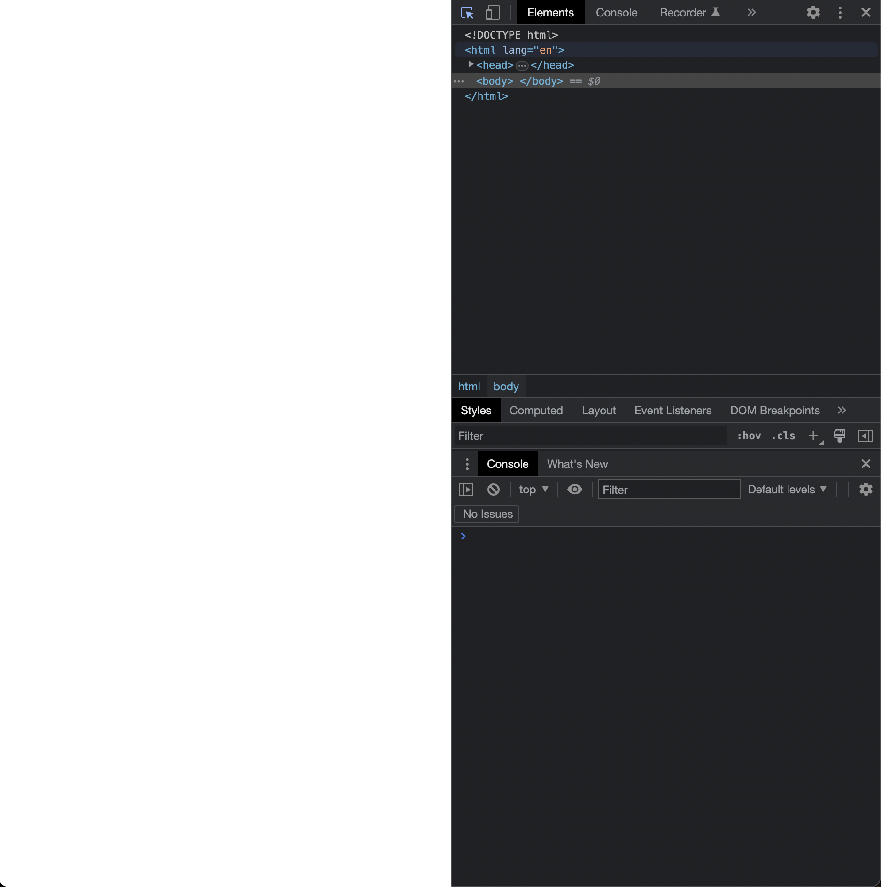
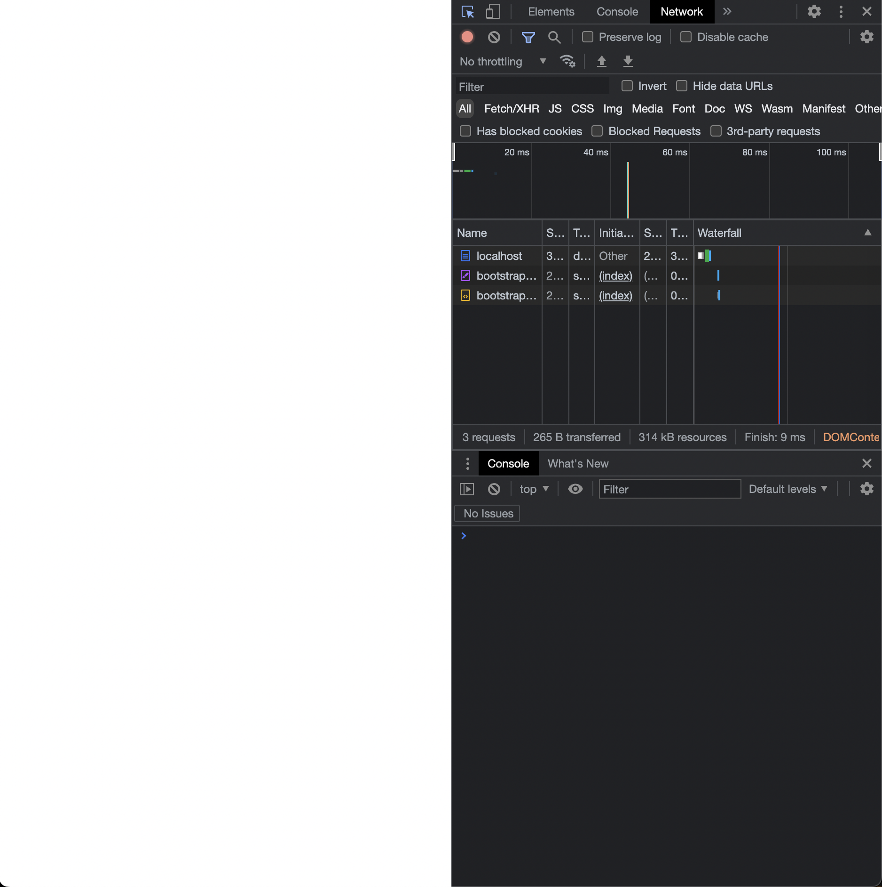
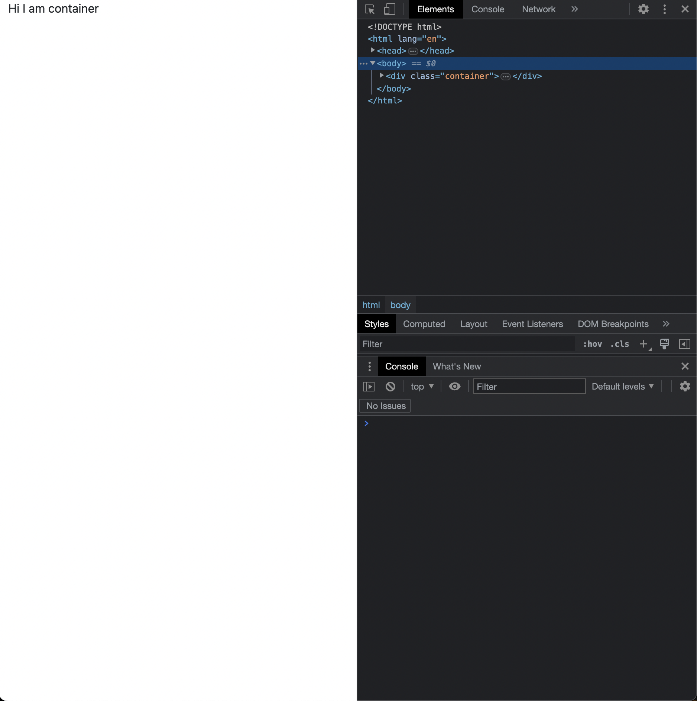
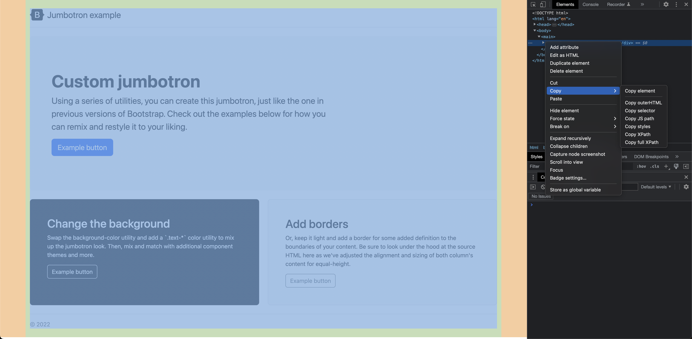
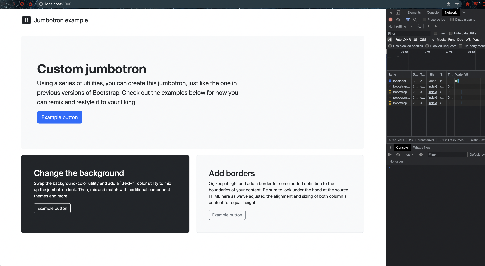
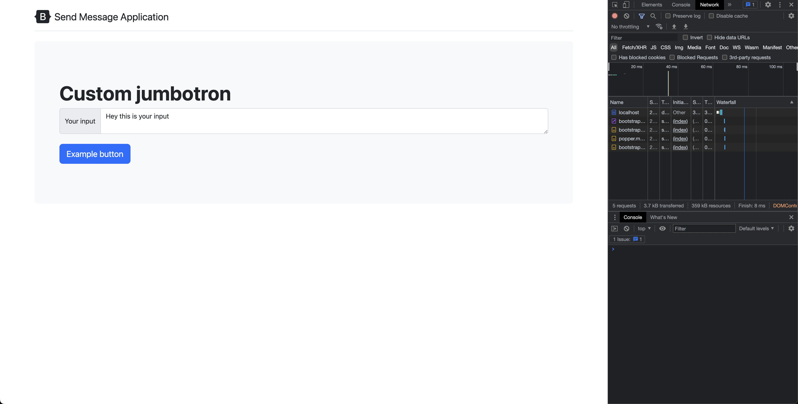
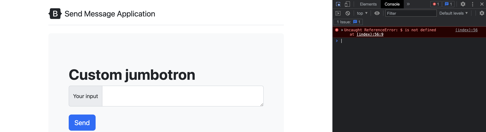
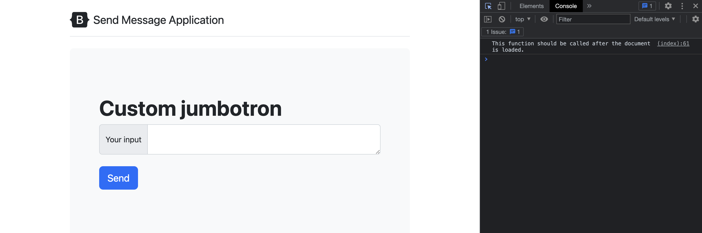
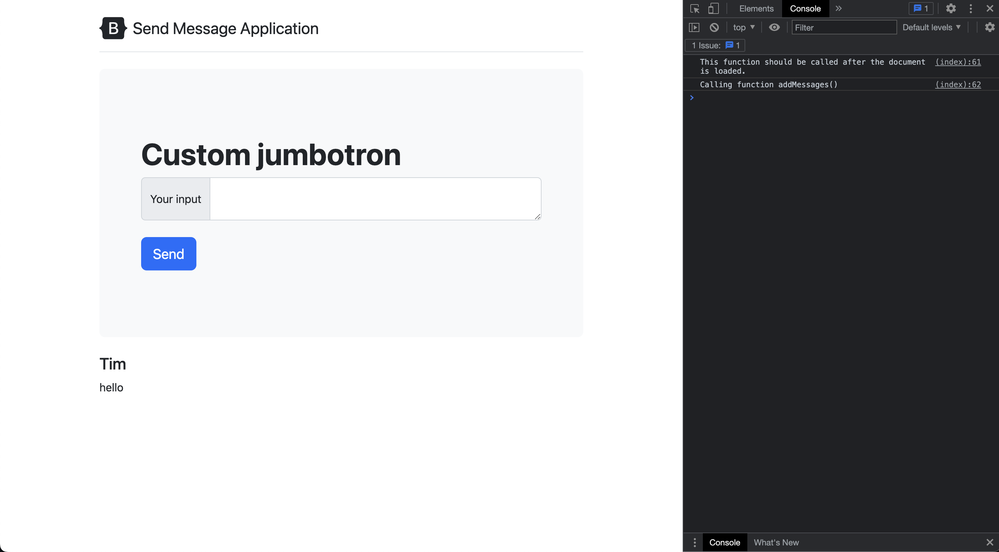
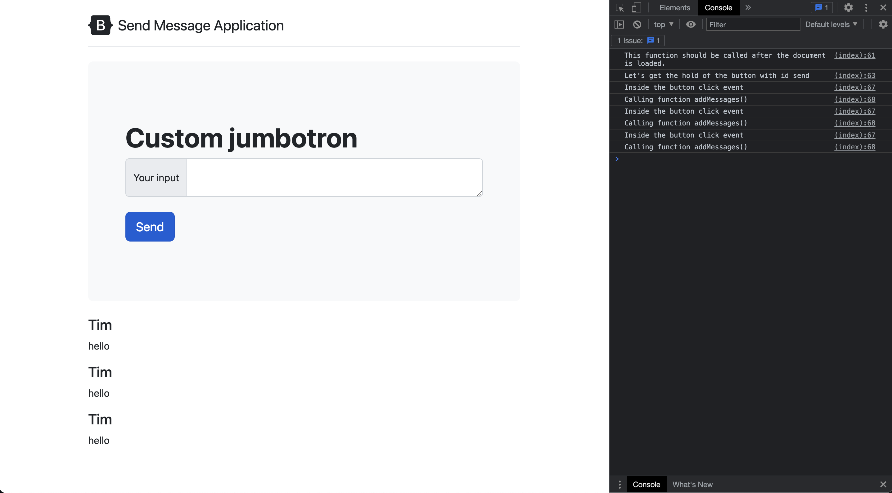

# Create Browser App

- [Bootstrap - v5.3](https://getbootstrap.com/docs/5.3/getting-started/introduction/)
- [containers](https://getbootstrap.com/docs/5.3/layout/containers/)
- [jumbotron](https://getbootstrap.com/docs/5.3/migration/#jumbotron)
- [input](https://getbootstrap.com/docs/5.2/forms/input-group/#basic-example)

- [releases.jquery.com](https://releases.jquery.com)

## Explaination

The provided code is an HTML file that includes Bootstrap and jQuery libraries. It also contains a custom JavaScript script that adds messages to a designated HTML element.

Let's break down the code step by step:

- The HTML file includes the necessary meta tags, title, and external CSS and JavaScript files. It loads the Bootstrap CSS file and three JavaScript files: Bootstrap bundle, Popper.js, and jQuery.

- Inside the `body` tag, there is a container with various elements. The `header` section includes a Bootstrap logo and the title "Send Message Application."

- The `div` with the class `p-5 mb-4 bg-light rounded-3` represents a custom jumbotron. It contains a heading, an input group with a textarea, and a button.

- There is an empty `div` with the id `messages`. This is where the JavaScript script will append messages.

- The JavaScript script starts with a jQuery function that executes when the document is loaded. It logs a message to the console and calls the `addMessages` function.

- The `addMessages` function takes a message object as a parameter and appends the name and message to the `#messages` element using jQuery's `append` method. It uses template literals to construct the HTML markup.

Overall, this code sets up a basic HTML structure, includes necessary libraries, and provides a JavaScript function to dynamically add messages to the page.

## Snippet and Explaination

```html
            <div id="messages">

            </div>
        </div>
    </body>
    <script>
        // JQuery
        $(
            () => {
                console.log("This function should be called after the document is loaded.")
                console.log("Calling function addMessages()")
                addMessages(
                    {
                        name: 'Tim',
                        message: 'hello'
                    }
                )
            }
        )

        // Function to add messages
        function addMessages(message) {
            $("#messages").append(
                `
                    <h4> ${message.name} </h4>
                    <p> ${message.message} </p>
                `
            )

        }
    </script>
```

The section you highlighted is responsible for adding messages dynamically to the HTML page.

Here's how it works:

1. The HTML code includes an empty `div` element with the id `messages`: `<div id="messages"></div>`. This is the designated area where the messages will be added.

2. The JavaScript code within the `<script>` tags uses jQuery to manipulate the HTML DOM. It first waits for the document to be fully loaded using `$(...)`, which is a shorthand for `$(document).ready(...)`.

3. Once the document is loaded, the function specified as the argument for `$(...)` is executed. In this case, it logs a message to the console and then calls the `addMessages` function.

4. The `addMessages` function is defined below within the `<script>` tags. It takes a `message` object as a parameter, which should have `name` and `message` properties.

5. Inside the `addMessages` function, the jQuery selector `$("#messages")` is used to target the `div` element with the id `messages`.

6. The `append` method is then called on the selected `div` element, adding HTML markup to it. The markup includes an `<h4>` element with the `name` property of the `message` object and a `<p>` element with the `message` property.

7. The template literals (`${...}`) are used to dynamically insert the values from the `message` object into the HTML markup.

In summary, when the document is loaded, the `addMessages` function is called and it appends a new message to the `div` element with the id `messages`. This allows for dynamic updating of the messages displayed on the page.

## Code

- Create simple index.html



- Adding `javascript` and `css` CDN links



```html
    <link href="https://cdn.jsdelivr.net/npm/bootstrap@5.3.0-alpha3/dist/css/bootstrap.min.css" rel="stylesheet" integrity="sha384-KK94CHFLLe+nY2dmCWGMq91rCGa5gtU4mk92HdvYe+M/SXH301p5ILy+dN9+nJOZ" crossorigin="anonymous">

    <script src="https://cdn.jsdelivr.net/npm/bootstrap@5.3.0-alpha3/dist/js/bootstrap.bundle.min.js" integrity="sha384-ENjdO4Dr2bkBIFxQpeoTz1HIcje39Wm4jDKdf19U8gI4ddQ3GYNS7NTKfAdVQSZe" crossorigin="anonymous"></script>

```

- Add `Popper` and JS separately

- Add container

```html
        <div class="container">
            <!-- Content here -->
            Hi I am container
        </div>
```



- Copy `jumbotron` from the website



- How it looks after copying



- Adding the input



- Adding Jquery

```html
    <script>
        // JQuery
        $(
            () => {
                console.log("This function should be called after the document is loaded.")
            }
        )
    </script>
```

- This gives error that `$ is undefined` 



- After adding `jquery` CDN URL

```html
        <script src="https://code.jquery.com/jquery-3.7.0.slim.min.js"
            integrity="sha256-tG5mcZUtJsZvyKAxYLVXrmjKBVLd6VpVccqz/r4ypFE=" crossorigin="anonymous"></script>
```



- Calling function `addMessages` and appending to `div`



- Finally let's display the message when anyone clicks on Send button
  

