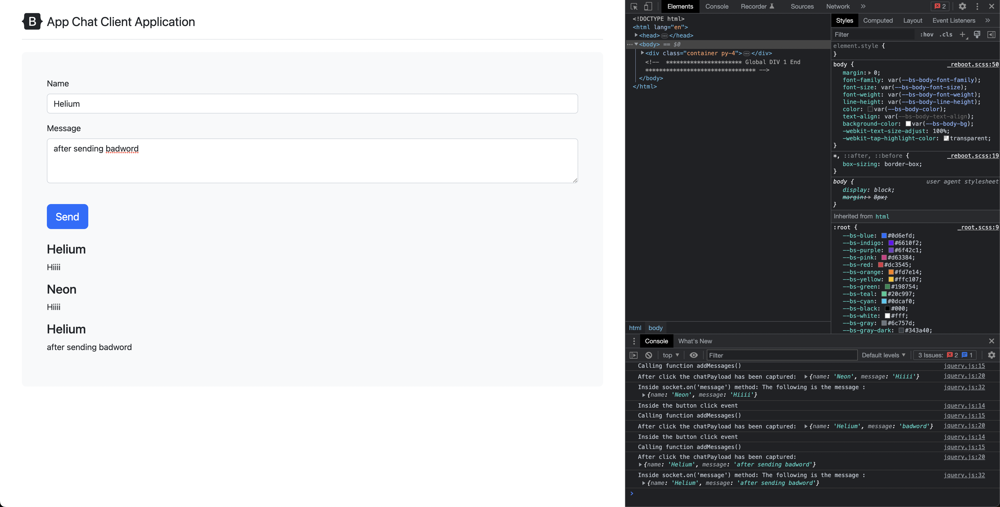

# Async Await

## What does async do?

The `async` keyword is used to define an asynchronous function in JavaScript. When a function is declared with `async`, it automatically returns a promise. Inside an asynchronous function, you can use the `await` keyword to pause the execution of the function until a promise is resolved or rejected. 

Here are the key points about `async` functions:

1. **Asynchronous Execution**: By declaring a function as `async`, you indicate that it contains asynchronous operations. Asynchronous operations are tasks that may take some time to complete, such as making network requests or querying a database.

2. **Promise-based**: The `async` function automatically wraps its return value in a promise. This allows you to use `await` within the function to handle promises in a more readable and sequential manner, without explicitly chaining `.then()` and `.catch()`.

3. **Awaiting Promises**: The `await` keyword is used within an `async` function to pause the execution until a promise is resolved or rejected. It can only be used inside an `async` function. When `await` is used with a promise, it suspends the execution of the function and waits for the promise to settle. Once settled, it either returns the resolved value or throws an error if the promise is rejected.

4. **Error Handling**: `async` functions simplify error handling by allowing you to use regular `try/catch` blocks to handle exceptions. Errors thrown within the `try` block can be caught and handled in the corresponding `catch` block, making error handling more intuitive and centralized.

Using `async` and `await` together can greatly improve the readability and maintainability of asynchronous code by providing a more sequential and synchronous-like style of programming while still leveraging the power of promises and non-blocking operations.

## Code

In the updated implementation:

```javascript
app.post('/messages', async (req, res) => {
  var messageModelObject = new messageModel(req.body);

  var savedMessage = await messageModelObject.save();
  console.log("Message has been saved successfully in the database");

  var censored = await messageModel.findOne({ message: 'badword' });

  if (censored) {
    console.log("Censored word found in the message: ", censored);
    removeCensoredMessage = await messageModel.findByIdAndDelete(censored._id);
    console.log("Censored message has been removed from the database");
  } else {
    io.emit('message', req.body);
  }

  res.sendStatus(200);
});
```

The key improvement is the use of `async/await` syntax instead of chained `.then()` and `.catch()` promises. This leads to more readable and concise code. Here's how the updated code is better:

1. **Readability**: The code reads more linearly, resembling synchronous code, which is easier to understand and reason about.

2. **Error handling**: With `async/await`, error handling becomes straightforward using `try/catch` blocks. Any error thrown within the `try` block will be caught in the corresponding `catch` block, allowing for centralized error handling.

3. **Simpler flow**: The code follows a more direct flow of execution. After saving the message, it immediately proceeds to check for a censored word. If a censored word is found, it removes it from the database. Otherwise, it emits the message through `io.emit()`. The response is sent with a status code of 200 in either case.

Overall, the updated implementation using `async/await` enhances code readability and simplifies error handling, making it easier to understand and maintain.

## Screenshots


