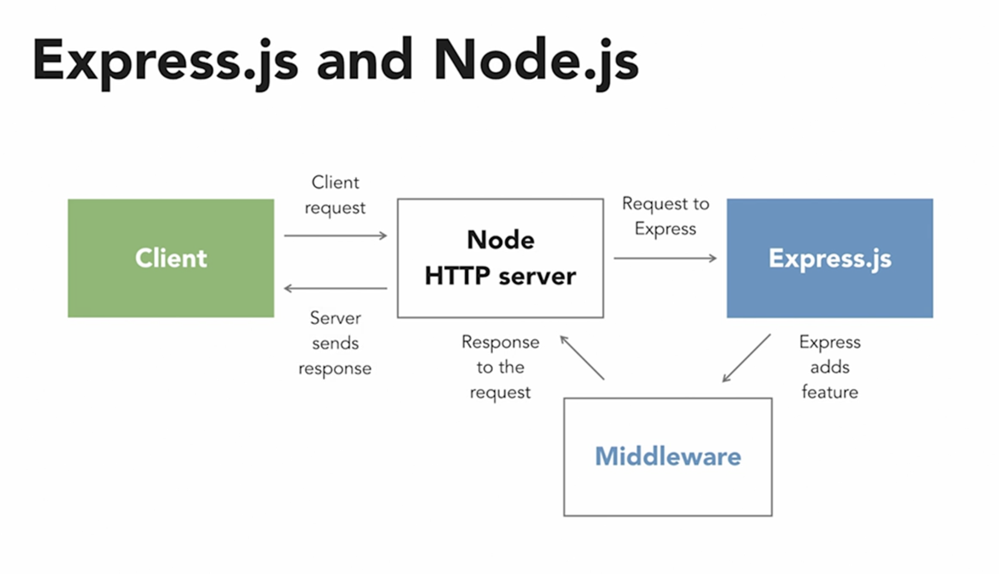
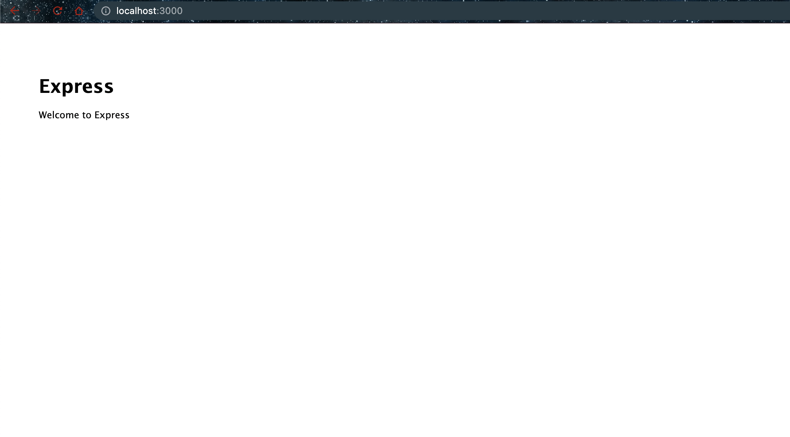

# Create express server

- Started using this initially [Express Essential Training](https://www.linkedin.com/learning/express-essential-training-14539342/getting-started-server-and-project-setup?autoplay=true&resume=false). But later found that the course was different i.e. [building-a-website-with-node-js-and-express-js-3](https://www.linkedin.com/learning/building-a-website-with-node-js-and-express-js-3/create-an-express-server-in-three-minutes?autoplay=true&resume=false).
This course will be seen at the end of ReadMe.md file.

## Express and Nodejs



## Create app using Express Application Generator

```bash
$ mkdir express && cd express
.
$ npm init -y
.
$ npm install express-generator
.
$ npm audit fix --force
.
$ npm audit fix --force
.
$ find . -name express
./node_modules/.bin/express
./node_modules/express-generator/bin/express

## Similarly you can install globally

$ npm install -g express-generator
.
$ which express
/opt/homebrew/bin/express
$ ls -ltrh /opt/homebrew/bin/express
lrwxr-xr-x  1 username  admin    56B May 28 14:42 /opt/homebrew/bin/express -> ../lib/node_modules/express-generator/bin/express-cli.js

$ express -h
.

$ express --view=hbs myapp

   create : myapp/
   create : myapp/public/
   create : myapp/public/javascripts/
   create : myapp/public/images/
   create : myapp/public/stylesheets/
   create : myapp/public/stylesheets/style.css
   create : myapp/routes/
   create : myapp/routes/index.js
   create : myapp/routes/users.js
   create : myapp/views/
   create : myapp/views/error.hbs
   create : myapp/views/index.hbs
   create : myapp/views/layout.hbs
   create : myapp/app.js
   create : myapp/package.json
   create : myapp/bin/
   create : myapp/bin/www

   change directory:
     $ cd myapp

   install dependencies:
     $ npm install

   run the app:
     $ DEBUG=myapp:* npm start

$ cd myapp
.

$ npm install
$ npm audit fix --force

$ DEBUG=myapp:* npm start

> myapp@0.0.0 start
> node ./bin/www

  myapp:server Listening on port 3000 +0ms
GET / 200 49.072 ms - 204
GET /stylesheets/style.css 200 2.792 ms - 111
GET /favicon.ico 404 3.943 ms - 2207
GET / 200 4.132 ms - 204
GET /stylesheets/style.css 200 0.967 ms - 111
GET /favicon.ico 404 3.666 ms - 2207
```

- Hitting [localhost:3000](http://localhost:3000) will give you the following



## Create App by yourself (not using application generator)

- Run

```bash
$ mkdir express-essentials && cd express-essentials
.
$ npm init -y
.
$ npm install express
.
$ npm install nodemon --save-dev

# Add the following in package.json
# @babel/core @babel/cli @babel/preset-env @babel/node to run ES6 code
# These packages are often used in development environments for working with modern JavaScript (ES6 and beyond) in applications
$ npm install --save-dev @babel/core @babel/cli @babel/preset-env @babel/node
```

- Create .babelrc file

```json
{
  "presets": [
    "@babel/preset-env"
  ]
}
```

The `.babelrc` file is a configuration file for Babel, a popular JavaScript compiler used to convert modern JavaScript (ES6 and beyond) into backward compatible versions of JavaScript that can run in older environments.

The configuration file in your question specifies a single preset: `@babel/preset-env`.

1. `"presets": ["@babel/preset-env"]`: This line is instructing Babel to use the `@babel/preset-env` preset for transforming the code.

- Change package.json file and add

```json
"type": "module",
```

The `"type": "module"` line in the `package.json` file is a relatively recent addition to Node.js, and it tells Node.js to treat `.js` files as ES Modules (ESM), as opposed to the traditional CommonJS (CJS) modules. 

In Node.js, the module system that has been in use for a long time is CommonJS. This is the module system that uses `require()` to load other JavaScript files or modules. For example: 

```javascript
const express = require('express');
```

However, in newer versions of JavaScript (ES6/ES2015 and later), a new module system was introduced, called ES Modules, which uses `import` and `export` syntax. For example:

```javascript
import express from 'express';
```

Adding `"type": "module"` to your `package.json` informs Node.js that it should parse all `.js` files as ES Modules by default. This is particularly useful if you want to write your Node.js code using ES6+ `import`/`export` syntax instead of `require()`.

```json
"scripts": {
  "start": "nodemon --experimental-modules --exec babel-node index.js"
}
```

This line is a part of the `scripts` section of a `package.json` file in a Node.js project. The `scripts` section is a place to define shortcut commands that you can use with `npm run`.

Here, a `start` script is defined, which can be run by typing `npm start` in the terminal. The command that gets run when you do this is:

`nodemon --experimental-modules --exec babel-node index.js`

Let's break this command down:

- `nodemon`: This is a utility that automatically restarts your Node.js application whenever files in the application are updated. This is extremely useful in a development environment, as it saves you from having to manually stop and restart your server every time you make a change.

- `--experimental-modules`: This is a flag that was used in versions of Node.js prior to version 14 to enable support for ES Modules (the `import`/`export` syntax). From Node.js 14 onwards, this flag is no longer needed as ES Modules are supported by default. However, when using Babel, you might still need to use this flag.

- `--exec babel-node`: This tells nodemon to execute the script using `babel-node` instead of `node`. Babel is a JavaScript compiler that lets you use next generation JavaScript, today. It converts the newer ES6 JavaScript code into ES5 code (older standard), which can be run in environments that do not support ES6 features natively. `babel-node` is a CLI that works exactly the same as the Node.js CLI, but with the added benefit of compiling with Babel presets and plugins before running it.

- `index.js`: This is the entry point to your application — the main JavaScript file that gets executed when you start your app.

In summary, `npm start` (which runs the command in question) will start the application, using nodemon to automatically restart the server whenever files change, and using Babel to allow for the use of ES6 syntax in your application.

- Create index.js file

```javascript
import express from 'express';

const app = express();

const PORT = 3000;

app.listen(PORT, () => {
    console.log(`Express server listening on port ${PORT}!`);
});
```

- Run the app

```bash
$ npm start                                                                  

> express-essentials@1.0.0 start
> nodemon --experimental-modules --exec babel-node index.js

[nodemon] 2.0.22
[nodemon] to restart at any time, enter `rs`
[nodemon] watching path(s): *.*
[nodemon] watching extensions: js,mjs,json
[nodemon] starting `babel-node --experimental-modules index.js`
Express server listening on port 3000!
```

## Create express server in 3 minutes as per course

- [building-a-website-with-node-js-and-express-js-3](https://www.linkedin.com/learning/building-a-website-with-node-js-and-express-js-3/create-an-express-server-in-three-minutes?autoplay=true&resume=false)

```bash
$ mkdir website
.
$ cd website
.
$ npm init -y
.
$ npm install express
.
```

- Create server.js file

```javascript
const express = require('express');

const app = express();

const port = 3000;

app.get('/', (request, response) => {
    response.send('Hello, world!');
}
);

app.listen(port, () => {
    console.log(`Server is listening on port ${port} Ready to accept requests!`);
}
);
```

- Run the app

```bash
$ node server.js
Server is listening on port 3000 Ready to accept requests!
```

- Test the server

```bash
$ curl http://localhost:3000
Hello, world!
```

