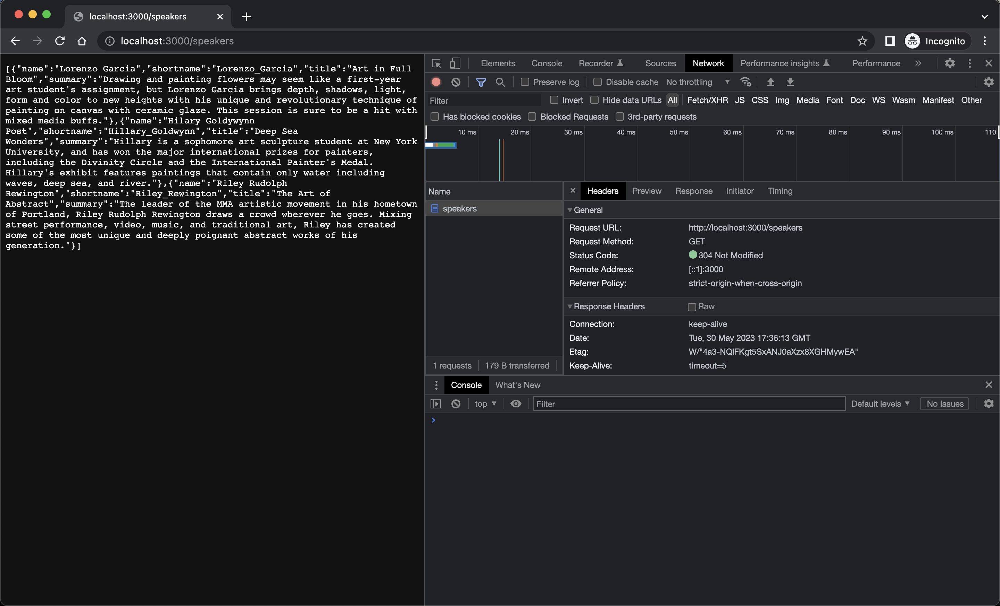
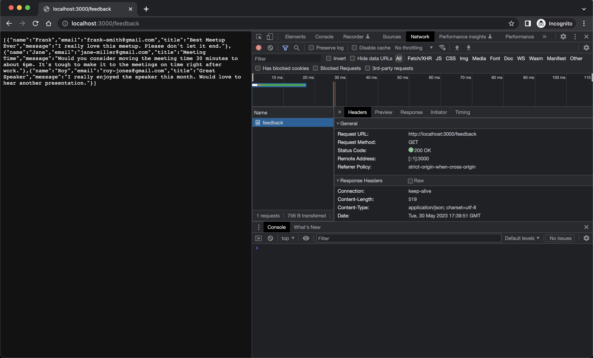

# Add business logic

- Running following

```bash
$ npm run dev

> website@1.0.0 dev
> nodemon --ignore feedback.json server.js

[nodemon] 2.0.22
[nodemon] to restart at any time, enter `rs`
[nodemon] watching path(s): *.*
[nodemon] watching extensions: js,mjs,json
[nodemon] starting `node server.js`
Server is listening on port 3000 Ready to accept requests!
```

- Validate

```bash
curl localhost:3000/speakers
[{"name":"Lorenzo Garcia","shortname":"Lorenzo_Garcia","title":"Art in Full Bloom","summary":"Drawing and painting flowers may seem like a first-year art student's assignment, but Lorenzo Garcia brings depth, shadows, light, form and color to new heights with his unique and revolutionary technique of painting on canvas with ceramic glaze. This session is sure to be a hit with mixed media buffs."},{"name":"Hilary Goldywynn Post","shortname":"Hillary_Goldwynn","title":"Deep Sea Wonders","summary":"Hillary is a sophomore art sculpture student at New York University, and has won the major international prizes for painters, including the Divinity Circle and the International Painter's Medal. Hillary's exhibit features paintings that contain only water including waves, deep sea, and river."},{"name":"Riley Rudolph Rewington","shortname":"Riley_Rewington","title":"The Art of Abstract","summary":"The leader of the MMA artistic movement in his hometown of Portland, Riley Rudolph Rewington draws a crowd wherever he goes. Mixing street performance, video, music, and traditional art, Riley has created some of the most unique and deeply poignant abstract works of his generation."}]
```



- testing the feedback endpoint

```bash
$ curl localhost:3000/feedback
[{"name":"Frank","email":"frank-smith@gmail.com","title":"Best Meetup Ever","message":"I really love this meetup. Please don't let it end."},{"name":"Jane","email":"jane-miller@gmail.com","title":"Meeting Time","message":"Would you consider moving the meeting time 30 minutes to about 6pm. It's tough to make it to the meetings on time right after work."},{"name":"Roy","email":"roy-jones@gmail.com","title":"Great Speaker","message":"I really enjoyed the speaker this month. Would love to hear another presentation."}]
```

