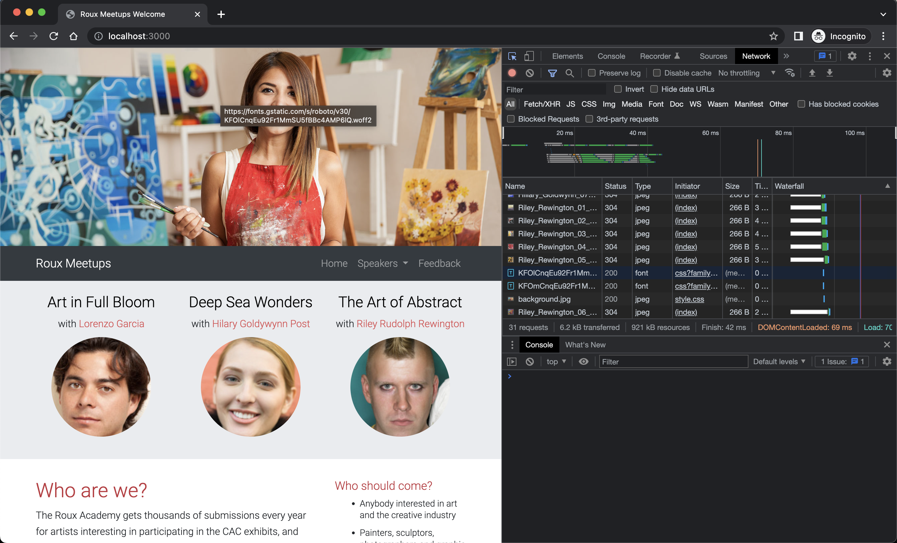

# Create a site-wide layout

- Create a folder `layouts` in the `views` folder

```bash
$ mkdir views/layouts
.
# copy the index.ejs file to the layouts folder
$ cp views/index.ejs views/layouts
.
# add the overall layout in the views/layouts/index.ejs file
# add the content to views/pages/index.ejs
```

- change the relative path in views/layouts/index.ejs

```html
<script src="/js/pixgrid.js"></script>
```

- Now include `views/pages/index.ejs` in `views/layouts/index.ejs` by using

```html
    <%- include(`../pages/${template}`) %>
```

- Also change the render function in routes/index.js

```javascript
  router.get('/', (request, response) => {
    if (!request.session.visitcount) {
      request.session.visitcount = 0;
    }
    request.session.visitcount += 1;
    /* eslint-disable no-console */
    console.log(`Number of visits: ${request.session.visitcount}`);
    response.render('layout', { pageTitle: 'Welcome', template: 'index' });
  });
```

- Run

```bash
$ npm run dev

> website@1.0.0 dev
> nodemon --ignore feedback.json server.js

[nodemon] 2.0.22
[nodemon] to restart at any time, enter `rs`
[nodemon] watching path(s): *.*
[nodemon] watching extensions: js,mjs,json
[nodemon] starting `node server.js`
Server is listening on port 3000 Ready to accept requests!
Number of visits: 11
Number of visits: 1
Number of visits: 2
```

- Open the browser and go to [http://localhost:3000](http://localhost:3000)
  You should see the same page as before


