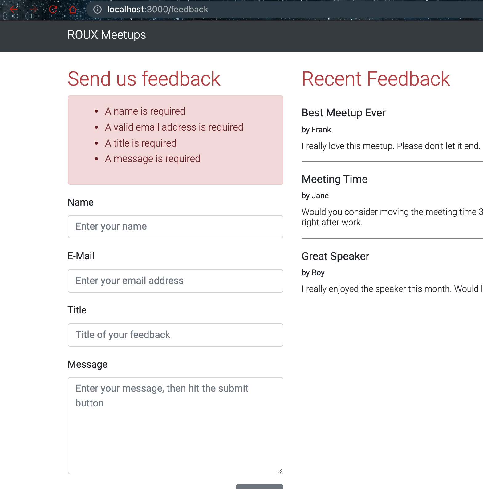
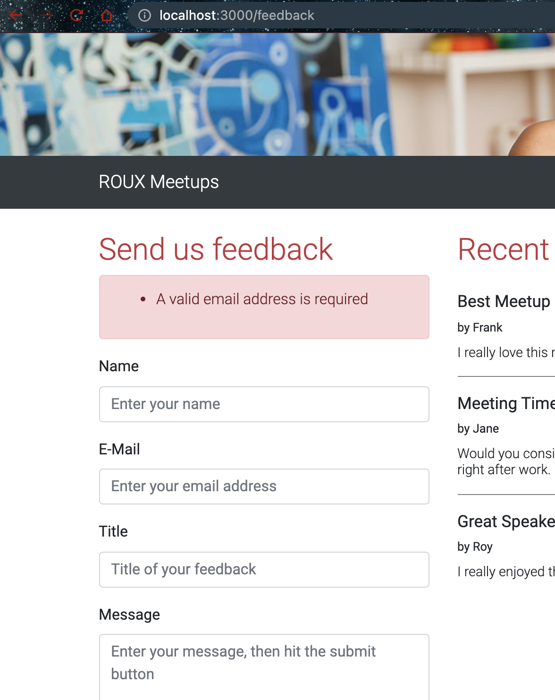

# Validating and Sanitizing User Input

- Install express validator

```bash
$ npm install express-validator

added 337 packages, and audited 338 packages in 3s

58 packages are looking for funding
  run `npm fund` for details

found 0 vulnerabilities
```

- Clicking on submit without entering anything



- Giving invalid email address


