# The Intro Section

- Version Info

```bash
$ showenv
node: v19.8.0
npm: 9.5.1
yarn: 1.22.19
```

- Start the intro section section

```html
        <section id="home" class="intro-section">
            <div class="container">
                <div class="row">
                    <div class="col-md-6 intros">
                        <h1 class="display-2">
                            <span class="display-2--intro">Hey!, I'm Ankit</span>
                            <span class="display-2--description">This is a multipurpose responsive layout created with
                                bootstrap v5.3</span>
                        </h1>
                        <button type="button" class="rounded-pill btn-rounded">Get in Touch
                            <span><i class="fas fa-arrow-right"></i></span>
                        </button>
                    </div>
                    <div class="col-md-6 intros"></div>
                </div>
            </div>
        </section>
```


- Add more styling by adding file `_typography.scss`

```scss
@use '../custom' as *; // Importing everything from the 'custom' SCSS file.
.display-2 {  // Defining a class named 'display-2'.
    margin-bottom: 1rem; // Applying a bottom margin of 1rem to this class.
    text-transform: capitalize; // Transforming the text to capitalize the first letter of each word.
    &--intro { // Defining a modifier class 'display-2--intro' for 'display-2'.
        display: inline-block; // Making the element with this class display as an inline-block.
        font-weight: 700; // Setting the font weight to 700, making it bold.
    }
    &--description { // Defining a modifier class 'display-2--description' for 'display-2'.
        font-size: 1rem; // Setting the font size to 1rem.
        display: block; // Making the element with this class display as a block, occupying the full width of its parent container.
    }
}
```

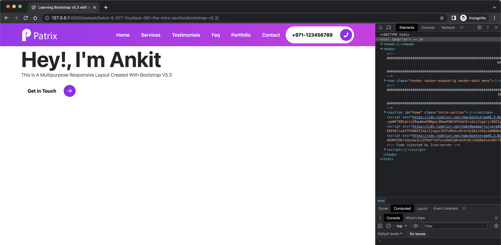

- Add more styling by updating file `_intro-section.scss`

```scss
@use '../custom' as *; // Importing everything from the 'custom' SCSS file.
@use '../components/mixins' as *; // Importing everything from the 'mixins' SCSS file.

.intro-section { // Defining a class named 'intro-section'.
    @include gradient; // Including a mixin named 'gradient' that defines a gradient style.
    padding: 10rem 0 0 0; // Applying padding of 10rem to the top and no padding to the right, bottom and left sides.
    width: 100%; // Setting the width of the element with this class to 100% of the parent container's width.
    height: 100%; // Setting the height of the element with this class to 100% of the parent container's height.
}
```


- Add shadow in navbar by adding classes `shadow` and `fixed-top` in `nav` tag

```html
        <nav class="navbar navbar-expand-lg navbar-dark menu shadow fixed-top">
```

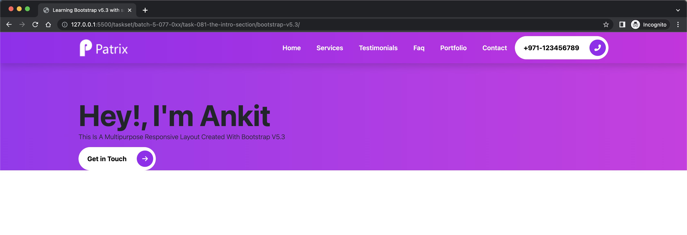

- Get font's from [fonts.google.com/specimen/Poppins?query=poppins](https://fonts.google.com/specimen/Poppins?query=poppins) and add in `index.html`
  
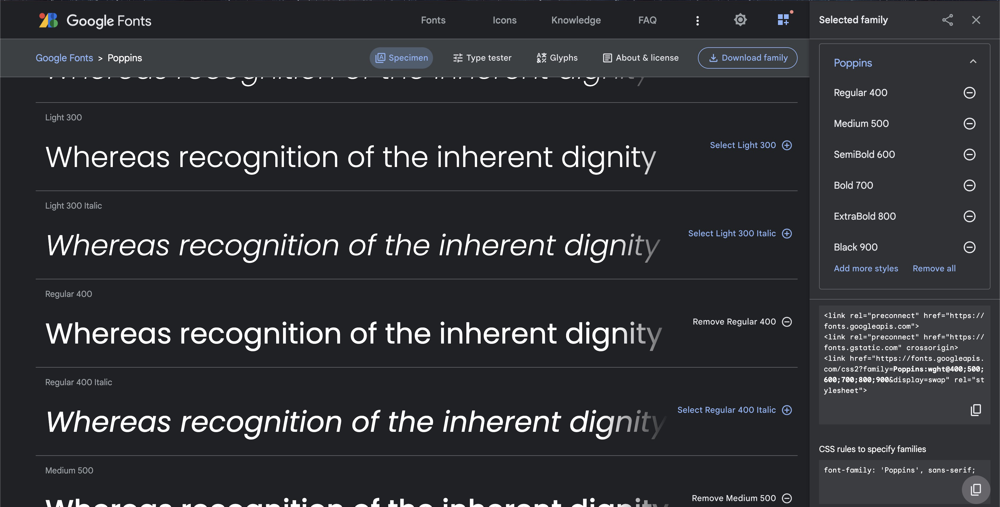

```html
...
        <link rel="preconnect" href="https://fonts.googleapis.com">
        <link rel="preconnect" href="https://fonts.gstatic.com" crossorigin>
        <link href="https://fonts.googleapis.com/css2?family=Poppins:wght@400;500;600;700;800;900&display=swap"
            rel="stylesheet">
     </head>
     <body>
...
         <section id="home" class="intro-section">
...
                <div class="row align-items-center text-white">
```

- Add more styling by updating file `_typography.scss` and `index.html`

```scss
 .display-2 {  // Defining a class named 'display-2'.
  ...
    font-family: 'Poppins', sans-serif; // Setting the font family to 'Poppins' and sans-serif as a fallback.
     &--intro { // Defining a modifier class 'display-2--intro' for 'display-2'.
      ...
        font-family: 'Poppins', sans-serif; // Setting the font family to 'Poppins' and sans-serif as a fallback.
      ...
   }
    &--description {
      ...
        margin-top: 1.2rem; 
        ...
    }
 }
```

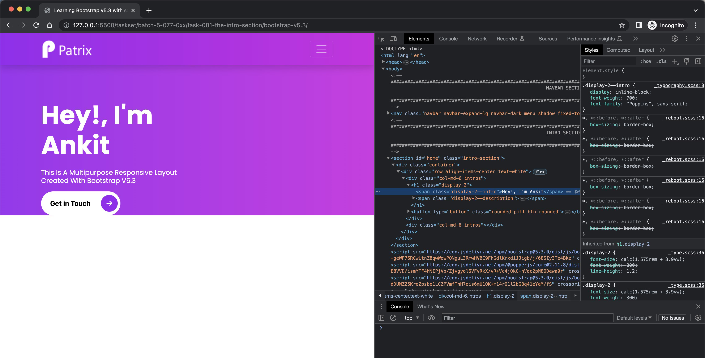

- Do more styling by adding `lh-base` class in `index.html`

```html
                            <span class="display-2--description lh-base">This is a multipurpose responsive layout
                                created with
                                bootstrap v5.3</span>
```

- also in `_typography.scss`

```scss
    &--description {
        ...
        line-height: 1.5; // Setting the line height to 1.5.
        text-transform: none; // Transforming the text to none.
    }
```

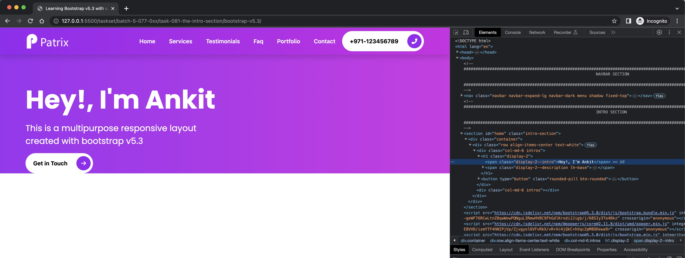

- Create folder `images/arts`

```bash
$ mkdir -p images/arts
.
```

- Get you image [https://www.manypixels.co/gallery](https://www.manypixels.co/gallery). Don't forget to change the color to #BB6EF5 as per our theme.


- Download and copy to `images/arts` folder

- Changes in `index.html`

```html
<!-- START THE CONTENT FOR THE INTRO -->
                    <!-- START THE CONTENT FOR THE VIDEO -->
                    <div class="col-md-6 intros">
                        <div class="video-box">
                            
                        </div>
                    </div>

```

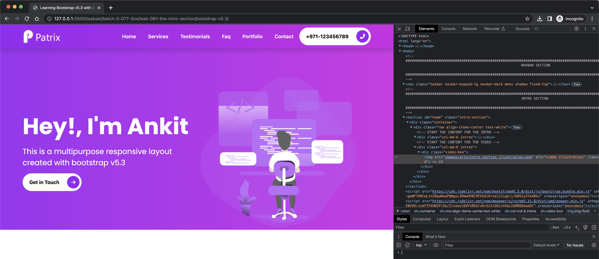

- Start adding the play button, move image to the end

```html
    <div class="col-md-6 intros text-end">
...
            <a href="#">
                <span>
                    <i class="fas fa-play"></i>
                </span>
            </a>
```

- changes in _intro-section.scss

```scss
...
.intros { // Defines a class 'intros'.
    
    .video-box { // Inside 'intros', defines another class 'video-box'.
        position: relative; // Positions '.video-box' relative to its normal position.
        a { // Targets anchor tags '<a>' within '.video-box'.
            position: absolute; // Positions '<a>' absolutely within '.video-box'.
            span { // Targets '<span>' tags within '<a>'.

                i { // Targets '<i>' tags within '<span>'.
                    font-size: 6rem; // Sets the font size of text within '<i>' tags to 6rem.
                    color: $black; // Sets the color of text within '<i>' tags to black, as defined by the $black variable.
                }
            }
        }
    }
}
```

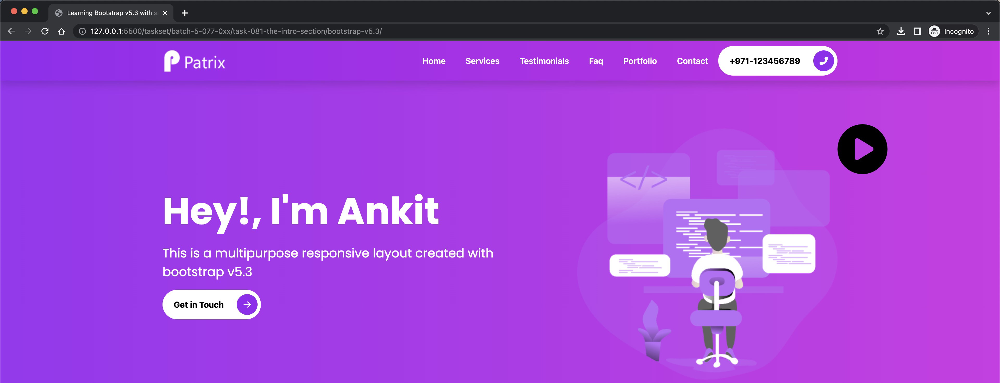

- Checkout the positioning doc here [utilities/position/#position-values](https://getbootstrap.com/docs/5.3/utilities/position/#position-values)

- Move the circle to the center and change it's color to $secondary

- Changes in `_mixins.scss`


```scss
@mixin absoluteCenter { // Defining a mixin named 'absoluteCenter'.
    position: absolute; // The element is positioned relative to the nearest positioned ancestor (instead of positioned relative to the viewport).
    top: 50%; // Position the element 50% down from the top of its container.
    left: 50%; // Position the element 50% across from the left of its container.
    transform: translate(-50%, -50%); // Moves the element back along the x and y axis by 50%, effectively centering the element within its container.
}
```

- Changes in `_intro-section.scss`

```scss
...
        a { // Targets anchor tags '<a>' within '.video-box'.

            @include absoluteCenter; // Includes a mixin named 'absoluteCenter' that defines a style for absolute centering.
...
            span { // Targets '<span>' tags within '<a>'.

                i { // Targets '<i>' tags within '<span>'.
...
                    color: $secondary; // Sets the color of text within '<i>' tags to black, as defined by the $secondary variable.
                }
            }
        }
```

- Validate the changes by opening `index.html` in browser


- Achieving the same position in center by using changes in `index.html`

```html
                            <a href="#" class="position-absolute top-50 start-50 translate-middle">
```

- Changes in `_intro-section.scss`

```scss
            // @include absoluteCenter; // Includes a mixin named 'absoluteCenter' that defines a style for absolute centering.
```


- Let's introduce some waves using [https://getwaves.io/](https://getwaves.io/)

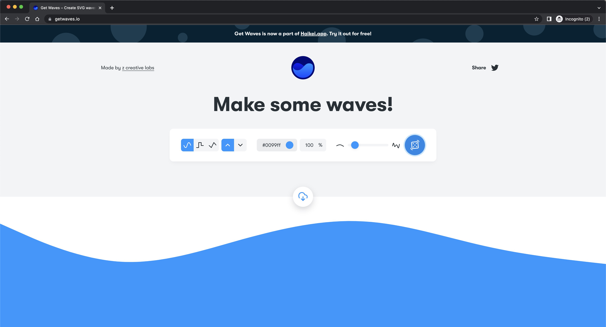

- copy svg code and change color to #ffffff

```html
</div>
<svg xmlns="http://www.w3.org/2000/svg" viewBox="0 0 1440 320"><path fill="#ffffff" fill-opacity="1" d="M0,64L48,85.3C96,107,192,149,288,154.7C384,160,480,128,576,101.3C672,75,768,53,864,58.7C960,64,1056,96,1152,117.3C1248,139,1344,149,1392,154.7L1440,160L1440,320L1392,320C1344,320,1248,320,1152,320C1056,320,960,320,864,320C768,320,672,320,576,320C480,320,384,320,288,320C192,320,96,320,48,320L0,320Z"></path></svg>
```

- You should be able to see the waves now


- Create a circle around the playbutton

- Changes in `_intro-section.scss`

```scss
.border-animation { // Defines a class named 'border-animation'.
    position: absolute; // The element is positioned relative to the nearest positioned ancestor (instead of positioned relative to the viewport).
    top: 0; // Position the element at the top of its container.
    left: 0; // Position the element at the left of its container.
    width: 6rem; // Sets the width of the element to 6rem.
    height: 6rem; // Sets the height of the element to 6rem.
    border: 0.55rem solid $black; // Sets a border of 0.55rem with solid style and color as specified in the $black variable.
    border-radius: 50%; // Rounds the corners of the border to create a circular or elliptical shape.
}
```

- Changes in `index.html`

```html
                                 </span>
                                <span class="border-animation"></span>
                             </a>
```

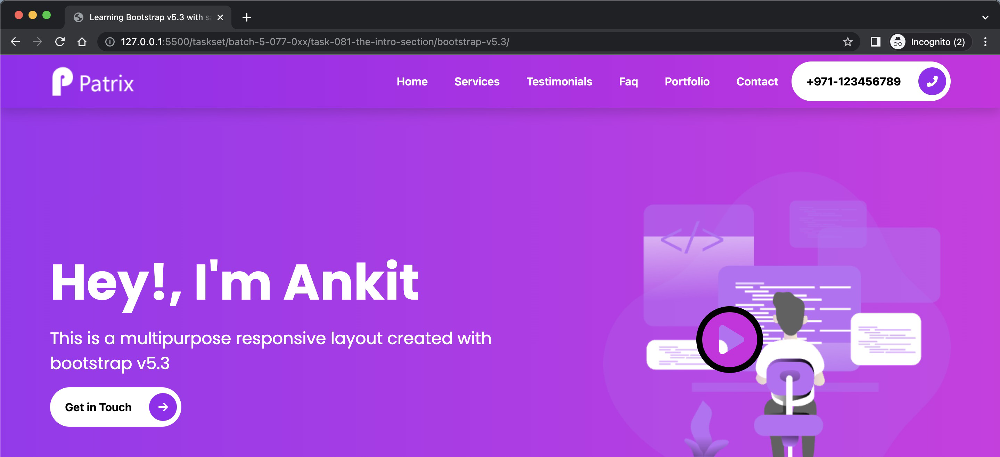

- Complete the animation
- Create a new file `_animations.scss`

```scss
// PULSE BORDER
@keyframes pulse-border { // Defines a set of animation keyframes named 'pulse-border'.
    0% { // At the start of the animation (0% progression).
      transform: scale(1); // The element maintains its original scale.
      opacity: 1; // The element is fully visible.
    }
    100% { // At the end of the animation (100% progression).
      transform: scale(1.5); // The element increases its scale by 1.5 times its original size.
      opacity: 0; // The element is completely transparent.
    }
  }
```

- Changes in `_intro-section.scss`

```scss
...
    animation: pulse-border 1.5s linear infinite; // Applies the 'pulse-border' animation to the element, with a duration of 1.5s, a linear speed curve, and repeating infinitely.
    &--border-1 {
        animation-delay: 1s; // For elements with the class 'border-animation--border-1', delays the start of the animation by 1s.
    }

    &--border-2 {
        animation-delay: 1.5s; // For elements with the class 'border-animation--border-2', delays the start of the animation by 1.5s.
    }
...
```

- Changes in `index.html`

```html
                                 </span>
                                <span class="border-animation border-animation--border-1"></span>
                                <span class="border-animation border-animation--border-2"></span>
                             </a>
```

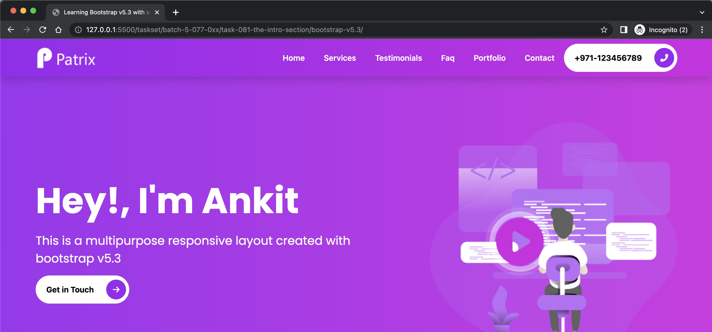

- Let's add the playing of video part using [glightbox](https://www.npmjs.com/package/glightbox) and use the CDN options

- Changes in `index.html`

```html
        <!-- https://www.npmjs.com/package/glightbox -->
        <link rel="stylesheet" href="https://cdn.jsdelivr.net/npm/glightbox/dist/css/glightbox.min.css" />


...
                            <a href="#" class="glightbox position-absolute top-50 start-50 translate-middle">
...
        <!-- https://www.npmjs.com/package/glightbox -->
        <script src="https://cdn.jsdelivr.net/gh/mcstudios/glightbox/dist/js/glightbox.min.js"></script>
        <script type="text/javascript">
            const lightbox = GLightbox({
                'href': 'https://www.youtube.com/watch?v=iJKCj8uAHz8',
                'type': 'video',
                'source': 'youtube', //vimeo, youtube or local
                'width': 900,
            });
        </script>
```

- Now clicking on the play button will open the video and autoplay it

- Let's make the description part better for smaller devices. We will keep the font-size 1.4rem for larger devices and 1rem for smaller devices

- Changes in `_typography.scss`

```scss
...
    &--description { // Defining a modifier class 'display-2--description' for 'display-2'.
        font-size: 1rem; // Setting the font size to 1rem.
...
        @include media-breakpoint-up(lg) {
            font-size: 1.4rem; // When the viewport is at least 'lg' (large) wide, increases the font size to 1.4rem.
            display: inline-block; // Also when viewport is at least 'lg' (large) wide, changes the display to inline-block, allowing elements to sit side by side.
        }
    }
...
```

- Validate for small device

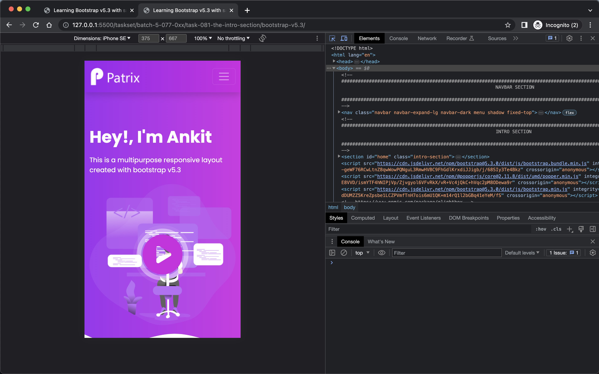

- Validate for large device


