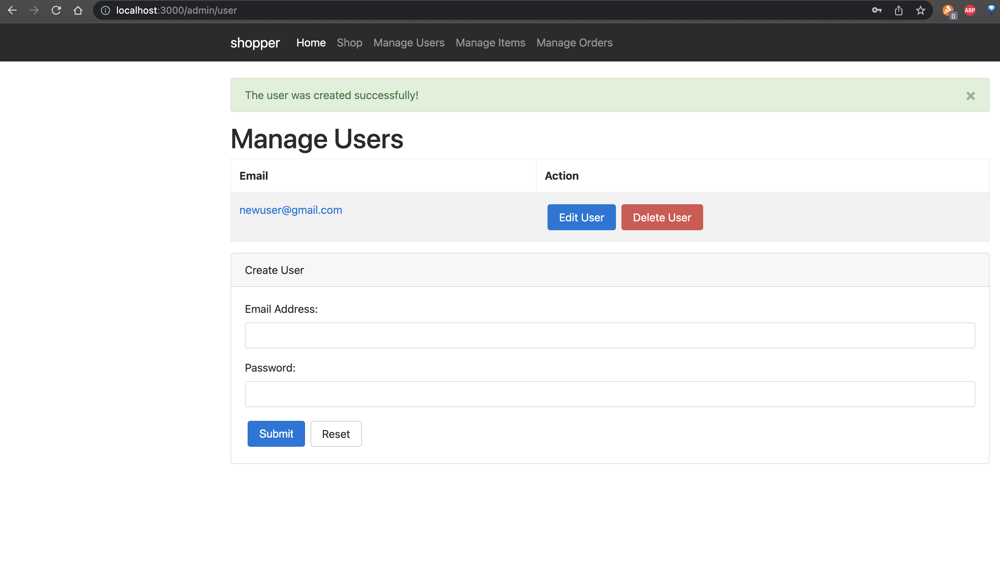
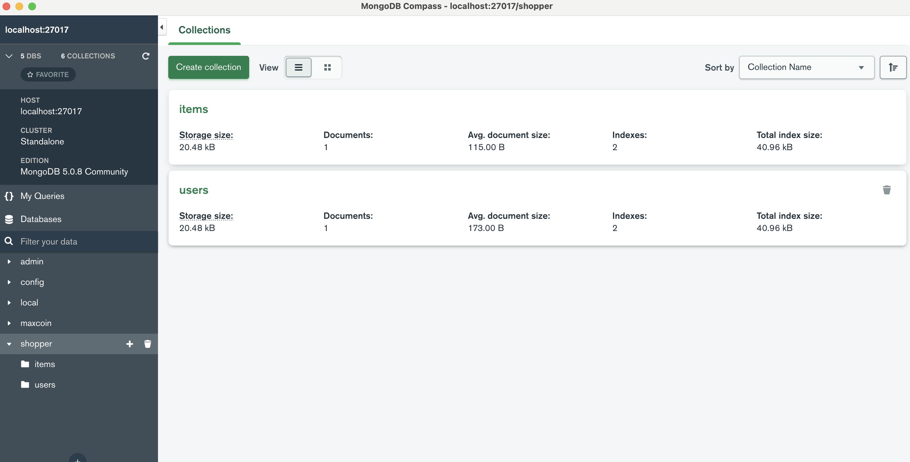
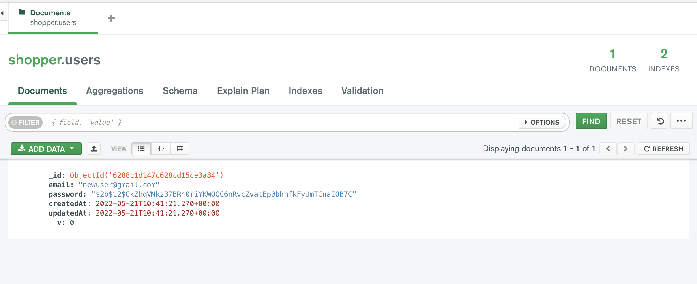

- Run

```bash
$ npm install bcrypt     

added 41 packages, changed 2 packages, and audited 442 packages in 7s

41 packages are looking for funding
  run `npm fund` for details

found 0 vulnerabilities

```

- Run 

```bash
$ npm run dev

> shopper@0.0.0 dev
> nodemon ./server/bin/start

[nodemon] 2.0.4
[nodemon] to restart at any time, enter `rs`
[nodemon] watching path(s): *.*
[nodemon] watching extensions: js,mjs,json
[nodemon] starting `node ./server/bin/start.js`
Successfully connected to MongoDB
shopper listening on port 3000
```

- New user creation



- In db



- Encrypted Password

