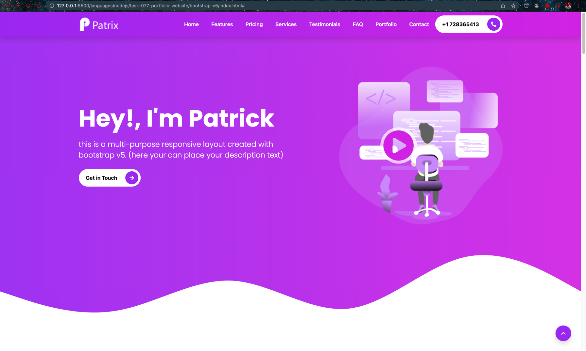
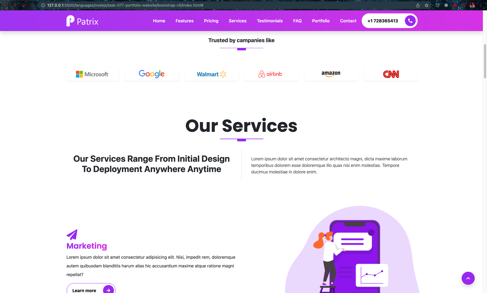
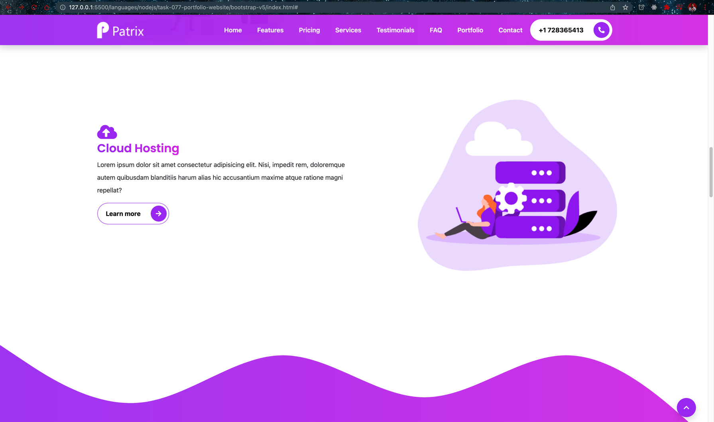
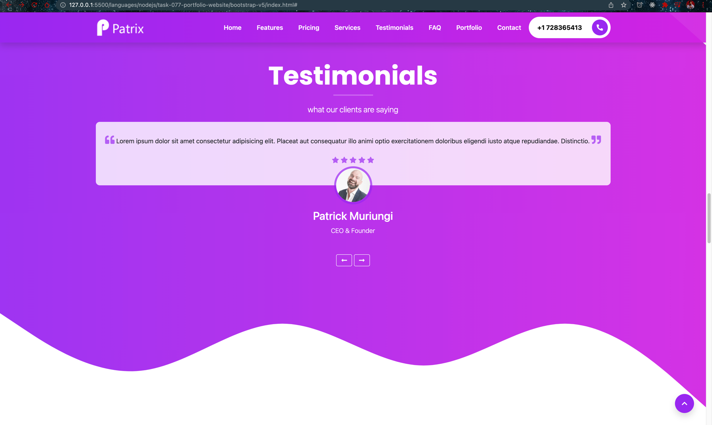
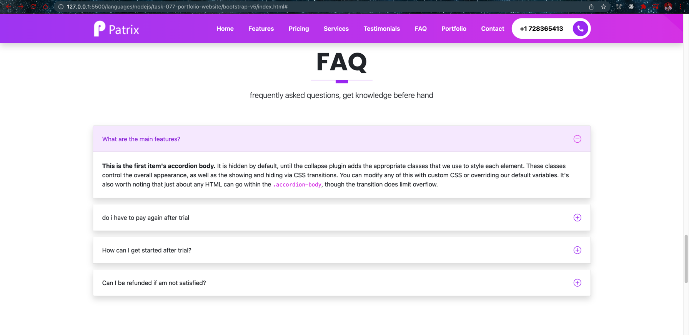
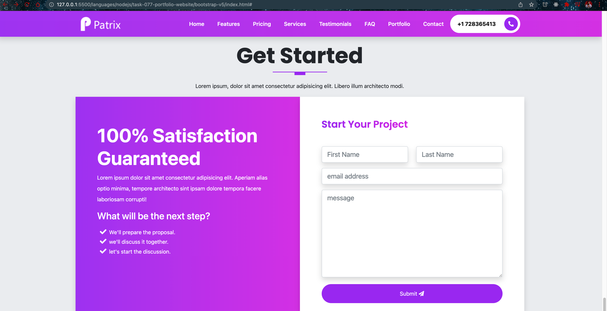
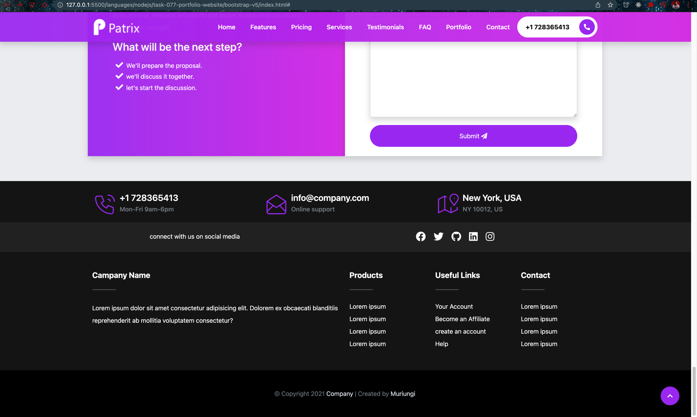

# Portfolio Website

- [Youtube - Learn Bootstrap 5 and SASS by Building a Portfolio Website - Full Course](https://www.youtube.com/watch?v=iJKCj8uAHz8)

- [Build and deploy a portfolio website - Full Tutorial Course](https://www.youtube.com/watch?v=_xkSvufmjEs)

- [bootstrap docs](https://getbootstrap.com/docs/5.0/getting-started/introduction)
- [icons](https://icons.getbootstrap.com)
- [navbar](https://getbootstrap.com/docs/5.0/components/navbar)
- [Carousel](https://getbootstrap.com/docs/5.0/components/carousel)
- [Accordion](https://getbootstrap.com/docs/5.0/components/accordion)
- [accordion/#flush](https://getbootstrap.com/docs/5.0/components/accordion/#flush)
- [google fonts](https://fonts.google.com/)
- [manypixels.co/gallery](https://www.manypixels.co/gallery)
- [getwaves.io](https://getwaves.io)
- [github.com/biati-digital/glightbox](https://github.com/biati-digital/glightbox)
- [npmjs.com/package/glightbox](https://www.npmjs.com/package/glightbox)
- [fontawesome.com/v5/cheatsheet](https://fontawesome.com/v5/cheatsheet)
- [tablericons.com](https://tablericons.com)

- Version

```bash
$ showenv
node: v19.8.0
npm: 9.5.1
yarn: 1.22.19
```

- Init

```bash
$ npm init
.       
```

- Dev dependency add [sass](https://www.npmjs.com/package/sass)

```bash
$ npm install --save-dev sass 
.
```

- Add bootstrap dependency [bootstrap](https://www.npmjs.com/package/bootstrap)

```bash
$ npm install --save bootstrap 
.
```

- Install fontawesome free [fortawesome/fontawesome-free](https://www.npmjs.com/package/@fortawesome/fontawesome-free)

```bash
$ npm install --save @fortawesome/fontawesome-free
.
```

- Install [autoprefixer](https://www.npmjs.com/package/autoprefixer) and  [postcss-cli](https://www.npmjs.com/package/postcss-cli)

```bash
$ npm install postcss-cli
.
$ npm install autoprefixer
.         
```

- Create the following folders and files

```bash
$ mkdir scss        

$ touch scss/style.scss

$ npm run compile:sass         

> bootstrap-v5@1.0.0 compile:sass
> sass scss:assets/css
```

- Now add the watch flag

```json
    "compile:sass": "sass --watch scss:assets/css"

```

- Add file

```bash
$ touch scss/_custom.scss
.
$ touch theming-kit.html
.    
```

- You can open the content of themin-kit.html using `Live Server`


- Create folders

```bash
$ mkdir -p scss/sections
.                                  
$ mkdir -p scss/components 
.
$ touch scss/components/_buttons.scss
.
$ touch scss/components/_animations.scss 
.
$ touch scss/components/_mixins.scss    
.
$ touch scss/components/_typography.scss 
.
$ touch scss/sections/_navbar.scss  
.
$ touch scss/sections/_intro-section.scss 
.
$ touch scss/sections/_companies.scss    
.
$ touch scss/sections/_services.scss 
.
$ touch scss/sections/_testimonials.scss
.
$ touch scss/sections/_faq.scss         
.
$ touch scss/sections/_portfolio.scss
.
$ touch scss/sections/_get-started.scss
.
$ touch scss/sections/_footer.scss     
.
```

- After deployment - Home page



- Trusted by



- Our-services



- Testimonials



- FAQ



- Latest-work


- Get started



- Footer.png


