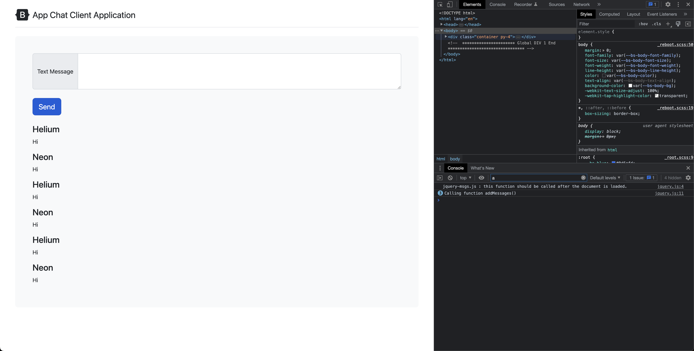

# Create Get Message Service

## Getting the req and res for /messages endpoint

```bash
curl localhost:3000/messages
[{"name":"Helium","message":"Hi"},{"name":"Neon","message":"Hi"}
```

## Javascript Code

```javascript
// JQuery
$(
    () => {
        console.log("jquery-msgs.js : this function should be called after the document is loaded.")

        console.log("Let's get the hold of the button with id send")

        $("#send").on("click",
            () => {
                console.log("Inside the button click event")
                console.log("Calling function addMessages()")
                getMessages()
            }
        )
    }
)

// Function to add messages
function addMessages(message) {
    $("#messages").append(
        `
            <h4> ${message.name} </h4>
            <p> ${message.message} </p>
        `
    )

}

// Function to call /messages endpoint
function getMessages() {
    $.get(
        'http://localhost:3000/messages', (data) => {
            //console.log("Inside getMessages method: The following is the data : \n", data);
            //displayRequestData(data);
            data.forEach(element => {
                addMessages(element);
            });
        }
    )
}
```

## Explaination

Sure, let's break this down:

1. `$(() => {...})`: This is a shorthand for jQuery's `$(document).ready(function() {...})`, which means that the enclosed code will run as soon as the HTML document's DOM is fully loaded. 

2. `$("#send").on("click", () => {...})`: This line sets up an event listener on the HTML element with the ID of "send" (presumably a button). When the button is clicked, the enclosed function is triggered. 

3. `console.log(...)`: These are just logging statements that output messages to the browser's console for debugging purposes. 

4. `getMessages()`: This is a function call to the `getMessages` function, which is defined later in the script.

5. `function addMessages(message) {...}`: This function takes in an object called `message` (which has properties `name` and `message`), and appends a new HTML block containing these properties to the HTML element with the ID "messages".

6. `function getMessages() {...}`: This function sends a GET request to the server at 'http://localhost:3000/messages'. The server responds with data (presumably an array of message objects), which is then looped over using `forEach`. For each element in the data array, the `addMessages` function is called to append the element's details to the "messages" HTML element. The `$.get` method is asynchronous, which means it won't block the rest of the script from executing while it waits for a response from the server.

So, in essence, this script waits for the page to load, then sets up a click event on the "send" button. When this button is clicked, it sends a GET request to a server to retrieve an array of messages, each of which is then appended to the "messages" HTML element.

## Screenshots


