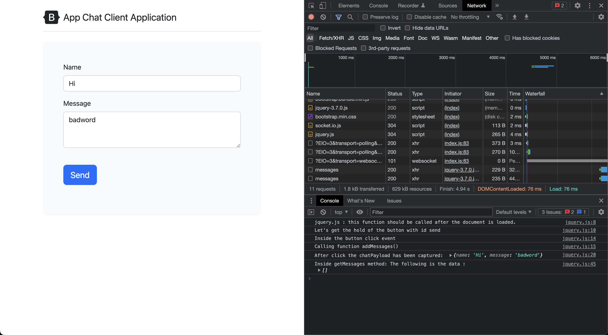

# Nested Callbacks

## Correct code using Promises

Let's break down and explain the provided code:

```javascript
messageModel.findOne({ message: 'badword' })
    .then((censored) => {
        console.log("Censored word found in the message: ", censored);
        console.log("Removing the censored message from the database");
        messageModel.remove({ _id: censored.id })
            .then(() => {
                console.log("Censored message has been removed from the database");
            })
            .catch((err) => {
                console.log("There was an error removing the censored message from the database", err);
            });
    })
    .catch((err) => {
        console.log("There was an error finding the censored message in the database", err);
    });
```

This code snippet focuses on finding and removing a censored message from the database. Let's go through it step by step:

1. `messageModel.findOne({ message: 'badword' })`: This Mongoose query searches for the first document in the `messageModel` collection where the `message` property matches the value "badword". It returns a promise.

2. `.then((censored) => { ... })`: If the `findOne()` operation is successful and a censored message is found, the `.then()` block is executed. The `censored` parameter holds the found document.

3. `console.log("Censored word found in the message: ", censored)`: This line logs a message to the console indicating that a censored word was found in the message. It also prints the `censored` document to provide additional information.

4. `console.log("Removing the censored message from the database")`: This line logs a message to the console indicating that the censored message is being removed from the database.

5. `messageModel.remove({ _id: censored.id })`: This Mongoose method removes the censored message from the database. It takes an object with the `_id` property set to the ID of the `censored` document.

6. `.then(() => { ... })`: If the removal operation is successful, the `.then()` block is executed, indicating that the censored message has been successfully removed from the database.

7. `console.log("Censored message has been removed from the database")`: This line logs a message to the console confirming that the censored message has been successfully removed.

8. `.catch((err) => { ... })`: If there is an error during the removal operation, the `.catch()` block is executed, and the error is logged to the console.

9. The outer `.catch((err) => { ... })` block handles any errors that occur during the `findOne()` operation, such as if there was an error finding the censored message in the database.

This code snippet demonstrates the process of finding and removing a censored message from the database. If a censored message is found, it is removed using the `remove()` method. The code logs appropriate messages to the console to provide information about the process and any encountered errors.

## Callback Hell

The callback hell code for post method is as follows:

```javascript
app.post('/messages', (req, res) => {
    var messageModelObject = new messageModel(req.body);

    messageModelObject.save((saveErr) => {
        if (saveErr) {
            console.log("There was an error saving the msg object to the database", saveErr);
            console.log("Sending 500 status code");
            res.sendStatus(500);
        } else {
            console.log("Message has been saved successfully in the database");
            console.log("This is a post request");
            console.log("Req body: ", req.body);

            messageModel.findOne({ message: 'badword' }, (findErr, censored) => {
                if (findErr) {
                    console.log("There was an error finding the censored message in the database", findErr);
                    res.sendStatus(500);
                } else {
                    console.log("Censored word found in the message: ", censored);
                    console.log("Removing the censored message from the database");

                    messageModel.remove({ _id: censored.id }, (removeErr) => {
                        if (removeErr) {
                            console.log("There was an error removing the censored message from the database", removeErr);
                            res.sendStatus(500);
                        } else {
                            console.log("Censored message has been removed from the database");
                            io.emit('message', req.body);
                            res.sendStatus(200);
                        }
                    });
                }
            });
        }
    });
});
```

## Screenshots

Before and after clicking on send with `badword`



Server logs

```bash
server is listening on port 3000

A user is connected
A user is connected
Successfully found all the documents as per mongo query
Messages :  []
Message has been saved successfully in the database
This is a post request
Req body:  [Object: null prototype] { name: 'Hi', message: 'badword' }
Censored word found in the message:  {
  _id: new ObjectId("6469a7095af440fa2c02b364"),
  name: 'Hi',
  message: 'badword',
  __v: 0
}
Removing the censored message from the database
(node:25102) [MONGODB DRIVER] Warning: collection.remove is deprecated. Use deleteOne, deleteMany, or bulkWrite instead.
Censored message has been removed from the database

```
