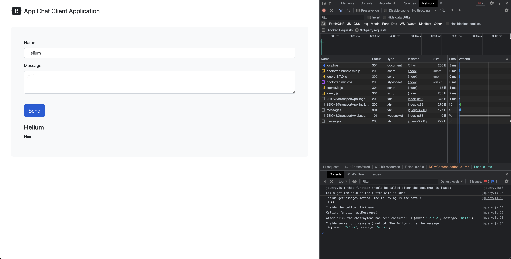
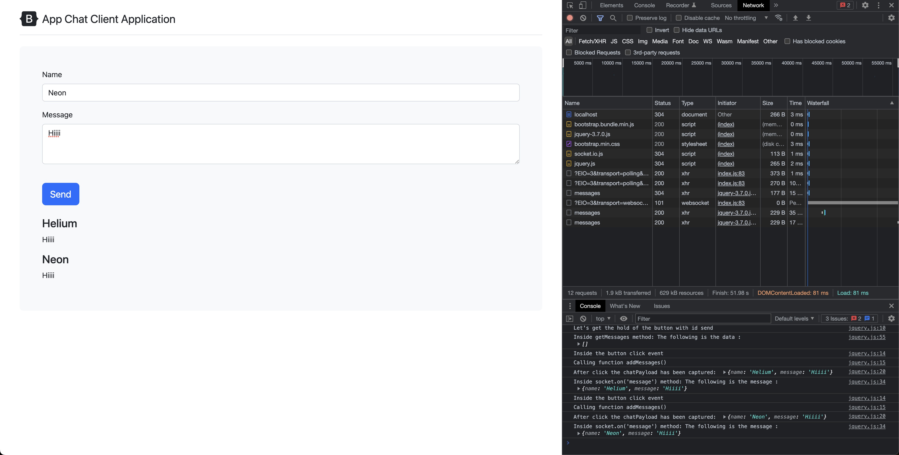
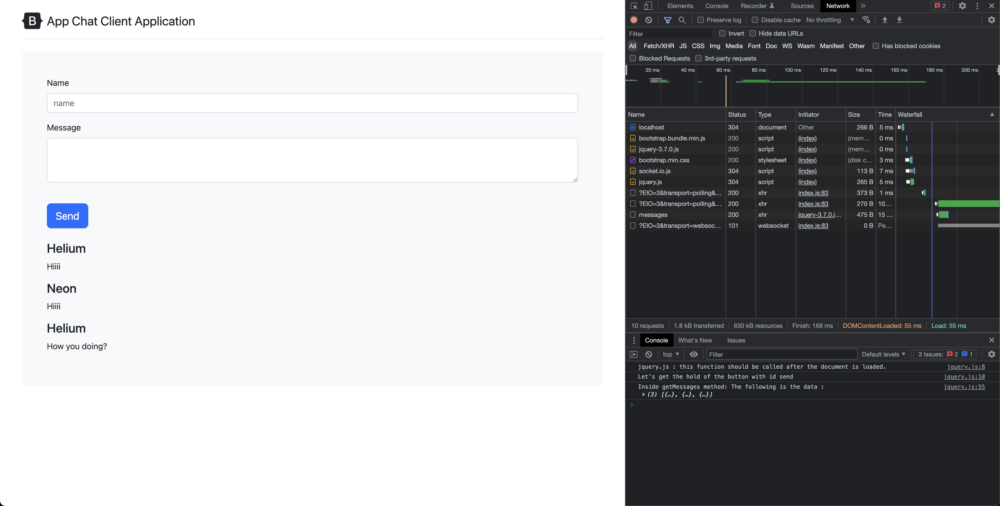

# Promises

## Optimized version of code

```javascript
app.post('/messages', (req, res) => {
    var messageModelObject = new messageModel(req.body);
    var censoredWordFound = false; // Track whether a censored word was found

    messageModelObject.save()
        .then(() => {
            console.log("Message has been saved successfully in the database");
            return messageModel.findOne({ message: 'badword' });
        })
        .then((censored) => {
            // We need this if because if we don't have any censored word in the message, then censored will be null
            // and we will get an error while trying to access censored.id
            // So, we need to check if censored is null or not
            if (censored) {
                console.log("Censored word found in the message: ", censored);
                censoredWordFound = true; // Set the flag to true
                return messageModel.findByIdAndDelete(censored._id);
            }
        })
        .then(() => {
            console.log("Censored message has been removed from the database");
            console.log("Req body", req.body);
            if (!censoredWordFound) {
                console.log("Why not working??????????????????");
                io.emit('message', req.body);
            }
            console.log("Req body", req.body);
            res.sendStatus(200);
        })
        .catch((err) => {
            console.log("Error occurred while processing the request:", err);
                res.sendStatus(500);
        });
});
```


## Screenshot

### First msg (Helium)



### Second msg (Neon)



### Third msg (Helium)


### Refresh Tab


