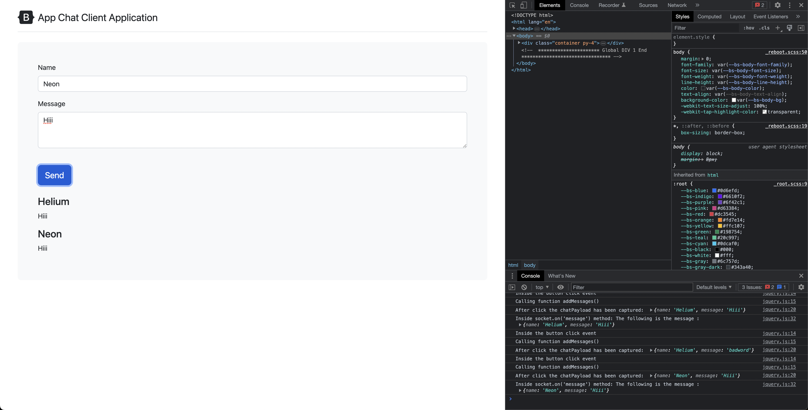
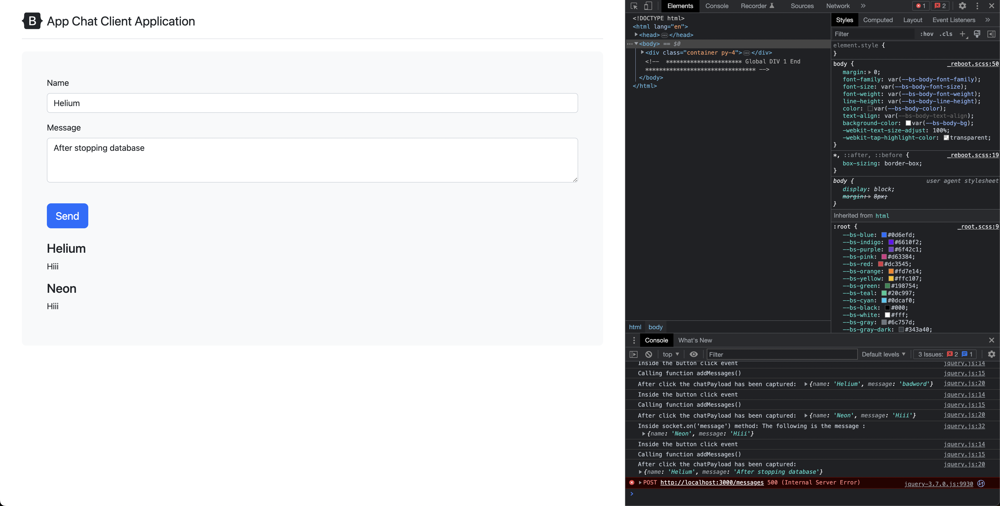

# Try Catch

## Code

```javascript
app.post('/messages', async (req, res) => {
    try {
        var messageModelObject = new messageModel(req.body);

        var savedMessage = await messageModelObject.save()
        console.log("Message has been saved successfully in the database");

        var censored = await messageModel.findOne({ message: 'badword' });

        if (censored) {
            console.log("Censored word found in the message: ", censored);
            removeCensoredMessage = await messageModel.findByIdAndDelete(censored._id);
            console.log("Censored message has been removed from the database");
        }
        else {
            io.emit('message', req.body);
        }

        res.sendStatus(200);
    }
    catch (error) {
        res.sendStatus(500);
        return console.log("Error while saving the message in the database : ", error);
    }

});
```

## Screenshot



- If you stop the database in between, you will get the following error



- Server logs

```bash
.
Error while saving the message in the database :  MongooseServerSelectionError: connect ECONNREFUSED 127.0.0.1:27888
.
```
