# Try Catch Finally And Debugger

## Code

```javascript
app.post('/messages', async (req, res) => {
    try {
        var messageModelObject = new messageModel(req.body);

        var savedMessage = await messageModelObject.save()
        console.log("Message has been saved successfully in the database");

        var censored = await messageModel.findOne({ message: 'badword' });

        if (censored) {
            console.log("Censored word found in the message: ", censored);
            removeCensoredMessage = await messageModel.findByIdAndDelete(censored._id);
            console.log("Censored message has been removed from the database");
        }
        else {
            io.emit('message', req.body);
        }

        res.sendStatus(200);
    }
    catch (error) {
        res.sendStatus(500);
        return console.log("Error while saving the message in the database : ", error);
    }
    finally {
        console.log("Message always called");
    }

});
```

## Server Logs

```bash
.Database is connected.
server is listening on port 3000
A user is connected
A user is connected
Successfully found all the documents as per mongo query
Messages :  []
Message has been saved successfully in the database
Message always called
.
```


## Debugger

- Open the file you want to debug

- Add a breakpoint by clicking on the line number

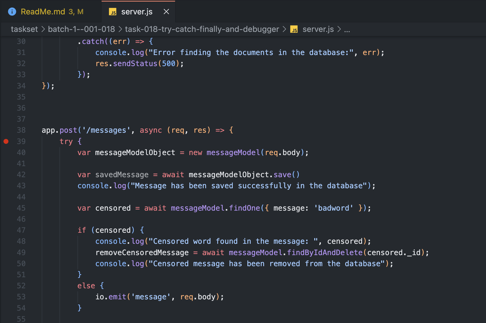

- `CMD + SHIFT + D` to open the debug panel and click on Run and Debug

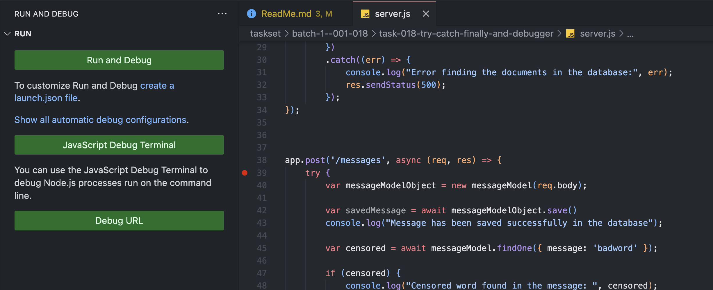

- Select `Node.js`

- You should see following screen


- Give message in browser and click on send

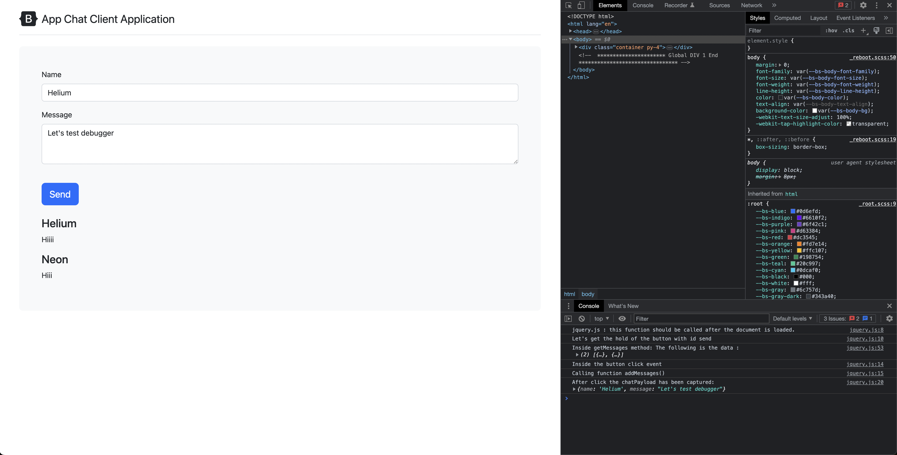

- The debugger screen

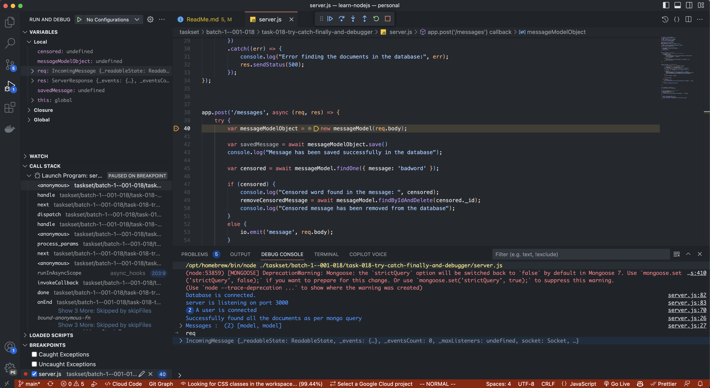

- Type `req.body` at the bottom and press enter. The same info is also available in the variables section

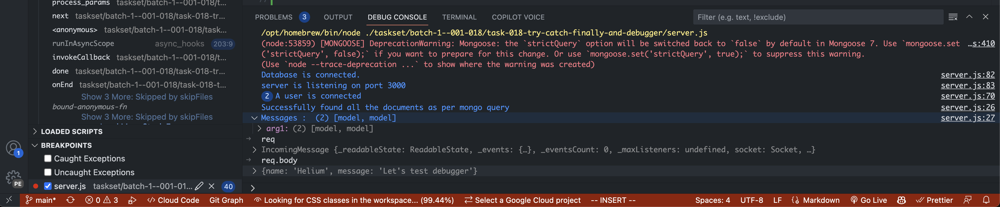

- Click on `step.over` which takes us to the next statement

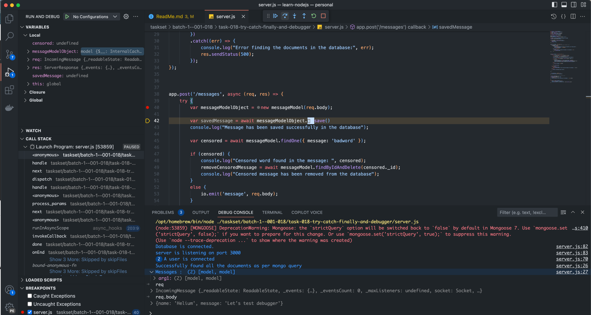

- `Step.into` takes us inside the function. Let's get into `messageModel.findOne()`

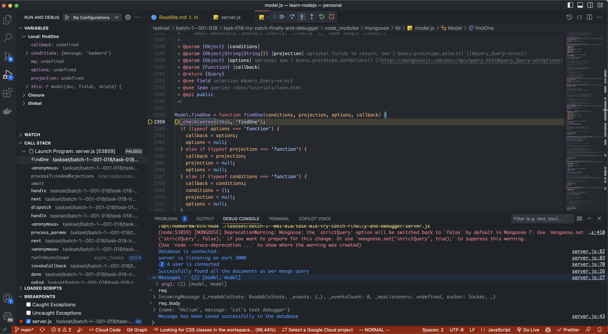

- `Step.out` takes us out of the function

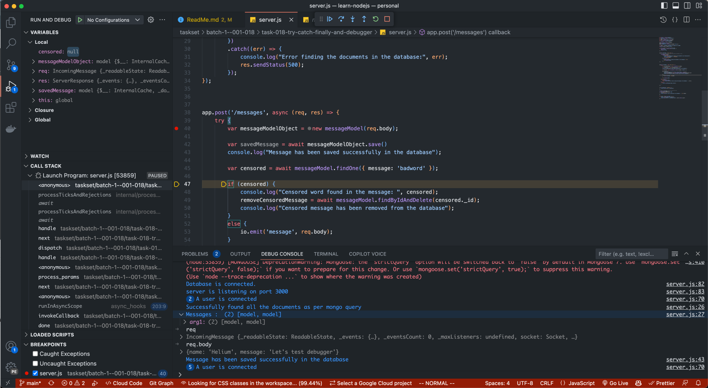

- Click `continue` to resume

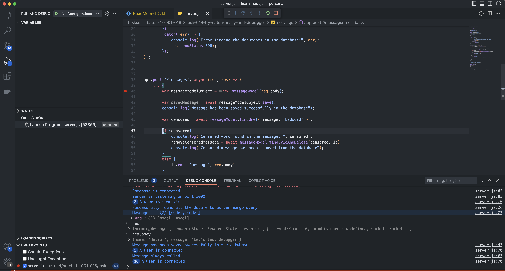

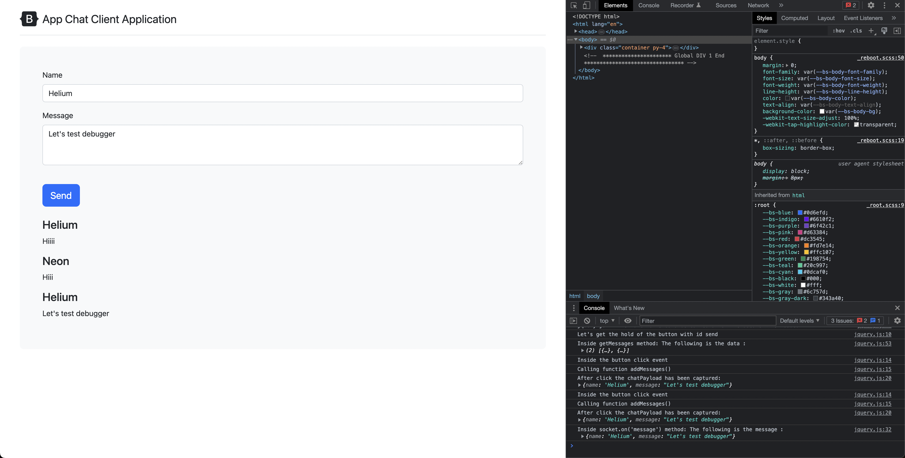

- Click on red `stop` to stop the debugger

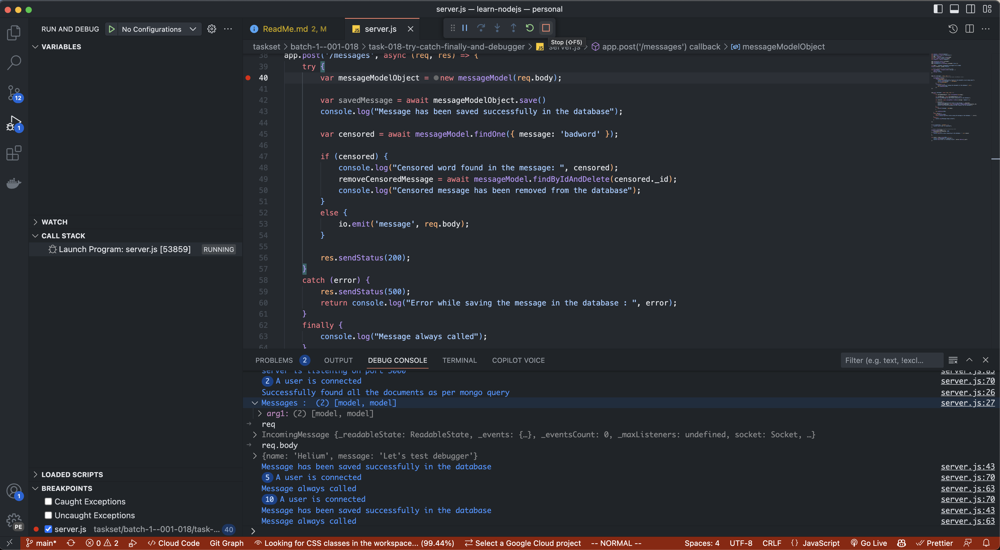

- Click on green `restart` to restart the debugger
