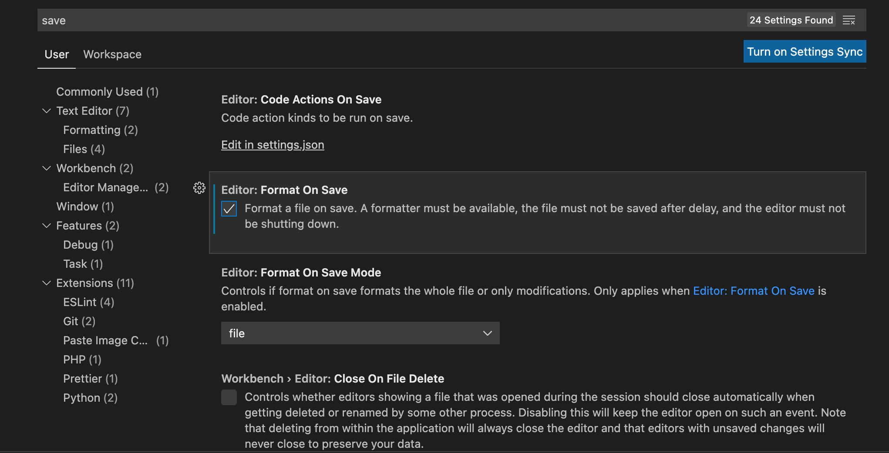
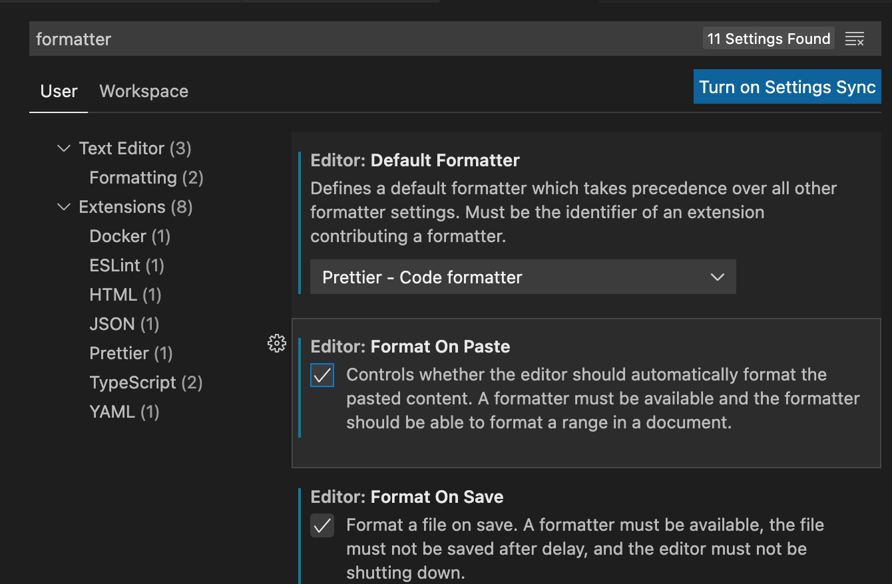
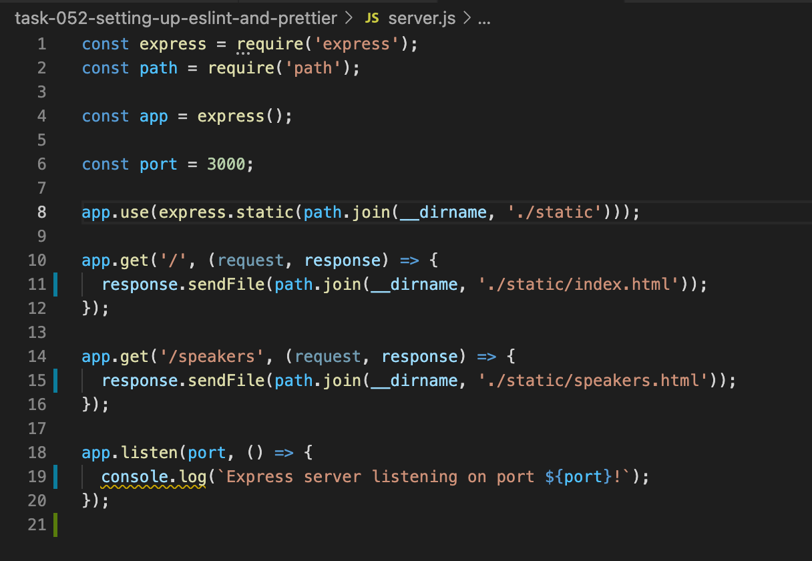

# Setting up ESLint and Prettier

## Env

```bash
$ showenv
node: v19.8.0
npm: 9.5.1
yarn: 1.22.19
```

- Install esLint as DevDependency

```bash
$ npm install -D eslint
.
$ which npx
/opt/homebrew/bin/npx
$ ls -ltrh /opt/homebrew/bin/npx
lrwxr-xr-x  1 username  admin    49B Mar 15 19:39 /opt/homebrew/bin/npx -> /opt/homebrew/lib/node_modules/npm/bin/npx-cli.js
$ npx --version    
9.5.1
```

- Now to initialize esLint we will use npx (Use arrow keys to select)

```bash
$ npx eslint --init
You can also run this command directly using 'npm init @eslint/config'.
✔ How would you like to use ESLint? · style
✔ What type of modules does your project use? · commonjs
✔ Which framework does your project use? · none
✔ Does your project use TypeScript? · No 
✔ Where does your code run? · browser
✔ How would you like to define a style for your project? · guide
✔ Which style guide do you want to follow? · airbnb
✔ What format do you want your config file to be in? · JSON
Checking peerDependencies of eslint-config-airbnb-base@latest
The config that you've selected requires the following dependencies:

eslint-config-airbnb-base@latest eslint@^7.32.0 || ^8.2.0 eslint-plugin-import@^2.25.2
✔ Would you like to install them now? · No / Yes
✔ Which package manager do you want to use? · npm
Installing eslint-config-airbnb-base@latest, eslint@^7.32.0 || ^8.2.0, eslint-plugin-import@^2.25.2
```

- Now we install the following

```bash
$ npm install -D prettier eslint-config-prettier eslint-plugin-prettier
.
```

- So far Visual Studio does not know anything about what we have installed. So we install the following extensions

- [ESLint by Microsoft](https://marketplace.visualstudio.com/items?itemName=dbaeumer.vscode-eslint)
- [Prettier - Code formatter](https://marketplace.visualstudio.com/items?itemName=esbenp.prettier-vscode)

- Enable the following in Code->Preferences



- Set the formatter



- Or update `user-settings.json` as follows

```json
    "[javascript]": {
        "editor.defaultFormatter": "esbenp.prettier-vscode",
        // "editor.defaultFormatter": "vscode.typescript-language-features",
        "editor.formatOnSave": true,
        "editor.formatOnPaste": true
    },
```

- add the values in `.eslinttc.json` as follows

```json
    "extends": ["airbnb-base", "prettier"],
    "plugins": ["prettier"],
```

- Finally create a file `.prettierrc` as follows

```json
{
  "trailingComma": "es5",
  "printWidth": 100,
  "singleQuote": true
}
```

- Let's test on `server.js`

- Before save


- After save



- .prettierrc

```json
{
  "trailingComma": "es5",
  "printWidth": 100,
  "singleQuote": true
}
```

This is a configuration file for Prettier, a tool for automatically formatting code to adhere to a consistent style. It's written in JSON format and specifies three rules for how your code should be formatted:

1. `"trailingComma": "es5"`: This rule is telling Prettier to add trailing commas where valid in ES5 (ECMAScript 5). This includes arrays and objects, but not function parameters and arguments due to syntax restrictions in ES5.

2. `"printWidth": 100`: This is specifying that Prettier should wrap lines longer than 100 characters. This is useful for maintaining readability when lines of code become too long.

3. `"singleQuote": true`: This tells Prettier to use single quotes instead of double quotes for string literals.

So when Prettier runs on your code, it will adjust your code style to match these specifications. This helps to maintain a consistent code style across a project.

- .eslintrc.json

```json
{
    "env": {
        "commonjs": true,
        "es2021": true,
        "node": true
    },
    "extends": ["airbnb-base", "prettier"],
    "plugins": ["prettier"],
    "parserOptions": {
        "ecmaVersion": 13
    },
    "rules": {
    }
}
```

This is a configuration file for ESLint, a popular tool for identifying and reporting on patterns found in ECMAScript/JavaScript code. It can be very helpful in highlighting syntax errors and stylistic errors, and can also prevent certain types of bugs. 

1. `"env"`: Defines global variables that are predefined. Here, `commonjs` is for CommonJS module system used by Node.js, `es2021` enables all ECMAScript 2021 globals and `node` is for Node.js global variables and Node.js scoping.

2. `"extends"`: This is a list of configurations that this configuration extends. Here, it is extending 'airbnb-base' and 'prettier'. 'airbnb-base' is a popular style guide for writing JavaScript, while 'prettier' is a code formatter. By extending them, you're inheriting their rules.

3. `"plugins"`: A list of the plugins this configuration is using. Here, it's using 'prettier' as a plugin, which enables Prettier to be run as an ESLint rule, and reports differences as individual ESLint issues.

4. `"parserOptions"`: An object specifying parser options. Here, it's specifying `ecmaVersion` to be 13 (which corresponds to ECMAScript 2021), allowing ESLint to understand the new syntax from that ECMAScript version.

5. `"rules"`: The rules that ESLint will enforce or ignore are defined here. The rules defined here override rules from any extended configurations. In this case, it is an empty object, meaning no additional or override rules are being specified.

This configuration would be useful for a Node.js project written in up-to-date JavaScript, and wanting to use the Airbnb style guide and Prettier to enforce a consistent code style.
