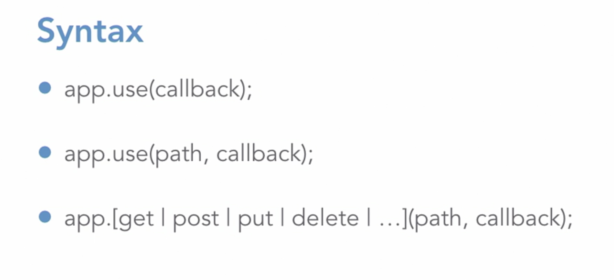
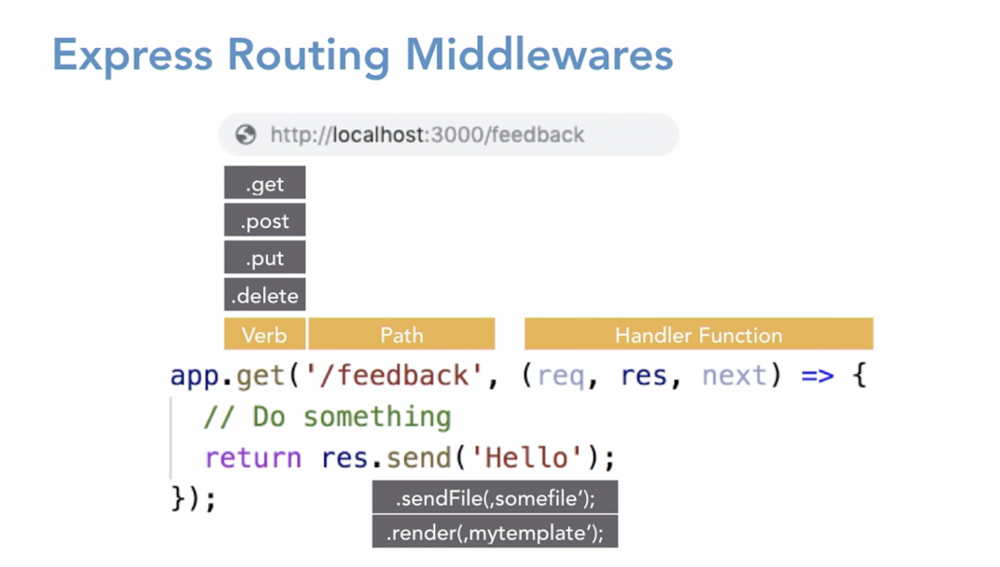
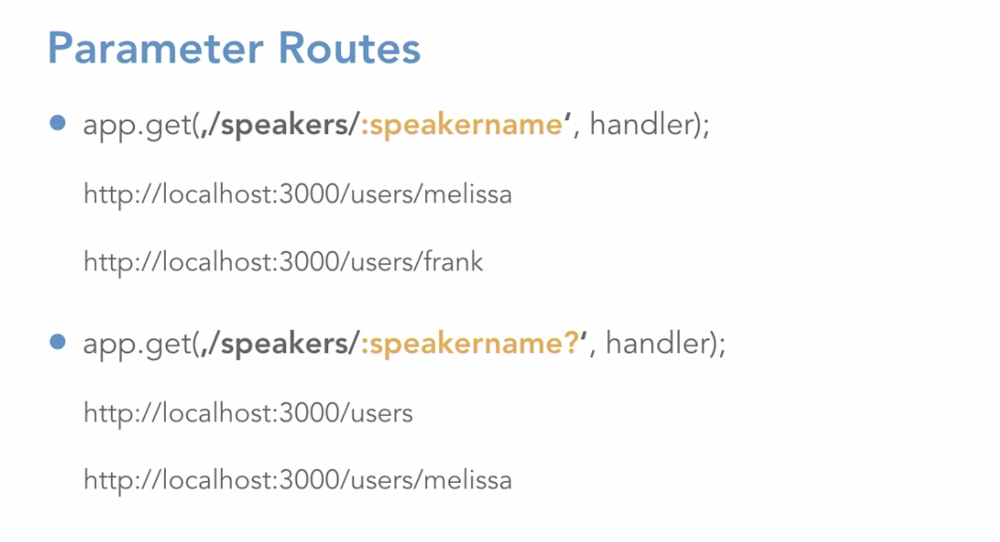
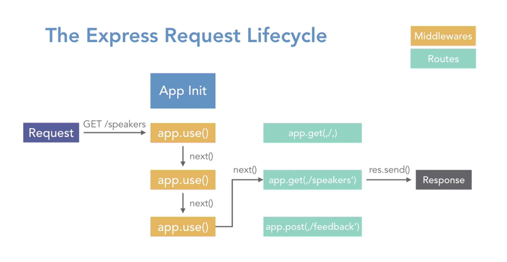

# Modular routers with express.Router

## Theory











- Create the `routes` folder and create file `index.js` inside it

```bash
$ mkdir routes
.
$ touch routes/index.js
.
```
- `routes/index.js`

```js
const express = require('express');
const path = require('path');

const router = express.Router();

router.get('/', (request, response) => {
  response.render('pages/index', { pageTitle: 'Welcome' });
});

router.get('/speakers', (request, response) => {
  response.sendFile(path.join(__dirname, './static/speakers.html'));
});

module.exports = router;
```


- Run

```bash
$ npm run dev

> website@1.0.0 dev
> nodemon --ignore feedback.json server.js

[nodemon] 2.0.22
[nodemon] to restart at any time, enter `rs`
[nodemon] watching path(s): *.*
[nodemon] watching extensions: js,mjs,json
[nodemon] starting `node server.js`
Server is listening on port 3000 Ready to accept requests!
[nodemon] restarting due to changes...
[nodemon] starting `node server.js`
Server is listening on port 3000 Ready to accept requests!
```

- Browser


