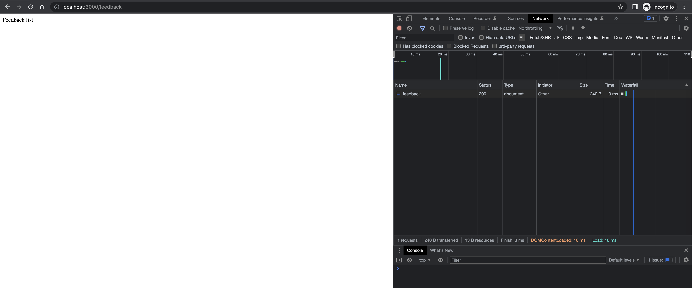

# Creating routes for all subpages


## Run

```bash
$ npm run dev

> website@1.0.0 dev
> nodemon --ignore feedback.json server.js

[nodemon] 2.0.22
[nodemon] to restart at any time, enter `rs`
[nodemon] watching path(s): *.*
[nodemon] watching extensions: js,mjs,json
[nodemon] starting `node server.js`
Server is listening on port 3000 Ready to accept requests!
```

- Test with curl

```bash
$ curl http://localhost:3000/speakers
Speakers list

curl http://localhost:3000/speakers/daniel
Detail page of daniel

curl http://localhost:3000/speakers/feedback
Detail page of feedback

curl http://localhost:3000/feedback        
Feedback page

curl http://localhost:3000/feedbacks
<!DOCTYPE html>
<html lang="en">
<head>
<meta charset="utf-8">
<title>Error</title>
</head>
<body>
<pre>Cannot GET /feedbacks</pre>
</body>
</html>
```


## Screenshots

- localhost:3000


- localhost:3000/speakers


- localhost:3000/speakers/daniel


- localhost:3000/feedback


