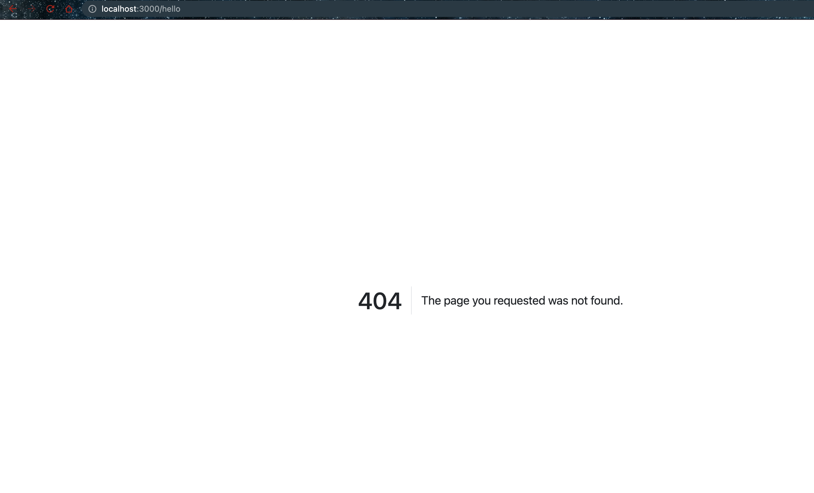

# Creating an error page

- Install http errors

```bash
$ npm install http-errors
.
```

- Error output

```bash
$ npm run dev


> task-050-create-express-server@1.0.0 dev
> nodemon --ignore feedback.json server.js

[nodemon] 2.0.15
[nodemon] to restart at any time, enter `rs`
[nodemon] watching path(s): *.*
[nodemon] watching extensions: js,mjs,json
[nodemon] starting `node server.js`
Express server listening on port 3000!
[Object: null prototype] {
  speakerNames: [
    { name: 'Lorenzo Garcia', shortname: 'Lorenzo_Garcia' },
    { name: 'Hilary Goldywynn Post', shortname: 'Hillary_Goldwynn' },
    { name: 'Riley Rudolph Rewington', shortname: 'Riley_Rewington' }
  ]
}
NotFoundError: File not found
    at /Users/admin/Ankit/workspace/devops-essentials-prv/languages/nodejs/task-068-creating-an-error-page/server.js:52:15
    at Layer.handle [as handle_request] (/Users/admin/Ankit/workspace/devops-essentials-prv/languages/nodejs/task-068-creating-an-error-page/node_modules/express/lib/router/layer.js:95:5)
    at trim_prefix (/Users/admin/Ankit/workspace/devops-essentials-prv/languages/nodejs/task-068-creating-an-error-page/node_modules/express/lib/router/index.js:317:13)
    at /Users/admin/Ankit/workspace/devops-essentials-prv/languages/nodejs/task-068-creating-an-error-page/node_modules/express/lib/router/index.js:284:7
    at Function.process_params (/Users/admin/Ankit/workspace/devops-essentials-prv/languages/nodejs/task-068-creating-an-error-page/node_modules/express/lib/router/index.js:335:12)
    at next (/Users/admin/Ankit/workspace/devops-essentials-prv/languages/nodejs/task-068-creating-an-error-page/node_modules/express/lib/router/index.js:275:10)
    at /Users/admin/Ankit/workspace/devops-essentials-prv/languages/nodejs/task-068-creating-an-error-page/node_modules/express/lib/router/index.js:635:15
    at next (/Users/admin/Ankit/workspace/devops-essentials-prv/languages/nodejs/task-068-creating-an-error-page/node_modules/express/lib/router/index.js:260:14)
    at Function.handle (/Users/admin/Ankit/workspace/devops-essentials-prv/languages/nodejs/task-068-creating-an-error-page/node_modules/express/lib/router/index.js:174:3)
    at router (/Users/admin/Ankit/workspace/devops-essentials-prv/languages/nodejs/task-068-creating-an-error-page/node_modules/express/lib/router/index.js:47:12)
[Object: null prototype] {
  speakerNames: [
    { name: 'Lorenzo Garcia', shortname: 'Lorenzo_Garcia' },
    { name: 'Hilary Goldywynn Post', shortname: 'Hillary_Goldwynn' },
    { name: 'Riley Rudolph Rewington', shortname: 'Riley_Rewington' }
  ]
}
NotFoundError: File not found
    at /Users/admin/Ankit/workspace/devops-essentials-prv/languages/nodejs/task-068-creating-an-error-page/server.js:52:15
    at Layer.handle [as handle_request] (/Users/admin/Ankit/workspace/devops-essentials-prv/languages/nodejs/task-068-creating-an-error-page/node_modules/express/lib/router/layer.js:95:5)
    at trim_prefix (/Users/admin/Ankit/workspace/devops-essentials-prv/languages/nodejs/task-068-creating-an-error-page/node_modules/express/lib/router/index.js:317:13)
    at /Users/admin/Ankit/workspace/devops-essentials-prv/languages/nodejs/task-068-creating-an-error-page/node_modules/express/lib/router/index.js:284:7
    at Function.process_params (/Users/admin/Ankit/workspace/devops-essentials-prv/languages/nodejs/task-068-creating-an-error-page/node_modules/express/lib/router/index.js:335:12)
    at next (/Users/admin/Ankit/workspace/devops-essentials-prv/languages/nodejs/task-068-creating-an-error-page/node_modules/express/lib/router/index.js:275:10)
    at /Users/admin/Ankit/workspace/devops-essentials-prv/languages/nodejs/task-068-creating-an-error-page/node_modules/express/lib/router/index.js:635:15
    at next (/Users/admin/Ankit/workspace/devops-essentials-prv/languages/nodejs/task-068-creating-an-error-page/node_modules/express/lib/router/index.js:260:14)
    at Function.handle (/Users/admin/Ankit/workspace/devops-essentials-prv/languages/nodejs/task-068-creating-an-error-page/node_modules/express/lib/router/index.js:174:3)
    at router (/Users/admin/Ankit/workspace/devops-essentials-prv/languages/nodejs/task-068-creating-an-error-page/node_modules/express/lib/router/index.js:47:12)

```

- Error page


