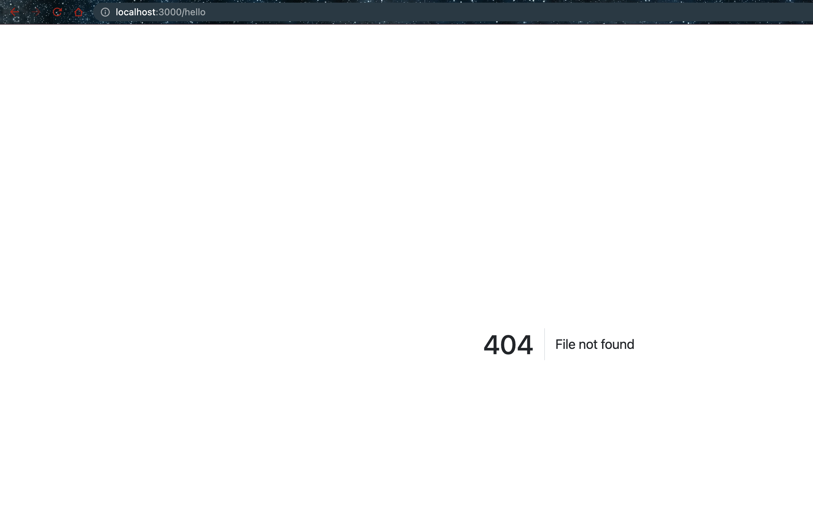

# Populating the error page

- Running

```bash
$ npm run dev

> website@1.0.0 dev
> nodemon --ignore feedback.json server.js

[nodemon] 2.0.22
[nodemon] to restart at any time, enter `rs`
[nodemon] watching path(s): *.*
[nodemon] watching extensions: js,mjs,json
[nodemon] starting `node server.js`
Server is listening on port 3000 Ready to accept requests!
[
  { name: 'Lorenzo Garcia', shortname: 'Lorenzo_Garcia' },
  { name: 'Hilary Goldywynn Post', shortname: 'Hillary_Goldwynn' },
  { name: 'Riley Rudolph Rewington', shortname: 'Riley_Rewington' }
]
NotFoundError: File not found
    at /Users/rinkydahiya/workspace/Frontend-Backend-DevOps/learn-nodejs/taskset/batch-4--050-078/task-069-populating-error-page/website/server.js:61:43
    at Layer.handle [as handle_request] (/Users/rinkydahiya/workspace/Frontend-Backend-DevOps/learn-nodejs/taskset/batch-4--050-078/task-069-populating-error-page/website/node_modules/express/lib/router/layer.js:95:5)
    at trim_prefix (/Users/rinkydahiya/workspace/Frontend-Backend-DevOps/learn-nodejs/taskset/batch-4--050-078/task-069-populating-error-page/website/node_modules/express/lib/router/index.js:328:13)
    at /Users/rinkydahiya/workspace/Frontend-Backend-DevOps/learn-nodejs/taskset/batch-4--050-078/task-069-populating-error-page/website/node_modules/express/lib/router/index.js:286:9
    at Function.process_params (/Users/rinkydahiya/workspace/Frontend-Backend-DevOps/learn-nodejs/taskset/batch-4--050-078/task-069-populating-error-page/website/node_modules/express/lib/router/index.js:346:12)
    at next (/Users/rinkydahiya/workspace/Frontend-Backend-DevOps/learn-nodejs/taskset/batch-4--050-078/task-069-populating-error-page/website/node_modules/express/lib/router/index.js:280:10)
    at /Users/rinkydahiya/workspace/Frontend-Backend-DevOps/learn-nodejs/taskset/batch-4--050-078/task-069-populating-error-page/website/node_modules/express/lib/router/index.js:646:15
    at next (/Users/rinkydahiya/workspace/Frontend-Backend-DevOps/learn-nodejs/taskset/batch-4--050-078/task-069-populating-error-page/website/node_modules/express/lib/router/index.js:265:14)
    at Function.handle (/Users/rinkydahiya/workspace/Frontend-Backend-DevOps/learn-nodejs/taskset/batch-4--050-078/task-069-populating-error-page/website/node_modules/express/lib/router/index.js:175:3)
    at router (/Users/rinkydahiya/workspace/Frontend-Backend-DevOps/learn-nodejs/taskset/batch-4--050-078/task-069-populating-error-page/website/node_modules/express/lib/router/index.js:47:12)
```

- Error page


