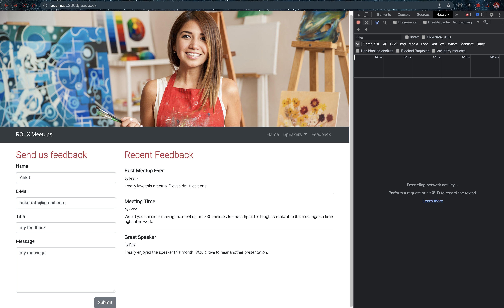
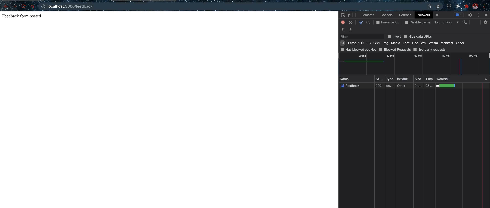
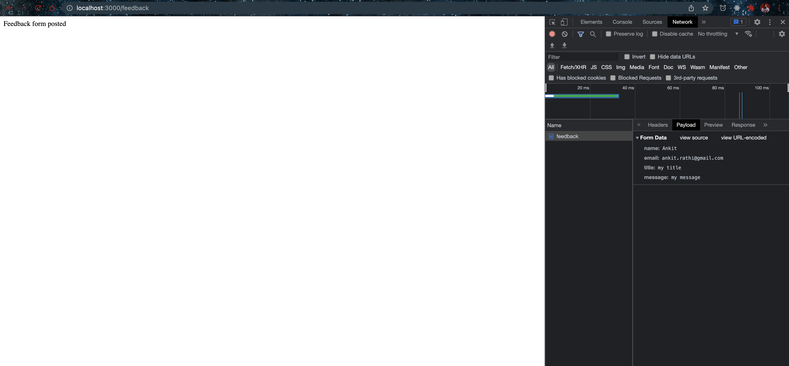

# Handling post requests

- Install body parser

```bash
$ npm install body-parser    

added 334 packages, and audited 335 packages in 3s

58 packages are looking for funding
  run `npm fund` for details

found 0 vulnerabilities
```

- Run

```bash
$ npm run dev
> task-050-create-express-server@1.0.0 dev
> nodemon --ignore feedback.json server.js

[nodemon] 2.0.15
[nodemon] to restart at any time, enter `rs`
[nodemon] watching path(s): *.*
[nodemon] watching extensions: js,mjs,json
[nodemon] starting `node server.js`
Express server listening on port 3000!
[Object: null prototype] {
  speakerNames: [
    { name: 'Lorenzo Garcia', shortname: 'Lorenzo_Garcia' },
    { name: 'Hilary Goldywynn Post', shortname: 'Hillary_Goldwynn' },
    { name: 'Riley Rudolph Rewington', shortname: 'Riley_Rewington' }
  ]
}
[Object: null prototype] {
  speakerNames: [
    { name: 'Lorenzo Garcia', shortname: 'Lorenzo_Garcia' },
    { name: 'Hilary Goldywynn Post', shortname: 'Hillary_Goldwynn' },
    { name: 'Riley Rudolph Rewington', shortname: 'Riley_Rewington' }
  ]
}
{
  name: 'Ankit',
  email: 'ankit.rathi@gmail.com',
  title: 'my title',
  message: 'my message'
}

```


- Sending feedback



- After post button pressed



- Form data in payload


