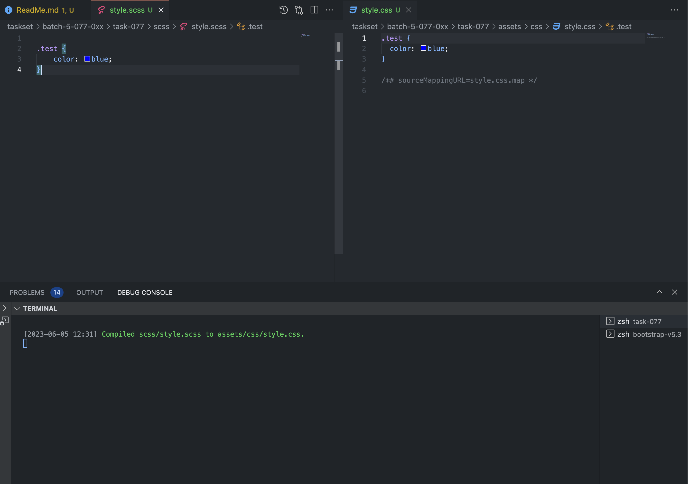

# Saas Setup 

- Version Info

```bash
$ showenv
node: v19.8.0
npm: 9.5.1
yarn: 1.22.19
```

- Init

```bash
$ npm init -y
.       
```

- Dev dependency add [sass](https://www.npmjs.com/package/sass)

```bash
$ npm install --save-dev sass 
.
```

- Add bootstrap dependency [bootstrap](https://www.npmjs.com/package/bootstrap)

```bash
$ npm install --save bootstrap 
.
```

- Install fontawesome free [fortawesome/fontawesome-free](https://www.npmjs.com/package/@fortawesome/fontawesome-free)

```bash
$ npm install --save @fortawesome/fontawesome-free
.
```

- Install [autoprefixer](https://www.npmjs.com/package/autoprefixer) and  [postcss-cli](https://www.npmjs.com/package/postcss-cli)

```bash
$ npm install postcss-cli
.
$ npm install autoprefixer
.         
```

- Create the following folders and files

```bash
$ mkdir scss        
.
$ touch scss/style.scss
.
```

- Add the following scrpt to `package.json`

```json
"compile:sass": "sass --watch scss:assets/css"
```

- Now run the following command

```bash
$ npm run compile:sass    

> task-077@1.0.0 compile:sass
> sass --watch scss:assets/css

[2023-06-05 12:27] Compiled scss/style.scss to assets/css/style.css.
Sass is watching for changes. Press Ctrl-C to stop.

```

- You should see the following folders and files created

```bash
$ tree assets          
assets
└── css
    ├── style.css
    └── style.css.map

2 directories, 2 files
```

- If you add one class in `scss/style.scss` file, you should see compiled changes in css file in `assets/css/style.css` file


