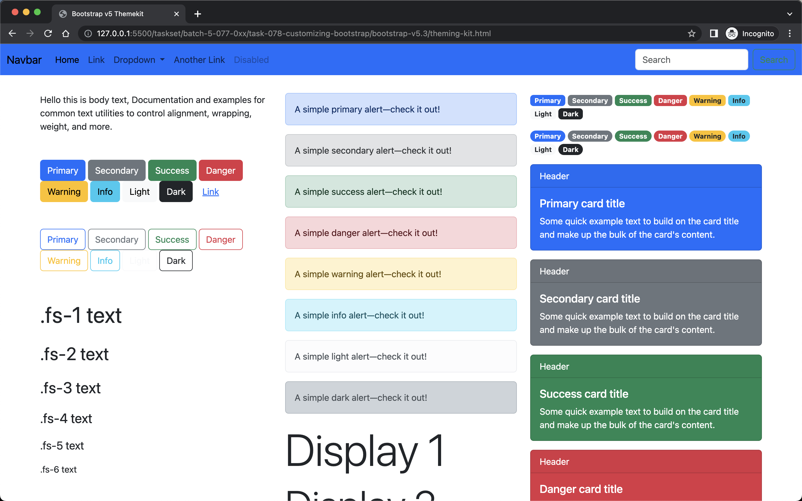
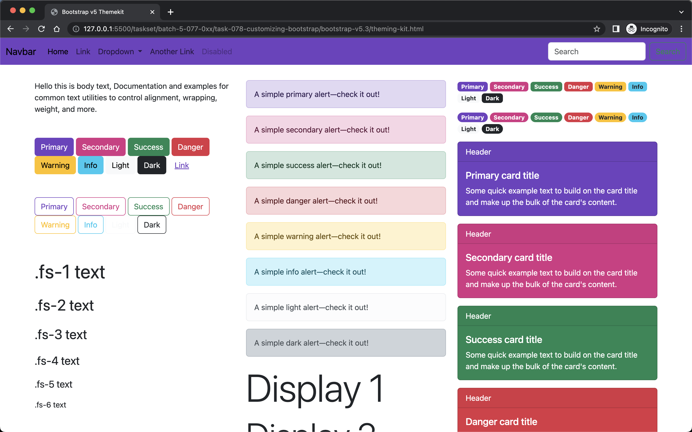
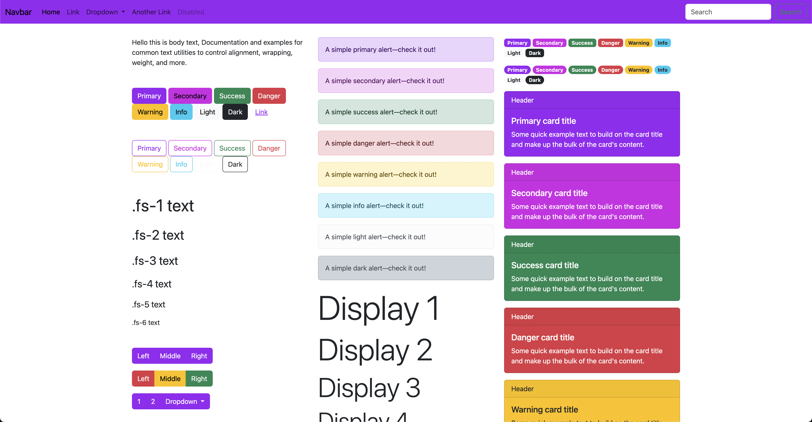
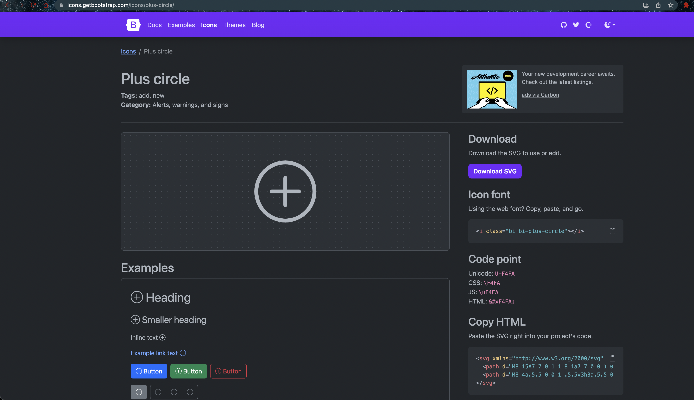
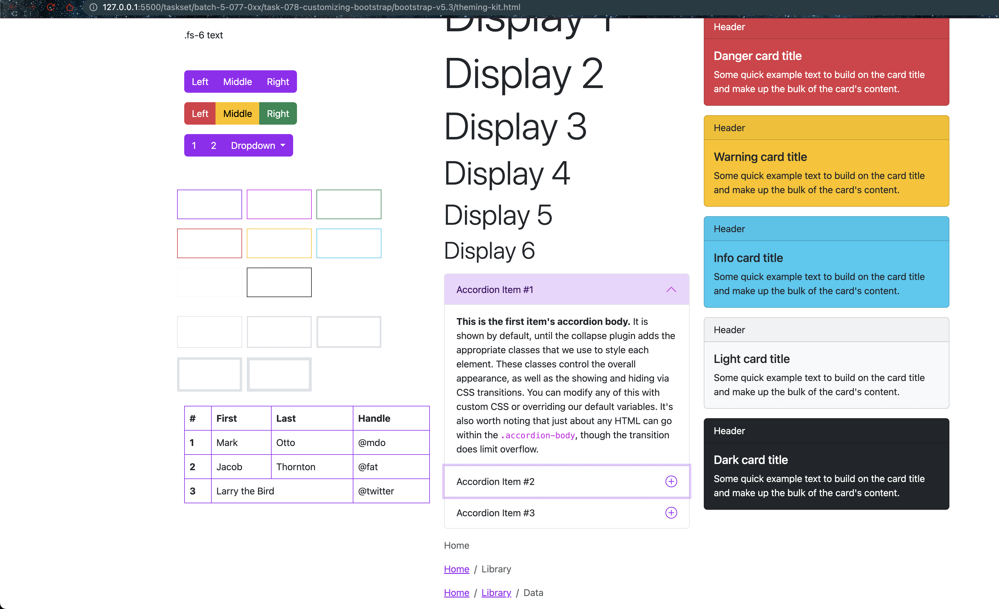
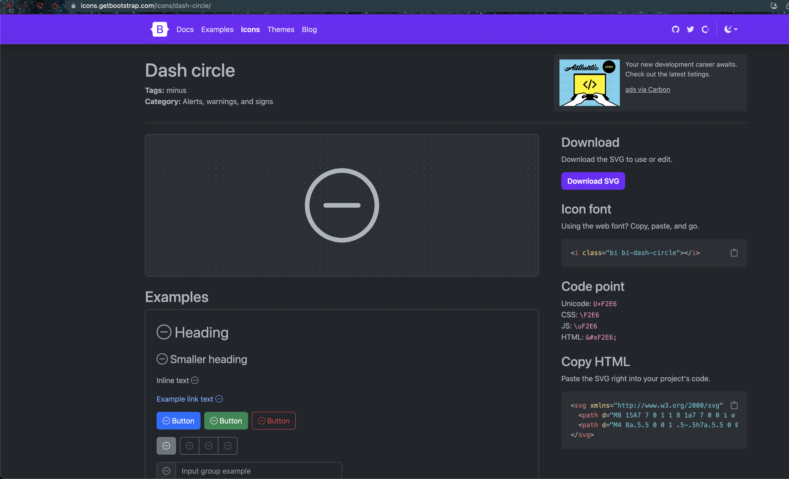
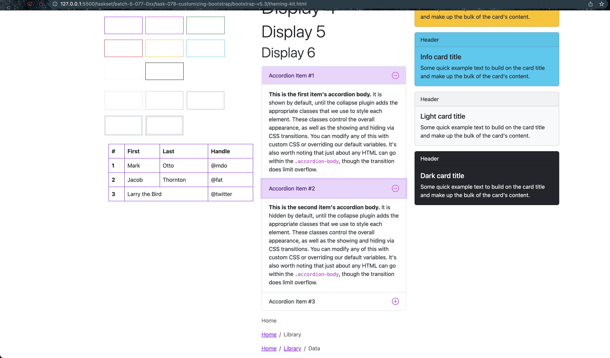
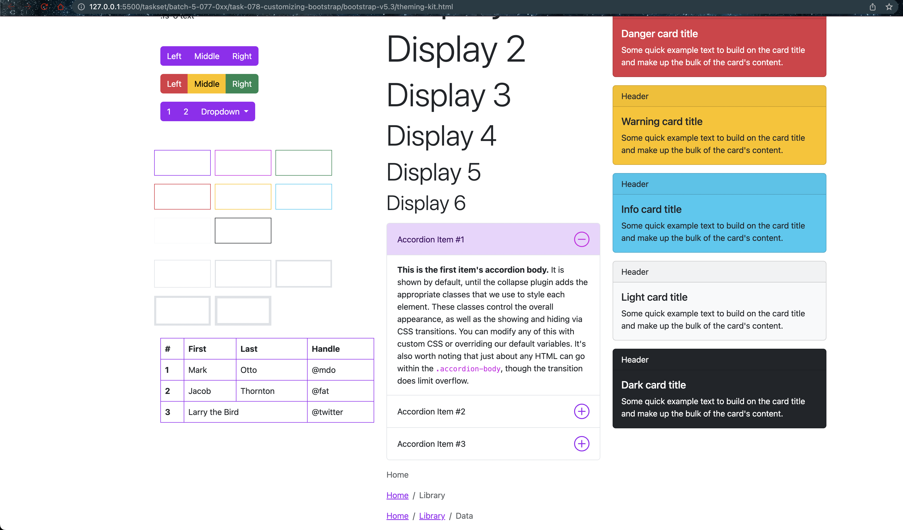

# Customizing Bootstrap

- Version Info

```bash
$ showenv
node: v19.8.0
npm: 9.5.1
yarn: 1.22.19
```

- Create `scss/_custom.scss` file

```bash
$ touch scss/_custom.scss
.
```

- _custom.scss

```scss
// IMPORT BOOTSTRAP
@import "../node_modules/bootstrap/scss/bootstrap.scss";
```

- style.scss

```scss
@use 'custom';
```

- Now when you should see the compiled css file in asset/css folder. The same can be imported in theming.html file.

```html
    <link rel="stylesheet" href="assets/css/style.css">
```



- Copy the colors

```bash
$ find . -name _variables.scss
./node_modules/bootstrap/scss/_variables.scss
./node_modules/@fortawesome/fontawesome-free/scss/_variables.scss

$ cat ./node_modules/bootstrap/scss/_variables.scss | grep "scss-docs-start gray-color-variables" -A 11
// scss-docs-start gray-color-variables
$white:    #fff !default;
$gray-100: #f8f9fa !default;
$gray-200: #e9ecef !default;
$gray-300: #dee2e6 !default;
$gray-400: #ced4da !default;
$gray-500: #adb5bd !default;
$gray-600: #6c757d !default;
$gray-700: #495057 !default;
$gray-800: #343a40 !default;
$gray-900: #212529 !default;
$black:    #000 !default;

$ cat ./node_modules/bootstrap/scss/_variables.scss | egrep "scss-docs-start color-variables" -A 10 | egrep "purple|pink"
$purple:  #6f42c1 !default;
$pink:    #d63384 !default;

$ cat ./node_modules/bootstrap/scss/_variables.scss | egrep "scss-docs-start theme-color-variables" -A 10 | egrep "primary|secondary"
$primary:       $blue !default;
$secondary:     $gray-600 !default;
```

- After adding these values in _custom.scss file, you should see the changes in the theming.html file.

```scss
// MY THEME COLORS
$purple:  #6f42c1;
$pink:    #d63384;

$white:    #fff;
$gray-100: #f8f9fa;
$gray-200: #e9ecef;
$gray-300: #dee2e6;
$gray-400: #ced4da;
$gray-500: #adb5bd;
$gray-600: #6c757d;
$gray-700: #495057;
$gray-800: #343a40;
$gray-900: #212529;
$black:    #000;
// IMPORT BOOTSTRAP

$primary:       $purple;
$secondary:     $pink;

@import "../node_modules/bootstrap/scss/bootstrap.scss";
```



- After changing theme colors



- Change the accordion icon

```bash
$ cat ./node_modules/bootstrap/scss/_variables.scss | egrep "accordion-icon-color|accordion-icon-active-color"
$accordion-icon-color:                    $body-color !default;
$accordion-icon-active-color:             $primary-text-emphasis !default;

$ cat ./node_modules/bootstrap/scss/_variables.scss | egrep "accordion-button-icon|accordion-button-active-icon"
$accordion-button-icon:         url("data:image/svg+xml,<svg xmlns='http://www.w3.org/2000/svg' viewBox='0 0 16 16' fill='#{$accordion-icon-color}'><path fill-rule='evenodd' d='M1.646 4.646a.5.5 0 0 1 .708 0L8 10.293l5.646-5.647a.5.5 0 0 1 .708.708l-6 6a.5.5 0 0 1-.708 0l-6-6a.5.5 0 0 1 0-.708z'/></svg>") !default;
$accordion-button-active-icon:  url("data:image/svg+xml,<svg xmlns='http://www.w3.org/2000/svg' viewBox='0 0 16 16' fill='#{$accordion-icon-active-color}'><path fill-rule='evenodd' d='M1.646 4.646a.5.5 0 0 1 .708 0L8 10.293l5.646-5.647a.5.5 0 0 1 .708.708l-6 6a.5.5 0 0 1-.708 0l-6-6a.5.5 0 0 1 0-.708z'/></svg>") !default;
```

- Get new icons [https://icons.getbootstrap.com/icons/plus-circle](https://icons.getbootstrap.com/icons/plus-circle) and copy HTML



```html
<svg xmlns="http://www.w3.org/2000/svg" width="16" height="16" fill="currentColor" class="bi bi-plus-circle" viewBox="0 0 16 16">
  <path d="M8 15A7 7 0 1 1 8 1a7 7 0 0 1 0 14zm0 1A8 8 0 1 0 8 0a8 8 0 0 0 0 16z"/>
  <path d="M8 4a.5.5 0 0 1 .5.5v3h3a.5.5 0 0 1 0 1h-3v3a.5.5 0 0 1-1 0v-3h-3a.5.5 0 0 1 0-1h3v-3A.5.5 0 0 1 8 4z"/>
</svg>
```

- Copy to `custom.scss` file `M8 15A7 7 0 1 1 8 1a7 7 0 0 1 0 14zm0 1A8 8 0 1 0 8 0a8 8 0 0 0 0 16z` and `<path d='M8 4a.5.5 0 0 1 .5.5v3h3a.5.5 0 0 1 0 1h-3v3a.5.5 0 0 1-1 0v-3h-3a.5.5 0 0 1 0-1h3v-3A.5.5 0 0 1 8 4z'/>` , replace " with ' quotes

```scss
$accordion-button-icon:         url("data:image/svg+xml,<svg xmlns='http://www.w3.org/2000/svg' viewBox='0 0 16 16' fill='#{$accordion-icon-color}'><path fill-rule='evenodd' d='M8 15A7 7 0 1 1 8 1a7 7 0 0 1 0 14zm0 1A8 8 0 1 0 8 0a8 8 0 0 0 0 16z'/><path d='M8 4a.5.5 0 0 1 .5.5v3h3a.5.5 0 0 1 0 1h-3v3a.5.5 0 0 1-1 0v-3h-3a.5.5 0 0 1 0-1h3v-3A.5.5 0 0 1 8 4z'/></svg>");
```

- Validate your changes by open theming.html file in live server



- Change the accordion icon [dash-circle](https://icons.getbootstrap.com/icons/dash-circle)



```html
<svg xmlns="http://www.w3.org/2000/svg" width="16" height="16" fill="currentColor" class="bi bi-dash-circle" viewBox="0 0 16 16">
  <path d="M8 15A7 7 0 1 1 8 1a7 7 0 0 1 0 14zm0 1A8 8 0 1 0 8 0a8 8 0 0 0 0 16z"/>
  <path d="M4 8a.5.5 0 0 1 .5-.5h7a.5.5 0 0 1 0 1h-7A.5.5 0 0 1 4 8z"/>
</svg>
```

- Copy to `custom.scss` file `M8 15A7 7 0 1 1 8 1a7 7 0 0 1 0 14zm0 1A8 8 0 1 0 8 0a8 8 0 0 0 0 16z` and `<path d="M4 8a.5.5 0 0 1 .5-.5h7a.5.5 0 0 1 0 1h-7A.5.5 0 0 1 4 8z"/>` , replace " with ' quotes

```scss
$accordion-button-active-icon:  url("data:image/svg+xml,<svg xmlns='http://www.w3.org/2000/svg' viewBox='0 0 16 16' fill='#{$accordion-icon-active-color}'><path fill-rule='evenodd' d='M8 15A7 7 0 1 1 8 1a7 7 0 0 1 0 14zm0 1A8 8 0 1 0 8 0a8 8 0 0 0 0 16z'/><path d='M4 8a.5.5 0 0 1 .5-.5h7a.5.5 0 0 1 0 1h-7A.5.5 0 0 1 4 8z'/></svg>");
```

- Validate your changes by open theming.html file in live server



- Change accordion-icon width

```bash
$ cat ./node_modules/bootstrap/scss/_variables.scss | egrep "accordion-icon-width"                              
$accordion-icon-width:                    1.25rem !default;
```

- Copy to `custom.scss` file

```scss
$accordion-icon-width:                    1.875rem;
```

- Validate your changes by open theming.html file in live server


