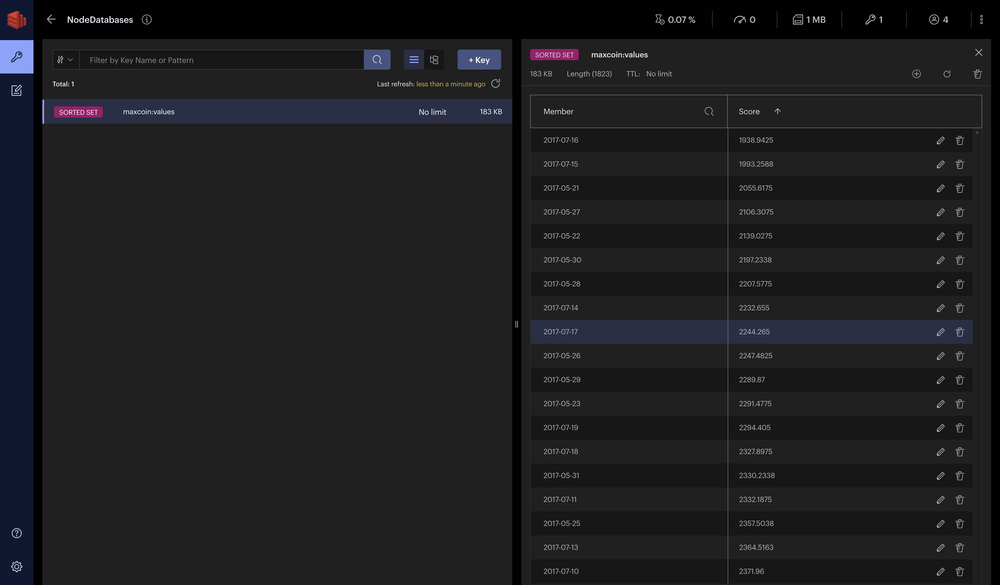

- Run

```bash
$ docker run --name redis -p 6379:6379 -d redis
31d3570f6006cead5efb296e26727120b45f539812cd4c1aebb1c97720e24b13
```

- Download [https://redis.com/redis-enterprise/redis-insight/](https://redis.com/redis-enterprise/redis-insight/) and create redis database

- Run

```bash
$ npm install       
npm WARN deprecated debug@4.2.0: Debug versions >=3.2.0 <3.2.7 || >=4 <4.3.1 have a low-severity ReDos regression when used in a Node.js environment. It is recommended you upgrade to 3.2.7 or 4.3.1. (https://github.com/visionmedia/debug/issues/797)

added 211 packages, and audited 212 packages in 2s

28 packages are looking for funding
  run `npm fund` for details

found 0 vulnerabilities


$ npm install ioredis

added 9 packages, changed 1 package, and audited 221 packages in 5s

29 packages are looking for funding
  run `npm fund` for details

found 0 vulnerabilities
```


- Run

```bash
$ npm start

> maxcoin@1.0.0 start
> node main.js

Connecting to Redis
Successfully connected to Redis
redis-connect: 1.223ms
Inserting into redis-db
redis-insert: 533.544ms
Number of documents inserted 1823 into Redis
Querying Redis 
redis-find: 0.904ms
disconnecting to Redis
redis-disconnect: 0.027ms
[ '2021-11-08', '67544.873300000007' ]
```


- After connecting to the client

