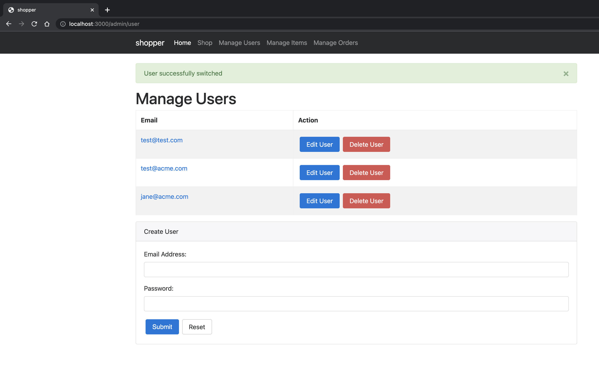
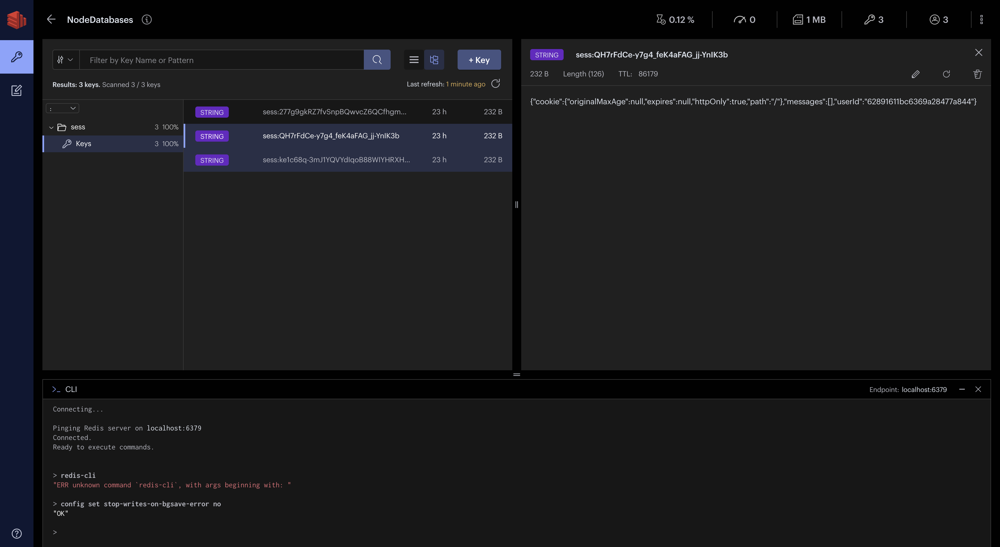

- Install

```bash
$ npm install connect-redis

added 1 package, and audited 453 packages in 2s

42 packages are looking for funding
  run `npm fund` for details

found 0 vulnerabilities
```

- Run 

```bash
$ npm start dev            

> shopper@0.0.0 start
> node ./server/bin/start "dev"

Successfully connected to Redis
Successfully connected to MongoDB
shopper listening on port 3000
```


- Visting the website in incognito creates new sessions 



- Redis Insights


