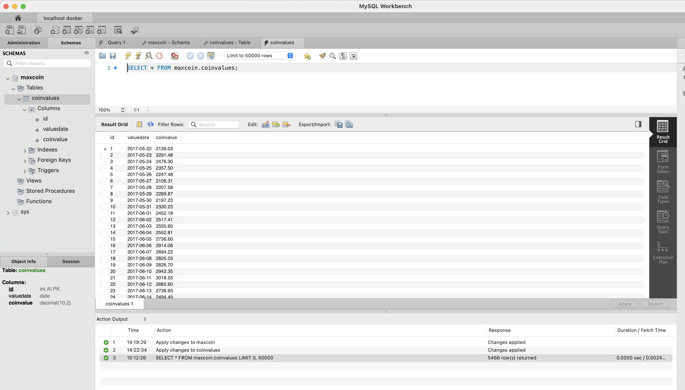

- Install Driver

```bash
$ npm install mysql2       

added 235 packages, and audited 236 packages in 4s

29 packages are looking for funding
  run `npm fund` for details

found 0 vulnerabilities
```


- Run

```bash
$ npm start dev

> maxcoin@1.0.0 start
> node main.js "dev"

Connecting to MySQL
Successfully connected to MySQL
mysql-connect: 4.497ms
Inserting into mysql-db
mysql-insert: 147.298ms
Number of documents inserted 1822 into MySQL
Querying MySQL 
mysql-find: 3.602ms
disconnecting to MySQL
mysql-disconnect: 0.251ms
{
  id: 1632,
  valuedate: 2021-11-07T20:00:00.000Z,
  coinvalue: '67544.87'
}
```


- In UI

