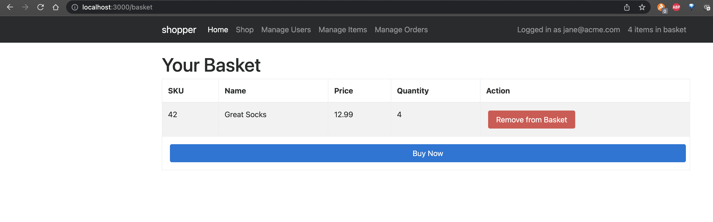
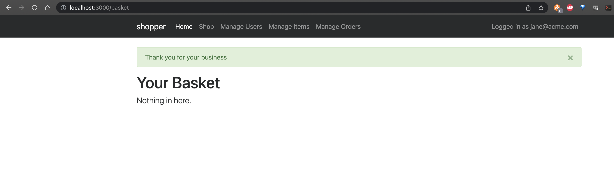
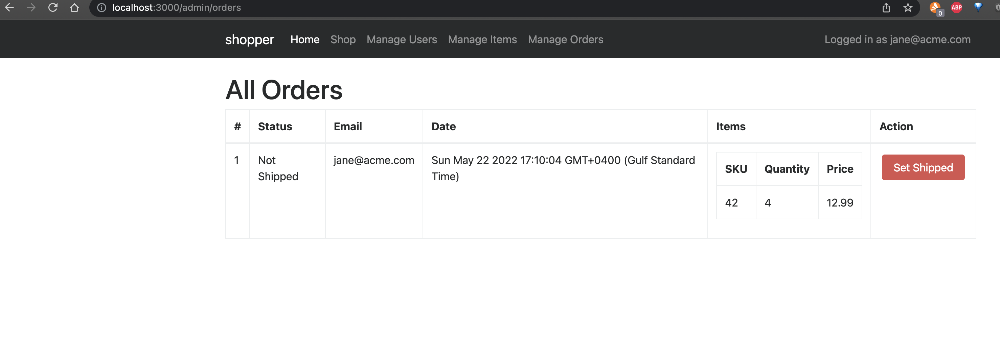
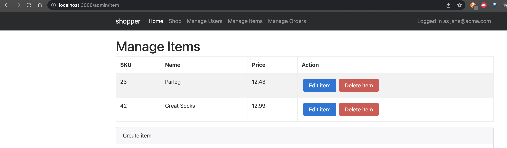
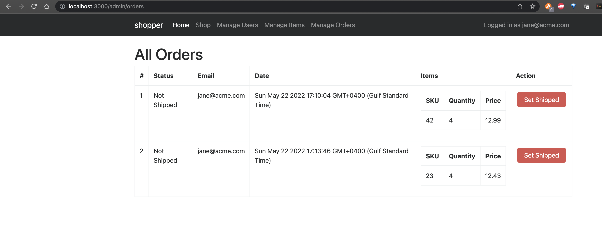
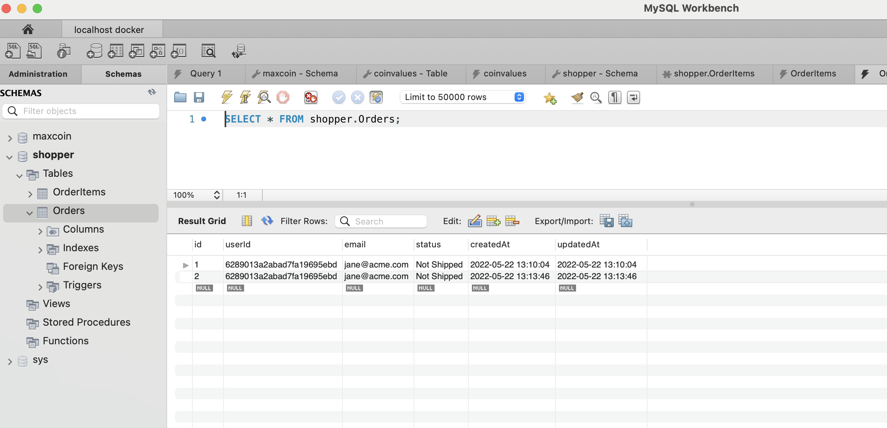
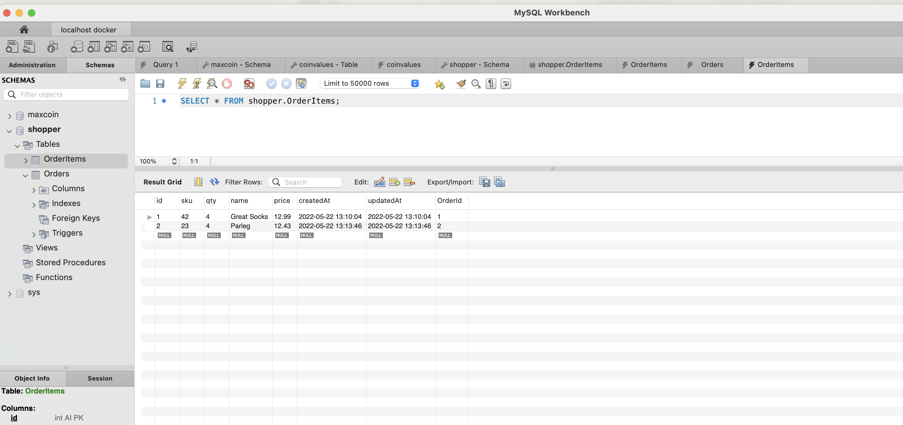

- Run


```bash
$ npm start

> shopper@0.0.0 start
> node ./server/bin/start

Successfully connected to Redis
Successfully connected to MongoDB
shopper listening on port 3000
Executing (default): SELECT 1+1 AS result
Executing (default): CREATE TABLE IF NOT EXISTS `Orders` (`id` INTEGER NOT NULL auto_increment , `userId` VARCHAR(24), `email` VARCHAR(255), `status` VARCHAR(255), `createdAt` DATETIME NOT NULL, `updatedAt` DATETIME NOT NULL, PRIMARY KEY (`id`)) ENGINE=InnoDB;
Executing (default): CREATE TABLE IF NOT EXISTS `Orders` (`id` INTEGER NOT NULL auto_increment , `userId` VARCHAR(24), `email` VARCHAR(255), `status` VARCHAR(255), `createdAt` DATETIME NOT NULL, `updatedAt` DATETIME NOT NULL, PRIMARY KEY (`id`)) ENGINE=InnoDB;
Successfully connected to MySQL
Executing (default): SHOW INDEX FROM `Orders` FROM `shopper`
Executing (default): SHOW INDEX FROM `Orders` FROM `shopper`
Executing (default): CREATE TABLE IF NOT EXISTS `OrderItems` (`id` INTEGER NOT NULL auto_increment , `sku` INTEGER, `qty` INTEGER, `name` VARCHAR(255), `price` DECIMAL(10,2), `createdAt` DATETIME NOT NULL, `updatedAt` DATETIME NOT NULL, `OrderId` INTEGER, PRIMARY KEY (`id`), FOREIGN KEY (`OrderId`) REFERENCES `Orders` (`id`) ON DELETE SET NULL ON UPDATE CASCADE) ENGINE=InnoDB;
Executing (default): CREATE TABLE IF NOT EXISTS `OrderItems` (`id` INTEGER NOT NULL auto_increment , `sku` INTEGER, `qty` INTEGER, `name` VARCHAR(255), `price` DECIMAL(10,2), `createdAt` DATETIME NOT NULL, `updatedAt` DATETIME NOT NULL, `OrderId` INTEGER, PRIMARY KEY (`id`), FOREIGN KEY (`OrderId`) REFERENCES `Orders` (`id`) ON DELETE SET NULL ON UPDATE CASCADE) ENGINE=InnoDB;
Executing (default): SHOW INDEX FROM `OrderItems` FROM `shopper`
Executing (default): SHOW INDEX FROM `OrderItems` FROM `shopper`
Executing (7ff24a4f-cc0d-4e8f-ad66-15c0696082d0): START TRANSACTION;
Executing (7ff24a4f-cc0d-4e8f-ad66-15c0696082d0): INSERT INTO `Orders` (`id`,`userId`,`email`,`status`,`createdAt`,`updatedAt`) VALUES (DEFAULT,?,?,?,?,?);
Executing (default): INSERT INTO `OrderItems` (`id`,`sku`,`qty`,`name`,`price`,`createdAt`,`updatedAt`) VALUES (DEFAULT,?,?,?,?,?,?);
Executing (7ff24a4f-cc0d-4e8f-ad66-15c0696082d0): UPDATE `OrderItems` SET `OrderId`=?,`updatedAt`=? WHERE `id` IN (1)
Executing (7ff24a4f-cc0d-4e8f-ad66-15c0696082d0): COMMIT;
Executing (default): SELECT `Order`.`id`, `Order`.`userId`, `Order`.`email`, `Order`.`status`, `Order`.`createdAt`, `Order`.`updatedAt`, `OrderItems`.`id` AS `OrderItems.id`, `OrderItems`.`sku` AS `OrderItems.sku`, `OrderItems`.`qty` AS `OrderItems.qty`, `OrderItems`.`name` AS `OrderItems.name`, `OrderItems`.`price` AS `OrderItems.price`, `OrderItems`.`createdAt` AS `OrderItems.createdAt`, `OrderItems`.`updatedAt` AS `OrderItems.updatedAt`, `OrderItems`.`OrderId` AS `OrderItems.OrderId` FROM `Orders` AS `Order` LEFT OUTER JOIN `OrderItems` AS `OrderItems` ON `Order`.`id` = `OrderItems`.`OrderId`;

```


- Click On Buy Now



- After clicking

)


- If you go to manage orders




- Adding more items 



- Manage Order finally




- Table Orders 



- Table OrderItems

