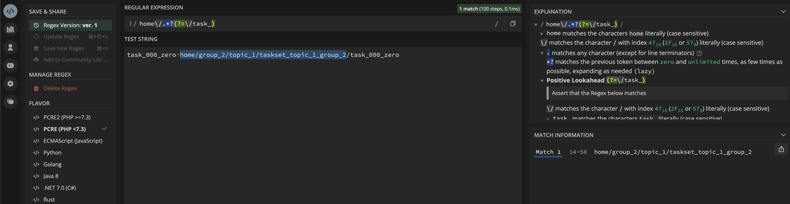

# Understanding createIndividualSectionsMarkdown

> Note: Run the file from the root directory of the repository.

<br>

## Directory Structre

```bash
$ tree 
.
├── ReadMe.md
├── base
│   ├── group_3
│   │   └── topic_3
│   │       ├── ReadMe.md
│   │       └── taskset_topic_3_group_3
│   │           ├── task_000_zero
│   │           │   └── ReadMe.md
│   │           └── task_001_one
│   │               └── ReadMe.md
│   └── group_4
│       └── topic_4
│           ├── ReadMe.md
│           └── taskset_topic_4_group_4
│               └── task_001_one
│                   └── ReadMe.md
└── generate-readme.php

11 directories, 7 files
```

<br>

## Detailed debug Output

```bash
$ php generate-readme.php


---------------tasksetDirectoryKey-------------taskset_topic_3_group_3-----------------------------------------------------------
---------------arrayOfDirectoriesInTasksetDirectory--------------------------------------------------------------------------------
Array
(
    [0] => task_000_zero base/group_3/topic_3/taskset_topic_3_group_3/task_000_zero
    [1] => task_001_one base/group_3/topic_3/taskset_topic_3_group_3/task_001_one
)
arrayOfDirectoriesInTasksetDirectory[0]: task_000_zero base/group_3/topic_3/taskset_topic_3_group_3/task_000_zero--------relativePathToTasksetDirectoryReadMeFile------------base/group_3/topic_3/taskset_topic_3_group_3----
--------relativePathToTasksetDirectoryReadMeFile------------base/group_3/topic_3----
--------taskDirectoryChildFolderConcatenatedWithRelativePath------------task_000_zero base/group_3/topic_3/taskset_topic_3_group_3/task_000_zero----
--------taskNumber------------task_000----
--------arrayOfChildFolderNameAndItsRelativePath---------------
--------childFolderName------------task_000_zero----
Array
(
    [0] => task_000_zero
    [1] => base/group_3/topic_3/taskset_topic_3_group_3/task_000_zero
)
--------childFolderName------------task_000_zero----
--------arrayOfChildFoldersRelativePathExplodedWithSlash---------------
Array
(
    [0] => base
    [1] => group_3
    [2] => topic_3
    [3] => taskset_topic_3_group_3
    [4] => task_000_zero
)
--------tasksetDirectoryName------------taskset_topic_3_group_3----
Adding following row to markdown
| task_000 | [task_000_zero](taskset_topic_3_group_3/task_000_zero) |
--------taskDirectoryChildFolderConcatenatedWithRelativePath------------task_001_one base/group_3/topic_3/taskset_topic_3_group_3/task_001_one----
--------taskNumber------------task_001----
--------arrayOfChildFolderNameAndItsRelativePath---------------
--------childFolderName------------task_001_one----
Array
(
    [0] => task_001_one
    [1] => base/group_3/topic_3/taskset_topic_3_group_3/task_001_one
)
--------childFolderName------------task_001_one----
--------arrayOfChildFoldersRelativePathExplodedWithSlash---------------
Array
(
    [0] => base
    [1] => group_3
    [2] => topic_3
    [3] => taskset_topic_3_group_3
    [4] => task_001_one
)
--------tasksetDirectoryName------------taskset_topic_3_group_3----
Adding following row to markdown
| task_001 | [task_001_one](taskset_topic_3_group_3/task_001_one) |


---------------tasksetDirectoryKey-------------taskset_topic_4_group_4-----------------------------------------------------------
---------------arrayOfDirectoriesInTasksetDirectory--------------------------------------------------------------------------------
Array
(
    [0] => task_001_one base/group_4/topic_4/taskset_topic_4_group_4/task_001_one
)
arrayOfDirectoriesInTasksetDirectory[0]: task_001_one base/group_4/topic_4/taskset_topic_4_group_4/task_001_one--------relativePathToTasksetDirectoryReadMeFile------------base/group_4/topic_4/taskset_topic_4_group_4----
--------relativePathToTasksetDirectoryReadMeFile------------base/group_4/topic_4----
--------taskDirectoryChildFolderConcatenatedWithRelativePath------------task_001_one base/group_4/topic_4/taskset_topic_4_group_4/task_001_one----
--------taskNumber------------task_001----
--------arrayOfChildFolderNameAndItsRelativePath---------------
--------childFolderName------------task_001_one----
Array
(
    [0] => task_001_one
    [1] => base/group_4/topic_4/taskset_topic_4_group_4/task_001_one
)
--------childFolderName------------task_001_one----
--------arrayOfChildFoldersRelativePathExplodedWithSlash---------------
Array
(
    [0] => base
    [1] => group_4
    [2] => topic_4
    [3] => taskset_topic_4_group_4
    [4] => task_001_one
)
--------tasksetDirectoryName------------taskset_topic_4_group_4----
Adding following row to markdown
| task_001 | [task_001_one](taskset_topic_4_group_4/task_001_one) |
```

<br>

## Understanding Regex

let's break down the regular expression `/base\/.*?(?=\/task_)/` used in the `preg_match` function:

<br>

### Explanation of the Regex `/base\/.*?(?=\/task_)/`

1. **`base\/`**:
   - **`base`**: Matches the literal string "base".
   - **`\/`**: Matches a literal forward slash `/`.

2. **`.*?`**:
   - **`.`**: Matches any single character except newline characters.
   - **`*`**: Matches 0 or more occurrences of the preceding character (any character).
   - **`?`**: Makes the preceding quantifier non-greedy, matching as few characters as possible while still allowing the rest of the pattern to match.

3. **`(?=\/task_)`**:
   - **`(?=...)`**: Positive lookahead assertion. It asserts that what immediately follows the current position in the string is the pattern inside the parentheses but does not include it in the match.
   - **`\/task_`**: Matches a literal forward slash `/` followed by the string "task_".

The regex `/base\/.*?(?=\/task_)/` matches "base/" followed by the shortest possible sequence of any characters that is followed by "/task_", without including "/task_" in the match.



[test-regex](https://regex101.com/r/hvpsc3/1)