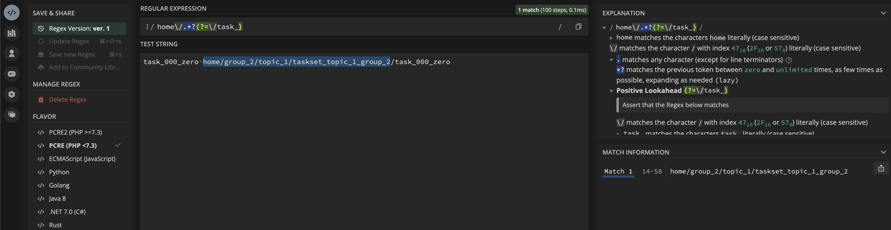

# Understanding createIndividualSectionsMarkdown

## Directory Structre

```bash
$ tree
.
├── ReadMe.md
├── generate-readme.php
└── home
    ├── group_1
    │   └── topic_1
    │       ├── ReadMe.md
    │       └── taskset_topic_1_group_1
    │           └── task_001_one
    │               └── ReadMe.md
    └── group_2
        └── topic_1
            ├── ReadMe.md
            └── taskset_topic_1_group_2
                ├── task_000_zero
                │   └── ReadMe.md
                └── task_001_one
                    └── ReadMe.md

11 directories, 7 files
```

## Detailed debug Output

```bash
$ php generate-readme.php


---------------tasksetDirectoryKey-------------taskset_topic_1_group_1-----------------------------------------------------------
---------------arrayOfDirectoriesInTasksetDirectory--------------------------------------------------------------------------------
Array
(
    [0] => task_001_one home/group_1/topic_1/taskset_topic_1_group_1/task_001_one
)
arrayOfDirectoriesInTasksetDirectory[0]: task_001_one home/group_1/topic_1/taskset_topic_1_group_1/task_001_one--------relativePathToTasksetDirectoryReadMeFile------------home/group_1/topic_1/taskset_topic_1_group_1----
--------relativePathToTasksetDirectoryReadMeFile------------home/group_1/topic_1----
--------taskDirectoryChildFolderConcatenatedWithRelativePath------------task_001_one home/group_1/topic_1/taskset_topic_1_group_1/task_001_one----
--------taskNumber------------task_001----
--------arrayOfChildFolderNameAndItsRelativePath---------------
--------childFolderName------------task_001_one----
Array
(
    [0] => task_001_one
    [1] => home/group_1/topic_1/taskset_topic_1_group_1/task_001_one
)
--------childFolderName------------task_001_one----
--------arrayOfChildFoldersRelativePathExplodedWithSlash---------------
Array
(
    [0] => home
    [1] => group_1
    [2] => topic_1
    [3] => taskset_topic_1_group_1
    [4] => task_001_one
)
--------tasksetDirectoryName------------taskset_topic_1_group_1----
Adding following row to markdown
| task_001 | [task_001_one](taskset_topic_1_group_1/task_001_one) |


---------------tasksetDirectoryKey-------------taskset_topic_1_group_2-----------------------------------------------------------
---------------arrayOfDirectoriesInTasksetDirectory--------------------------------------------------------------------------------
Array
(
    [0] => task_000_zero home/group_2/topic_1/taskset_topic_1_group_2/task_000_zero
    [1] => task_001_one home/group_2/topic_1/taskset_topic_1_group_2/task_001_one
)
arrayOfDirectoriesInTasksetDirectory[0]: task_000_zero home/group_2/topic_1/taskset_topic_1_group_2/task_000_zero--------relativePathToTasksetDirectoryReadMeFile------------home/group_2/topic_1/taskset_topic_1_group_2----
--------relativePathToTasksetDirectoryReadMeFile------------home/group_2/topic_1----
--------taskDirectoryChildFolderConcatenatedWithRelativePath------------task_000_zero home/group_2/topic_1/taskset_topic_1_group_2/task_000_zero----
--------taskNumber------------task_000----
--------arrayOfChildFolderNameAndItsRelativePath---------------
--------childFolderName------------task_000_zero----
Array
(
    [0] => task_000_zero
    [1] => home/group_2/topic_1/taskset_topic_1_group_2/task_000_zero
)
--------childFolderName------------task_000_zero----
--------arrayOfChildFoldersRelativePathExplodedWithSlash---------------
Array
(
    [0] => home
    [1] => group_2
    [2] => topic_1
    [3] => taskset_topic_1_group_2
    [4] => task_000_zero
)
--------tasksetDirectoryName------------taskset_topic_1_group_2----
Adding following row to markdown
| task_000 | [task_000_zero](taskset_topic_1_group_2/task_000_zero) |
--------taskDirectoryChildFolderConcatenatedWithRelativePath------------task_001_one home/group_2/topic_1/taskset_topic_1_group_2/task_001_one----
--------taskNumber------------task_001----
--------arrayOfChildFolderNameAndItsRelativePath---------------
--------childFolderName------------task_001_one----
Array
(
    [0] => task_001_one
    [1] => home/group_2/topic_1/taskset_topic_1_group_2/task_001_one
)
--------childFolderName------------task_001_one----
--------arrayOfChildFoldersRelativePathExplodedWithSlash---------------
Array
(
    [0] => home
    [1] => group_2
    [2] => topic_1
    [3] => taskset_topic_1_group_2
    [4] => task_001_one
)
--------tasksetDirectoryName------------taskset_topic_1_group_2----
Adding following row to markdown
| task_001 | [task_001_one](taskset_topic_1_group_2/task_001_one) |
```

## Understanding Regex

let's break down the regular expression `/home\/.*?(?=\/task_)/` used in the `preg_match` function:

### Explanation of the Regex `/home\/.*?(?=\/task_)/`

1. **`home\/`**:
   - **`home`**: Matches the literal string "home".
   - **`\/`**: Matches a literal forward slash `/`.

2. **`.*?`**:
   - **`.`**: Matches any single character except newline characters.
   - **`*`**: Matches 0 or more occurrences of the preceding character (any character).
   - **`?`**: Makes the preceding quantifier non-greedy, matching as few characters as possible while still allowing the rest of the pattern to match.

3. **`(?=\/task_)`**:
   - **`(?=...)`**: Positive lookahead assertion. It asserts that what immediately follows the current position in the string is the pattern inside the parentheses but does not include it in the match.
   - **`\/task_`**: Matches a literal forward slash `/` followed by the string "task_".

The regex `/home\/.*?(?=\/task_)/` matches "home/" followed by the shortest possible sequence of any characters that is followed by "/task_", without including "/task_" in the match.



[test-regex](https://regex101.com/r/hvpsc3/1)