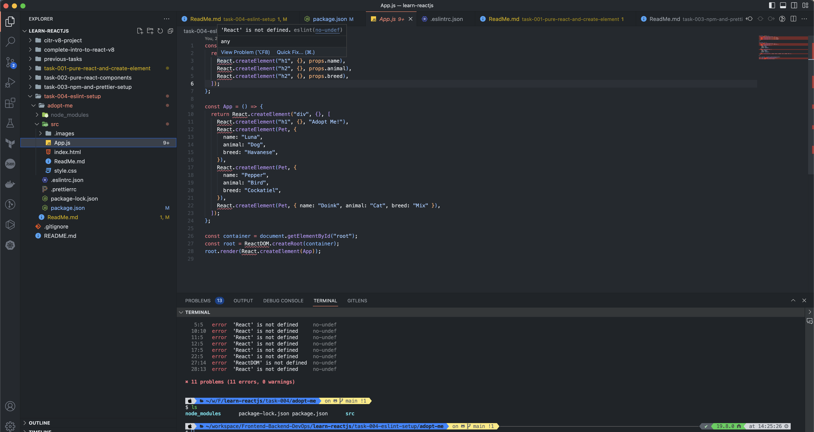

# Eslint Setup

- ENV
  
```bash
$ showenv
node: v19.8.0
npm env: 9.5.1
```

- Run

```bash
$ cd adopt-me
.

$ npm i -D eslint@8.38.0
.

$ npm i -D eslint-config-prettier@8.8.0
.  
```

- Create `eslintrc.json` file

```bash
$ touch .eslintrc.json
.
```

- Once you add the script `"lint": "eslint \"src/**/*.{js,jsx}\" --quiet",` you should see some errors

```bash
$ npm run lint                         

> adopt-me@1.0.0 lint
> eslint "src/**/*.{js,jsx}" --quiet


/Users/rinkydahiya/workspace/Frontend-Backend-DevOps/learn-reactjs/task-004-eslint-setup/adopt-me/src/App.js
   2:10  error  'React' is not defined     no-undef
   3:5   error  'React' is not defined     no-undef
   4:5   error  'React' is not defined     no-undef
   5:5   error  'React' is not defined     no-undef
  10:10  error  'React' is not defined     no-undef
  11:5   error  'React' is not defined     no-undef
  12:5   error  'React' is not defined     no-undef
  17:5   error  'React' is not defined     no-undef
  22:5   error  'React' is not defined     no-undef
  27:14  error  'ReactDOM' is not defined  no-undef
  28:13  error  'React' is not defined     no-undef

✖ 11 problems (11 errors, 0 warnings)
```

- You should also see them in the IDE


