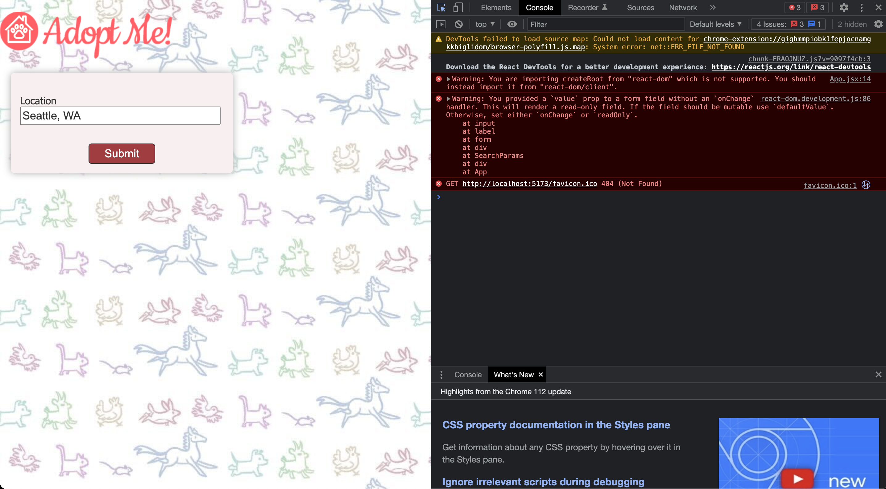
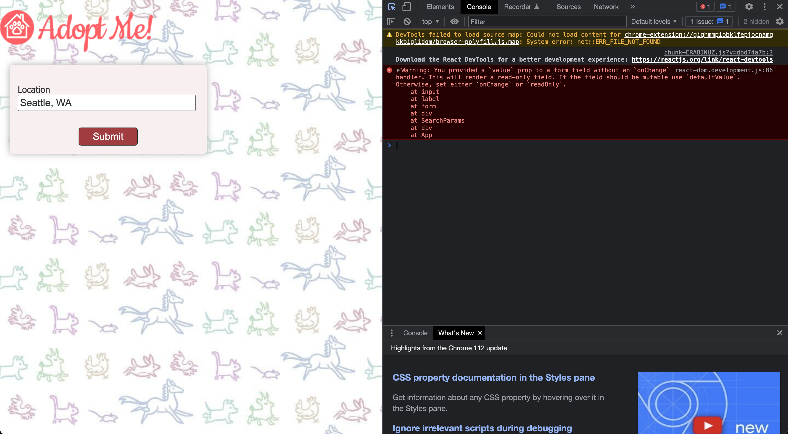
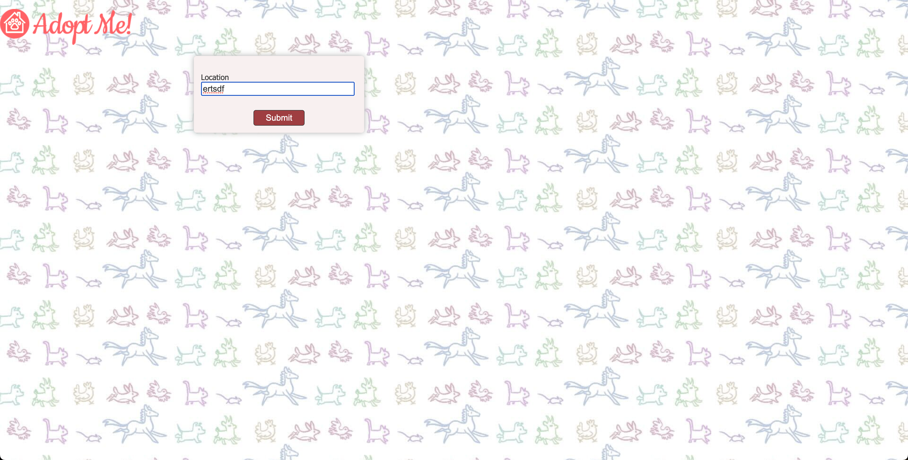

# Set State Hook

- [https://react-v8.holt.courses/lessons/core-react-concepts/hooks](https://react-v8.holt.courses/lessons/core-react-concepts/hooks)

- ENV
  
```bash
$ showenv
node: v19.8.0
npm env: 9.5.1
```

- Run

```bash
$ npm run dev 

> adopt-me@1.0.0 dev
> vite


  VITE v4.3.0  ready in 1669 ms

  ➜  Local:   http://localhost:5173/
  ➜  Network: use --host to expose
  ➜  press h to show help
```



- Fix the error by correcting import



- Try and type in it. You'll see that you can't modify it.  when you type in the input, React detects that a DOM event happens. When that happens, React thinks something may have changed so it runs a re-render.

- Fix and run again.



- An absolutely key concept for you to grasp is hooks rely on this strict ordering. As such, do not put hooks inside if statements or loops. 
  
- Let's add the ESLint rule
  
```bash
$ npm install -D eslint-plugin-react-hooks@4.6.0
.
```

