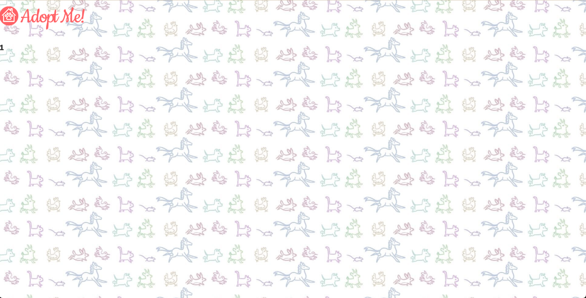
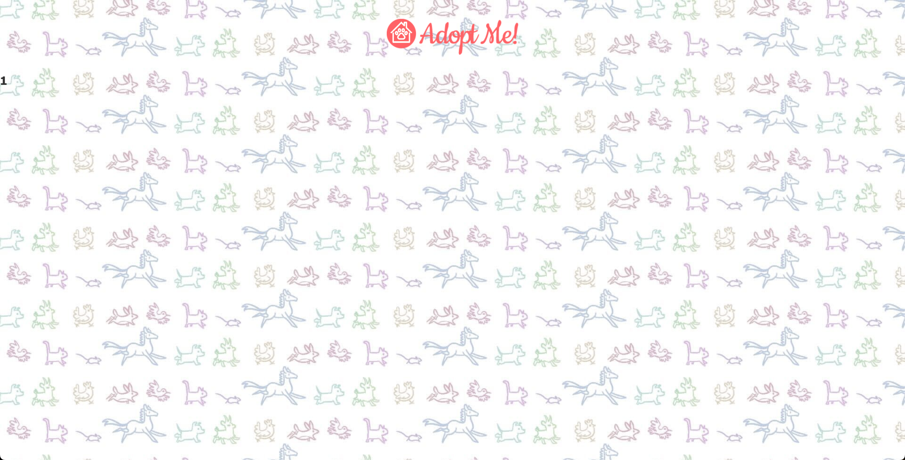

# useParams

- [https://react-v8.holt.courses/lessons/react-capabilities/react-router](https://react-v8.holt.courses/lessons/react-capabilities/react-router)

- ENV
  
```bash
$ showenv
node: v19.8.0
npm env: 9.5.1
```

- Now clicking on Luna takes you to details page ID displayed.




- Let's make the Adopt Me! header clickable too in App.jsx:


