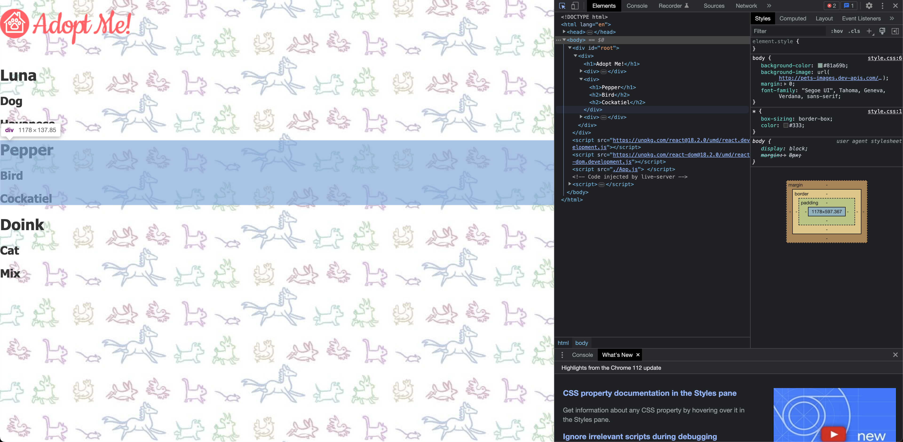
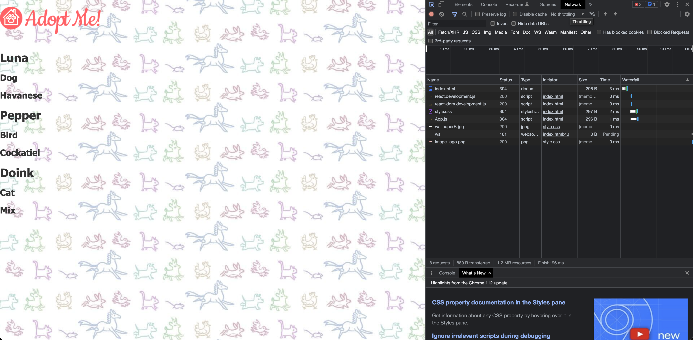

# Pure React Components

- [https://react-v8.holt.courses/lessons/no-frills-react/components](https://react-v8.holt.courses/lessons/no-frills-react/components)

```javascript
const Pet = (props) => {
    return React.createElement("div", {}, [
        React.createElement("h1", {}, props.name),
        React.createElement("h2", {}, props.animal),
        React.createElement("h2", {}, props.breed),
    ]);
};

const App = () => {
    return React.createElement("div", {}, [
        React.createElement("h1", {}, "Adopt Me!"),
        React.createElement(Pet, {
            name: "Luna",
            animal: "Dog",
            breed: "Havanese",
        }),
        React.createElement(Pet, {
            name: "Pepper",
            animal: "Bird",
            breed: "Cockatiel",
        }),
        React.createElement(Pet, { name: "Doink", animal: "Cat", breed: "Mix" }),
    ]);
};

const container = document.getElementById("root");
const root = ReactDOM.createRoot(container);
root.render(React.createElement(App));
```

This code snippet demonstrates the creation and rendering of two React components, `Pet` and `App`, using the React and ReactDOM libraries. Here's an explanation of each part of the code:

1. `const Pet = (props) => { ... }`: This is a functional component named 'Pet' that takes an object called 'props' as its argument. The component returns a `div` element containing three `h1` and `h2` elements displaying the pet's name, animal type, and breed, respectively. The values for these elements are taken from the 'props' object.

2. `const App = () => { ... }`: This is another functional component named 'App'. It returns a `div` element containing an `h1` element with the text "Adopt Me!" and three instances of the 'Pet' component with different sets of properties (props) defining the name, animal type, and breed for each pet.

3. `const container = document.getElementById("root");`: This line selects the 'root' element from the DOM using its ID.

4. `const root = ReactDOM.createRoot(container);`: This line creates a new root using the 'container' (the 'root' element) with the help of the `ReactDOM.createRoot()` function. This new root will be used to render the React components.

5. `root.render(React.createElement(App));`: This line renders the 'App' component as a React element by calling `React.createElement(App)`. The rendered component replaces the content of the 'root' element in the DOM.

After the code is executed, the content of the 'root' element will be:

```html
<div>
  <h1>Adopt Me!</h1>
  <div>
    <h1>Luna</h1>
    <h2>Dog</h2>
    <h2>Havanese</h2>
  </div>
  <div>
    <h1>Pepper</h1>
    <h2>Bird</h2>
    <h2>Cockatiel</h2>
  </div>
  <div>
    <h1>Doink</h1>
    <h2>Cat</h2>
    <h2>Mix</h2>
  </div>
</div>
```

The 'App' component renders a title and three instances of the 'Pet' component, each with different properties. This demonstrates the creation and usage of React components, passing props to child components, and rendering a component tree using the React and ReactDOM libraries.




