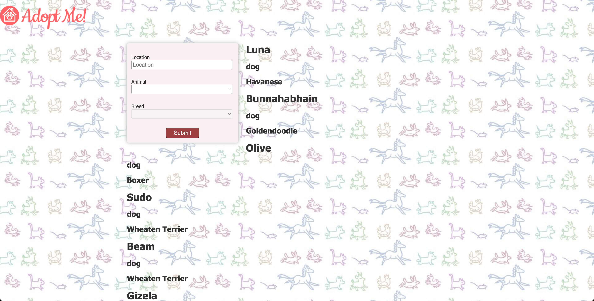
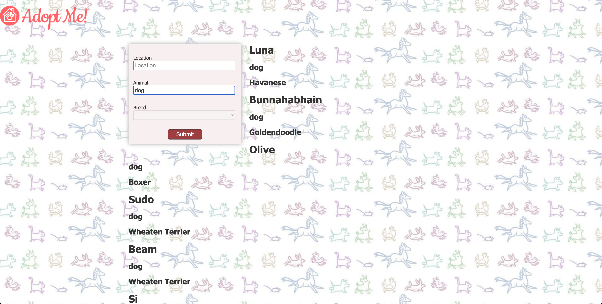

# Effects

- [https://react-v8.holt.courses/lessons/core-react-concepts/effects](https://react-v8.holt.courses/lessons/core-react-concepts/effects)

- ENV
  
```bash
$ showenv
node: v19.8.0
npm env: 9.5.1
```

- Running the application after, in this case we request once.



- Everytime animal changes, I want to you to re-run request pets.




- Everytime location changes, re-request


- Desired behavior is keeping the array empty

```jsx
    useEffect(() => {
    requestPets();
  }, [])
```
