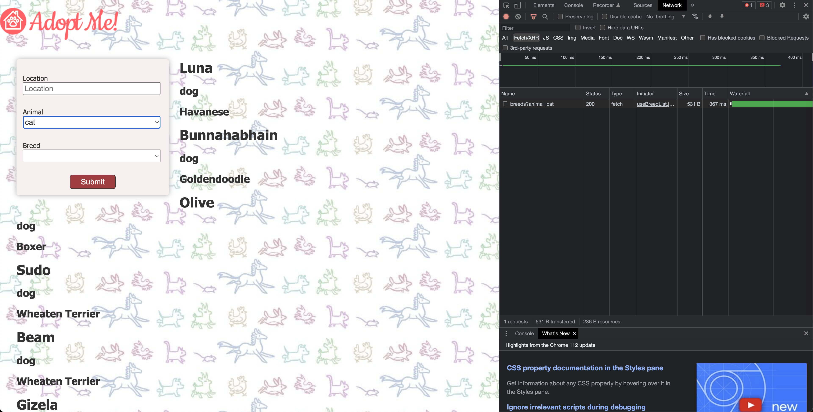
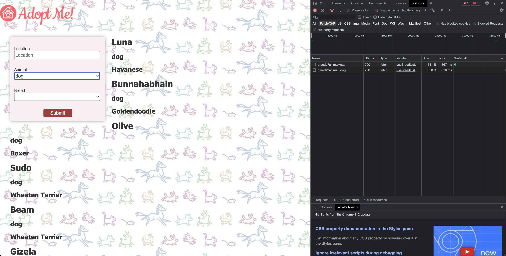

# useBreedList Custom Hook

- [https://react-v8.holt.courses/lessons/core-react-concepts/custom-hooks](https://react-v8.holt.courses/lessons/core-react-concepts/custom-hooks)

- ENV
  
```bash
$ showenv
node: v19.8.0
npm env: 9.5.1
```

- When you select cat



- When you select dog



- When you select car back again, there is no network call again.

