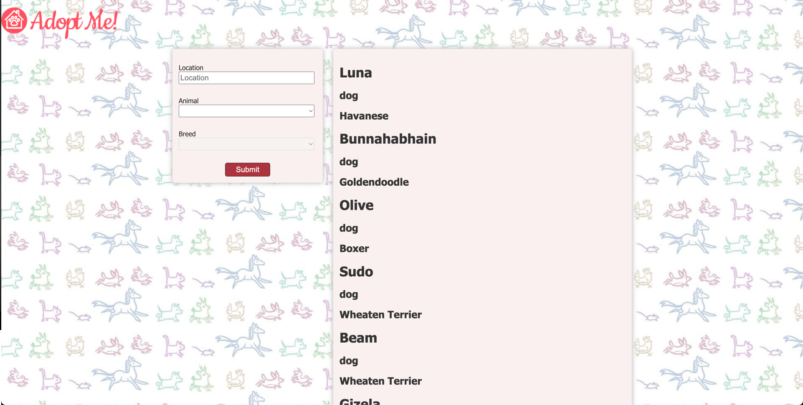
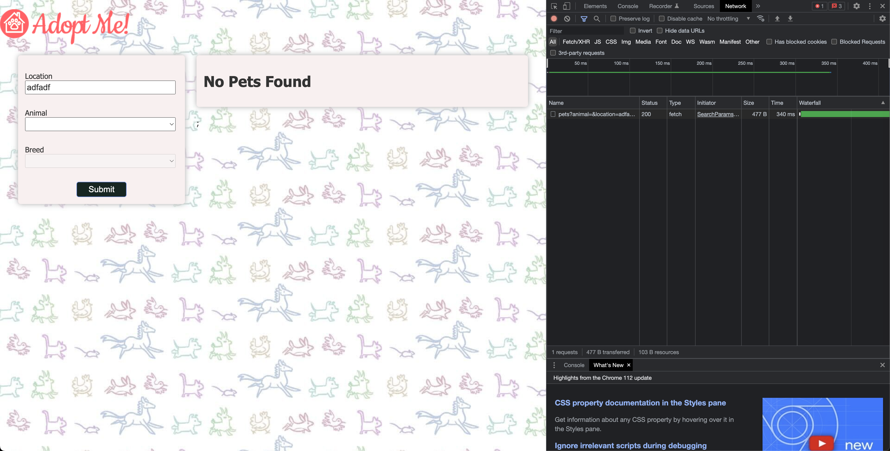

# Component Composition

- [https://react-v8.holt.courses/lessons/core-react-concepts/component-composition](https://react-v8.holt.courses/lessons/core-react-concepts/component-composition)

- ENV
  
```bash
$ showenv
node: v19.8.0
npm env: 9.5.1
```

- Now running the server



- However when I click on submit I don't see "No pets found" page.

- After fixing bug

