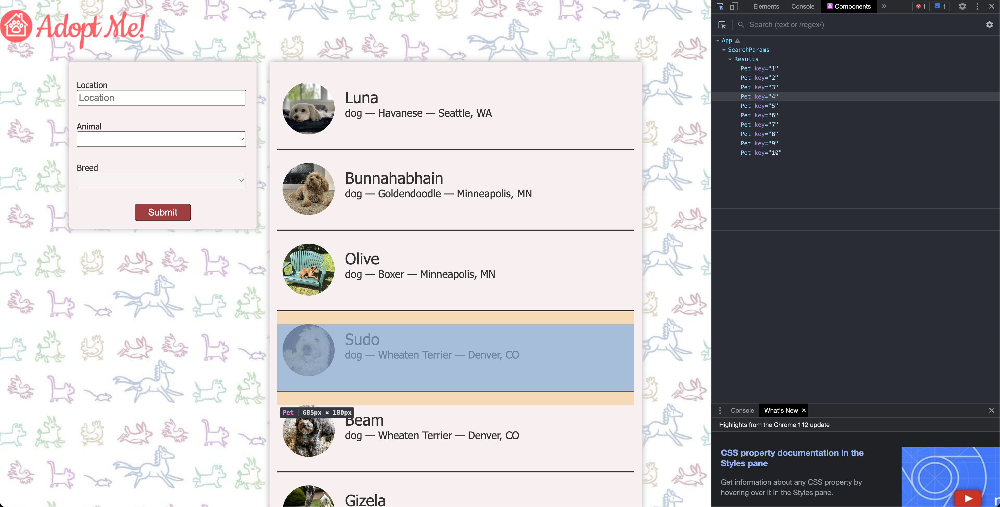
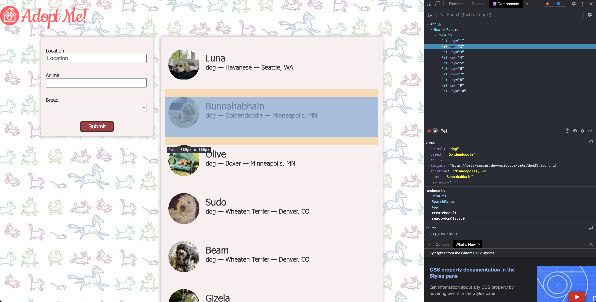
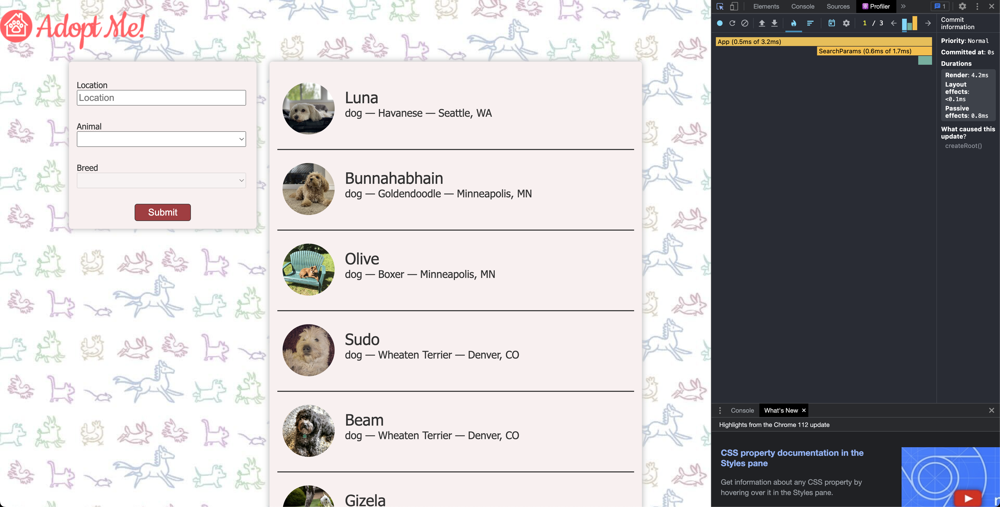

# React Dev Tools

- [https://react-v8.holt.courses/lessons/core-react-concepts/react-dev-tools](https://react-v8.holt.courses/lessons/core-react-concepts/react-dev-tools)

- ENV
  
```bash
$ showenv
node: v19.8.0
npm env: 9.5.1
```

## Browser Extensions

- [React Developer Tools](https://chrome.google.com/webstore/detail/react-developer-tools/fmkadmapgofadopljbjfkapdkoienihi)

- After installing the chrome extension



- Checking state



- Profiler data

