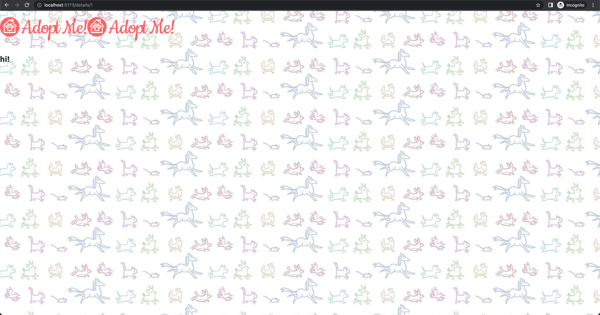
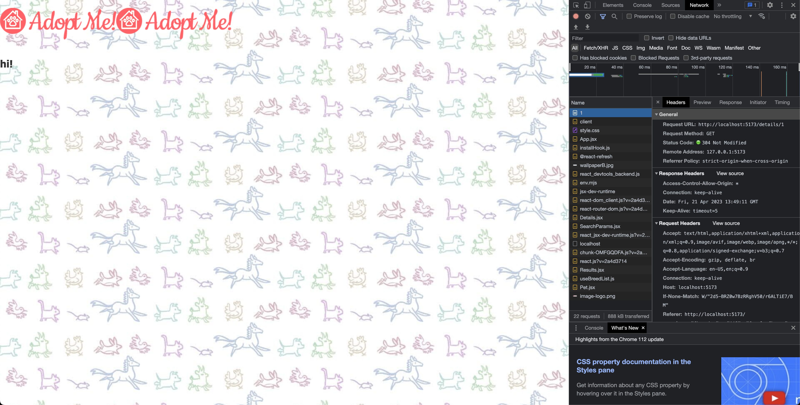

# React Dev Tools

- [https://react-v8.holt.courses/lessons/react-capabilities/react-router](https://react-v8.holt.courses/lessons/react-capabilities/react-router)

- ENV
  
```bash
$ showenv
node: v19.8.0
npm env: 9.5.1
```

- Run

```bash
$ npm i react-router-dom@6.10.0
.

```

- After making required changes, Now clicking on luna takes us to details page



- However every link you clicked would end up in the browser navigating to a whole new page which means React would totally reload your entire app all over again
  


- With `<Link>` it can intercept this and just handle that all client-side. Much faster and a better user experience.
