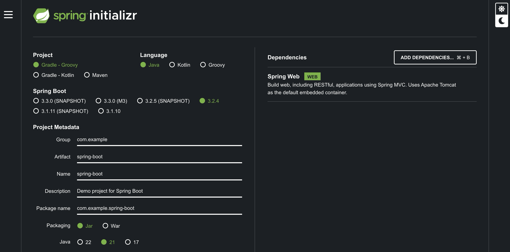

# [Building an Application with Spring Boot](https://spring.io/guides/gs/spring-boot)

You will build a simple web application with Spring Boot and add some useful services to it.

[Building a Guide with VS Code](https://spring.io/guides/gs/guides-with-vscode)

[Introduction to the Spring IoC Container and Beans](https://docs.spring.io/spring-framework/reference/core/beans/introduction.html)

In Spring, the objects that form the backbone of your application and that are managed by the Spring IoC container are called beans. A bean is an object that is instantiated, assembled, and managed by a Spring IoC container. Otherwise, a bean is simply one of many objects in your application. Beans, and the dependencies among them, are reflected in the configuration metadata used by a container.

[what is the difference between servlet container and spring container?](https://stackoverflow.com/questions/28040529/what-is-the-difference-between-servlet-container-and-spring-container)

> If you are getting import package errors then you can try opening only specific task in VS Code by running `code .` in the terminal. Every task is a separate project and has its own dependencies.

```bash
$ java --version
openjdk 21.0.2 2024-01-16
OpenJDK Runtime Environment Homebrew (build 21.0.2)
OpenJDK 64-Bit Server VM Homebrew (build 21.0.2, mixed mode, sharing)
```

## Starting with Spring Initializr

To manually initialize the project

1. Navigate to [https://start.spring.io](https://start.spring.io/#!type=gradle-project&language=java&platformVersion=3.2.4&packaging=jar&jvmVersion=21&groupId=com.example&artifactId=spring-boot&name=spring-boot&description=Demo%20project%20for%20Spring%20Boot&packageName=com.example.spring-boot&dependencies=web) This service pulls in all the dependencies you need for an application and does most of the setup for you. Make sure that `Gradle - Groovy` in project section
2. Choose either Gradle or Maven and the language you want to use. This guide assumes that you chose Java.
3. Click Dependencies and select Spring Web.
4. Click Generate.



Download the resulting ZIP file, which is an archive of a web application that is configured with your choices.

```bash
mv ~/Downloads/spring-boot.zip .
unzip spring-boot.zip
rm spring-boot.zip
mv spring-boot/* spring-boot/.gitignore .
rmdir spring-boot
```

## Create a Simple Web Application

```bash
touch src/main/java/com/example/springboot/HelloController.java
```

## Create an Application class

modify already created `src/main/java/com/example/springboot/Application.java`

## Run the application

```bash
# Install the dependencies using gradle kotlin
./gradlew build
# Run the application
./gradlew bootRun
```

Output

```bash
...
welcomePageNotAcceptableHandlerMapping
<==========---> 80% EXECUTING [6m 2s]
> :bootRun
```

Validate the application is running

```bash
curl http://localhost:8080
```

Output

```bash
Greetings from Spring Boot!
```

## Add Unit Tests

Add the following dependencies to the `build.gradle` file if not already added

```gradle
    testImplementation('org.springframework.boot:spring-boot-starter-test')
```

```bash
touch src/test/java/com/example/springboot/HelloControllerTest.java
touch src/test/java/com/example/springboot/HelloControllerIT.java
```

Run the tests

```bash
# Run the tests
./gradlew test
# In a typical development workflow with Gradle, if the source code or tests have not been modified since the last build, Gradle will consider the tasks up-to-date and will not rerun them
# To force Gradle to rerun the tests, you can use the --rerun-tasks option
./gradlew test --rerun-tasks
```

Output

```bash
BUILD SUCCESSFUL in 567ms
4 actionable tasks: 4 up-to-date
```

## Add Production-grade Services

Add the following dependencies to the `build.gradle.kts` file if not already added

```gradle
    implementation 'org.springframework.boot:spring-boot-starter-actuator'
```

```bash
# Install the dependencies if not already installed
./gradlew build
# Run the application
./gradlew bootRun
```

Validate the application is running

```bash
curl http://localhost:8080/actuator
```

```bash
curl http://localhost:8080/actuator/health
```

Output

```bash
{"status":"UP"}
```
